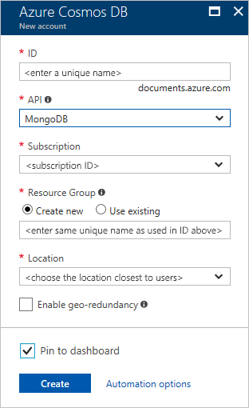
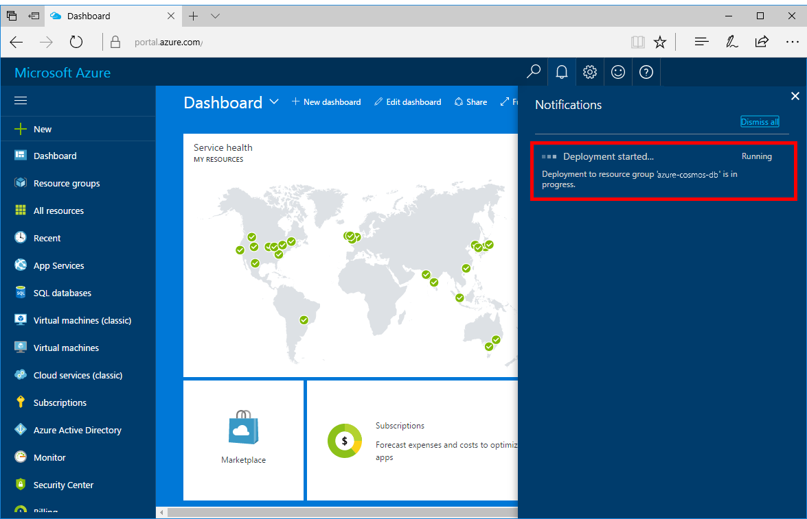

1. In a new window, sign in to the [Azure portal](https://portal.azure.com/).
2. In the left menu, click **New**, click **Databases**, and then click **Azure Cosmos DB**.
   
   

3. In the **New account** blade, specify the desired configuration for the Azure Cosmos DB account. 

    With Azure Cosmos DB, you can choose one of four programming models: Gremlin (graph), MongoDB, SQL (DocumentDB), and Table (key-value). 
       
    In this quick start we'll be programming against the MongoDB API so you'll choose **MongoDB** as you fill out the form. But if you have graph data for a social media app, document data from a catalog app, or key/value (table) data, realize that Azure Cosmos DB can provide a highly available, globally-distributed database service platform for all your mission-critical applications.

    Fill out the **New account** blade using the information in the table as a guide.
 
    
   
    Setting|Suggested value|Description
    ---|---|---
    ID|*Unique value*|A unique name you choose to identify the Azure Cosmos DB account. *documents.azure.com* is appended to the ID you provide to create your URI, so use a unique but identifiable ID. The ID may contain only lowercase letters, numbers, and the '-' character, and must be between 3 and 50 characters.
    API|MongoDB|We'll be programming against the [MongoDB API](../articles/documentdb/documentdb-protocol-mongodb.md) later in this article.|
    Subscription|*Your subscription*|The Azure subscription that you want to use for the Azure Cosmos DB account. 
    Resource Group|*The same value as ID*|The new resource group name for your account. For simplicity, you can use the same name as your ID. 
    Location|*The region closest to your users*|The geographic location in which to host your Azure Cosmos DB account. Choose the location closest to your users to give them the fastest access to the data.

4. Click **Create** to create the account.
5. On the toolbar, click **Notifications** to monitor the deployment process.

    

6.  When the deployment is complete, open the new account from the All Resources tile. 

    
