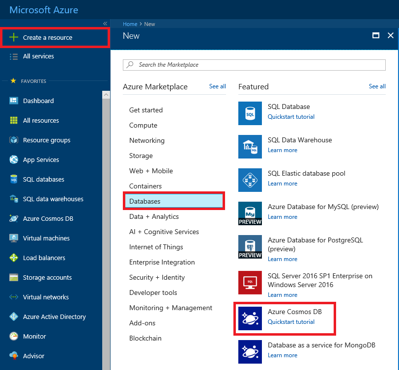
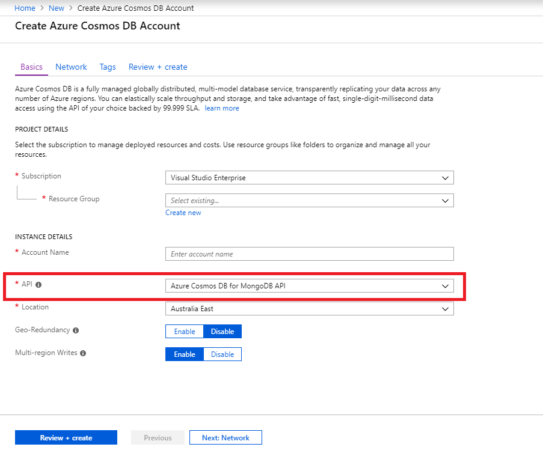
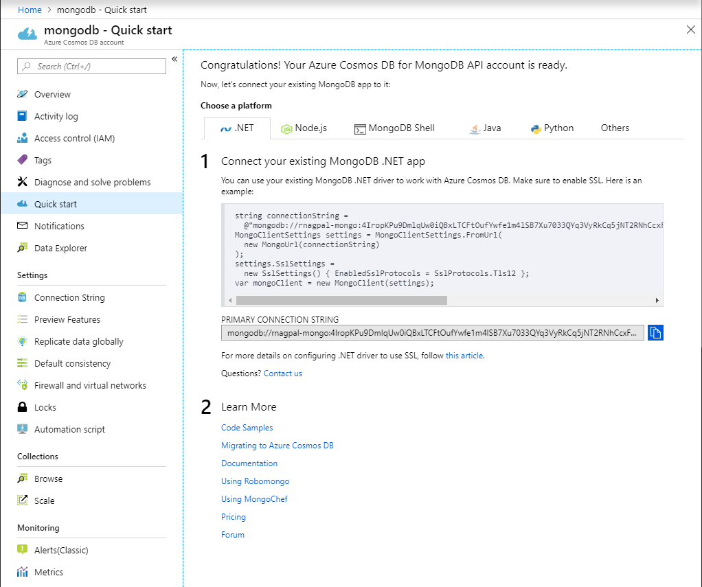

1. In a new browser window, sign in to the [Azure portal](https://portal.azure.com/).

2. In the left menu, select **Create a resource**.
   
   
   
3. On the **New** page, select **Databases** > **Azure Cosmos DB**.
   
   
   
3. On the **Create Azure Cosmos DB Account** page, enter the settings for the new Azure Cosmos DB account. 
 
    Setting|Value|Description
    ---|---|---
    Subscription|Your subscription|Select the Azure subscription that you want to use for this Azure Cosmos DB account. 
    Resource Group|Create new  Then enter the same name as Account Name|Select **Create new**. Then enter a new resource group name for your account. For simplicity, use the same name as your Azure Cosmos DB account name. 
    Account Name|Enter a unique name|Enter a unique name to identify your Azure Cosmos DB account. Your account URI will be *mongo.cosmos.azure.com* appended to your unique account name.  The account name can use only lowercase letters, numbers, and hyphens (-), and must be between 3 and 31 characters long.
    API|Azure Cosmos DB for Mongo DB API|The API determines the type of account to create. Azure Cosmos DB provides five APIs: Core (SQL) for document databases, Gremlin for graph databases, Azure Cosmos DB for Mongo DB API for document databases, Azure Table, and Cassandra. Currently, you must create a separate account for each API.   Select **Azure Cosmos DB for Mongo DB API**  because in this quickstart you are creating a collection that works with MongoDB.  [Learn more about Azure Cosmos DB for MongoDB API](../articles/cosmos-db/mongodb-introduction.md).|
    Location|Select the region closest to your users|Select a geographic location to host your Azure Cosmos DB account. Use the location that's closest to your users to give them the fastest access to the data.|

    Select **Review+Create**. You can skip the **Network** and **Tags** section. 

    

4. The account creation takes a few minutes. Wait for the portal to display the **Congratulations! Your Azure Cosmos DB for Mongo DB API account is ready** page.

    
