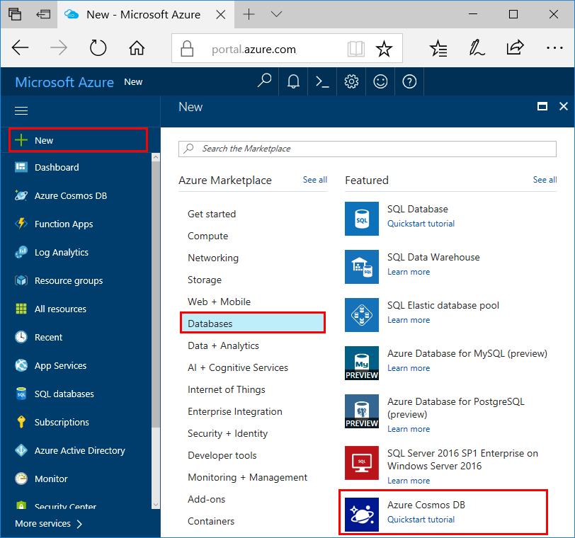
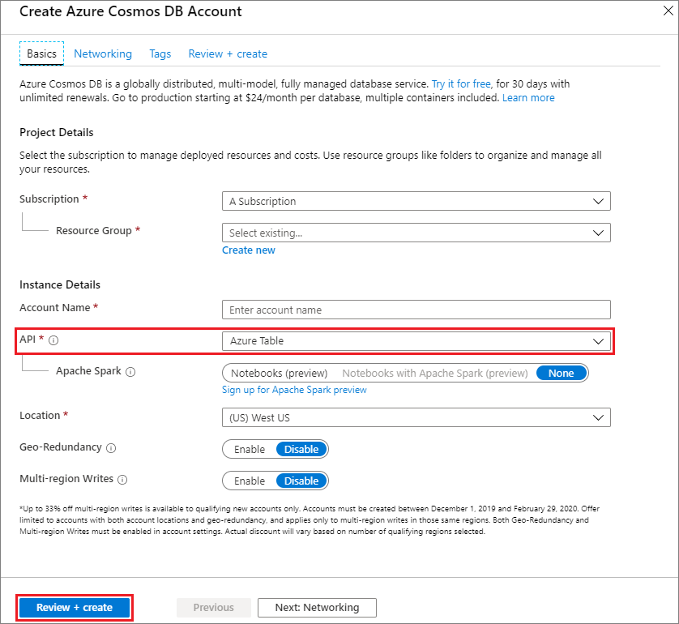
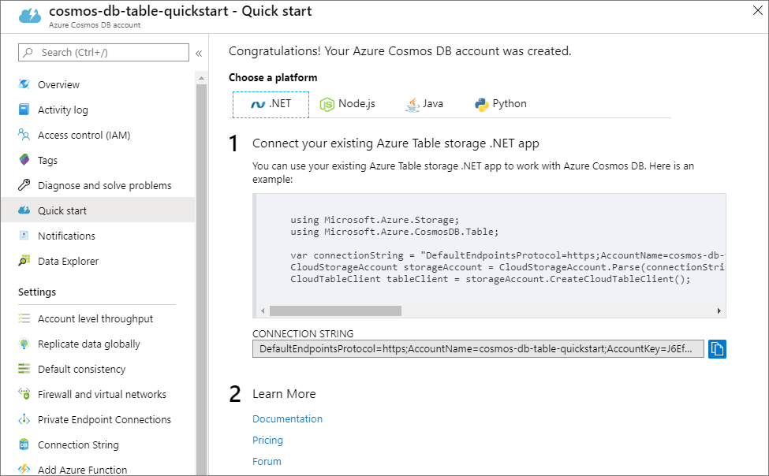

1. In a new browser window, sign in to the [Azure portal](https://portal.azure.com/).

2. In the left menu, select **Create a resource**.
   
   
   
3. On the **New** page, select **Databases** > **Azure Cosmos DB**.
   
   
   
3. On the **Create Azure Cosmos DB Account** page, enter the settings for the new Azure Cosmos DB account. 
 
    Setting|Value|Description
    ---|---|---
    Subscription|Your subscription|Select the Azure subscription that you want to use for this Azure Cosmos DB account. 
    Resource Group|**Create new**, then Account Name|Select **Create new**. Then enter a new resource group name for your account. For simplicity, use the same name as your Azure Cosmos DB account name. 
    Account Name|A unique name|Enter a unique name to identify your Azure Cosmos DB account.  The account name can use only lowercase letters, numbers, and hyphens (-), and must be between 3 and 31 characters long.
    API|Table|The API determines the type of account to create. Azure Cosmos DB provides five APIs: Core (SQL) for document databases, Gremlin for graph databases, MongoDB for document databases, Azure Table, and Cassandra. You must create a separate account for each API.   Select **Azure Table**, because in this quickstart you are creating a table that works with the Table API.   [Learn more about the Table API](../articles/cosmos-db/table-introduction.md).|
    Location|The region closest to your users|Select a geographic location to host your Azure Cosmos DB account. Use the location that's closest to your users to give them the fastest access to the data.

    You can leave the **Geo-Redundancy** and **Multi-region Writes** options at **Disable** to avoid additional charges, and skip the **Network** and **Tags** sections.

5. Select **Review+Create**. After the validation is complete, select **Create** to create the account. 
 
   

6. It takes a few minutes to create the account. You'll see a message that states **Your deployment is underway**. Wait for the deployment to finish, and then select **Go to resource**.

    

