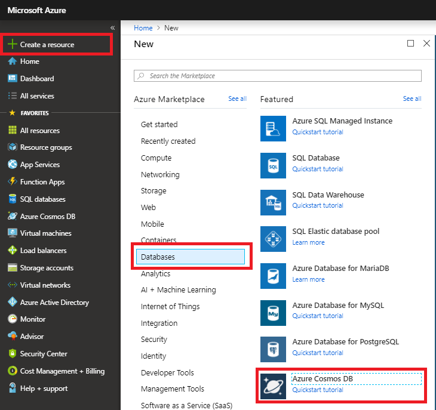
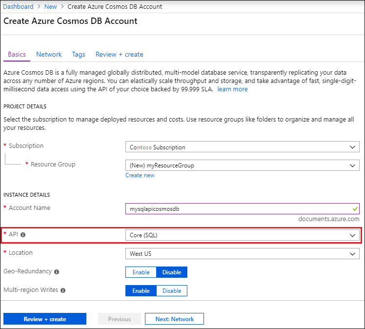
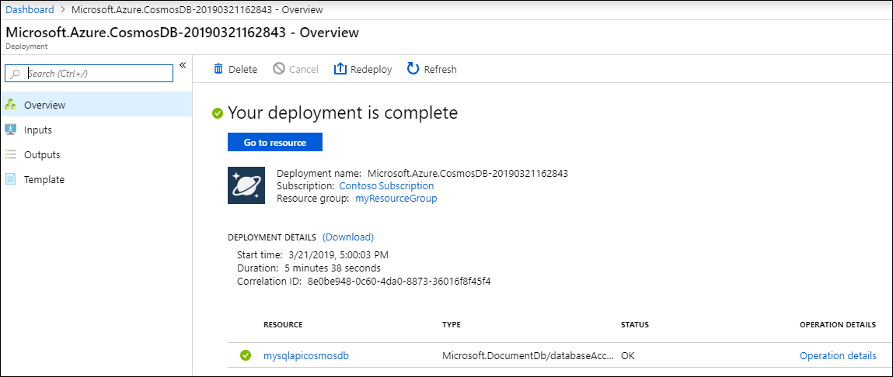

1. In a new browser window, sign in to the [Azure portal](https://portal.azure.com/).
2. Click **Create a resource** > **Databases** > **Azure Cosmos DB**.
   
   

3. In the **New account** page, enter the settings for the new Azure Cosmos DB account. 
 
    Setting|Value|Description
    ---|---|---
    ID|*Enter a unique name*|Enter a unique name to identify this Azure Cosmos DB account. Because *documents.azure.com* is appended to the ID that you provide to create your URI, use a unique but identifiable ID.  The ID can contain only lowercase letters, numbers, and the hyphen (-) character, and it must contain 3 to 50 characters.
    API|SQL|The API determines the type of account to create. Azure Cosmos DB provides five APIs: SQL (document database), Gremlin (graph database), MongoDB (document database), Azure Table, and Cassandra. Each API currently requires you to create a separate account.   Select **SQL** because in this quickstart you are creating a document database that is queryable using SQL syntax and accessible with the SQL API.  [Learn more about the SQL API](../articles/cosmos-db/documentdb-introduction.md)|
    Subscription|*Your subscription*|Select Azure subscription that you want to use for this Azure Cosmos DB account. 
    Resource Group|Create new  *Then enter the same unique name as provided above in ID*|Select **Create New**, then enter a new resource-group name for your account. For simplicity, you can use the same name as your ID. 
    Location|*Select the region closest to your users*|Select geographic location in which to host your Azure Cosmos DB account. Use the location that's closest to your users to give them the fastest access to the data.
    Enable geo-redundancy| Leave blank | This creates a replicated version of your database in a second (paired) region. Leave this blank.  
    Pin to dashboard | Select | Select this box so that your new database account is added to your portal dashboard for easy access.

    Then click **Create**.

    

4. The account creation takes a few minutes. Wait for the portal to display the **Congratulations! Your Azure Cosmos DB account was created** page.

    

