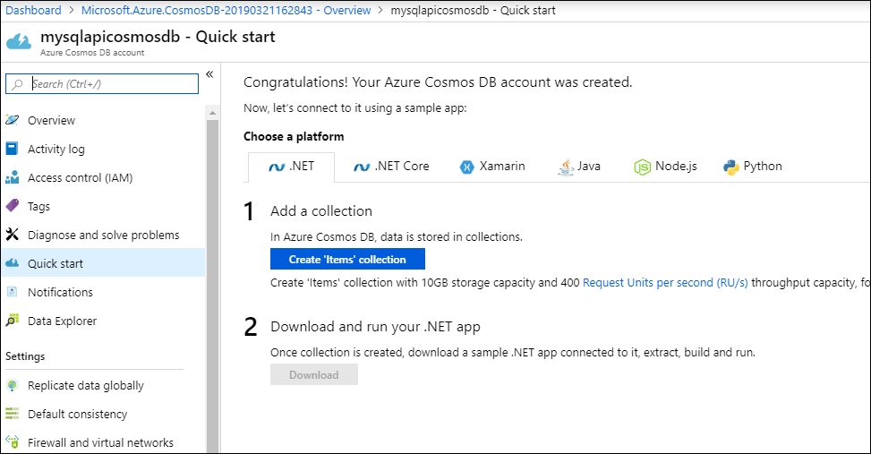

1. Sign in to the [Azure portal](https://portal.azure.com/).
1. Select **Create a resource** > **Databases** > **Azure Cosmos DB**.
   
   

1. On the **Create Azure Cosmos DB Account** page, enter the basic settings for the new Azure Cosmos account. 
 
    |Setting|Value|Description |
    |---|---|---|
    |Subscription|Subscription name|Select the Azure subscription that you want to use for this Azure Cosmos account. |
    |Resource Group|Resource group name|Select a resource group, or select **Create new**, then enter a unique name for the new resource group. |
    | Account Name|Enter a unique name|Enter a name to identify your Azure Cosmos account. Because *documents.azure.com* is appended to the ID that you provide to create your URI, use a unique ID.  The ID can only contain lowercase letters, numbers, and the hyphen (-) character. It must be between 3-31 characters in length.|
    | API|Core (SQL)|The API determines the type of account to create. Azure Cosmos DB provides five APIs: Core (SQL) and MongoDB for document data, Gremlin for graph data, Azure Table, and Cassandra. Currently, you must create a separate account for each API.   Select **Core (SQL)** to create a document database and query by using SQL syntax.   [Learn more about the SQL API](../articles/cosmos-db/documentdb-introduction.md).|
    | Location|Select the region closest to your users|Select a geographic location to host your Azure Cosmos DB account. Use the location that is closest to your users to give them the fastest access to the data.|
   
   

1. Select **Review + create**. You can skip the **Network** and **Tags** sections. 

1. Review the account settings, and then select **Create**. It takes a few minutes to create the account. Wait for the portal page to display **Your deployment is complete**. 

    

1. Select **Go to resource** to go to the Azure Cosmos DB account page. 

    
