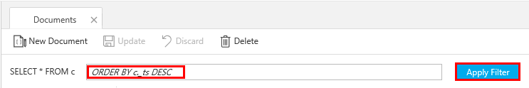
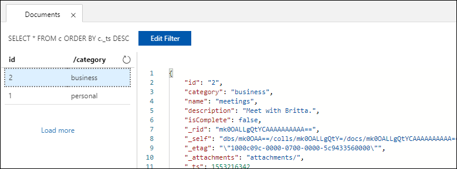

You can use queries in Data Explorer to retrieve and filter your data.

1. At the top of the **Documents** tab in Data Explorer, review the default query `SELECT * FROM c`. This query retrieves and displays all documents in the collection in ID order. 
   
   
   
1. To change the query, select **Edit Filter**, replace the default query with `ORDER BY c._ts DESC`, and then select **Apply Filter**.
   
   

   The modified query displays the documents in descending order based on their time stamp, so now your second document is listed first. 
   
   

If you're familiar with SQL syntax, you can enter any supported [SQL queries](../articles/cosmos-db/sql-api-sql-query.md) in the query predicate box. You can also use Data Explorer to create stored procedures, UDFs, and triggers for server-side business logic. 

Data Explorer provides easy Azure portal access to all of the built-in programmatic data access features available in the APIs. You also use the portal to scale throughput, get keys and connection strings, and review metrics and SLAs for your Azure Cosmos DB account. 

