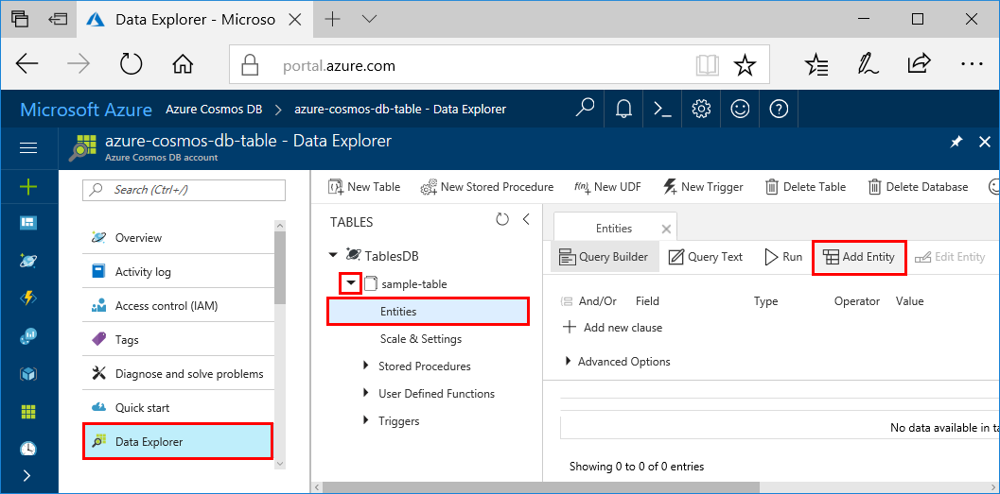

You can now add data to your new table using Data Explorer.

1. In Data Explorer, expand **sample-table**, click **Entities**, and then click **Add Entity**.

   

2. Now add data to the PartitionKey value box and RowKey value box, and click **Add Entity**.

   
  
    You can now add more entities to your table, edit your entities, or query your data in Data Explorer. Data Explorer is also where you can scale your throughput and add stored procedures, user-defined functions, and triggers to your table.