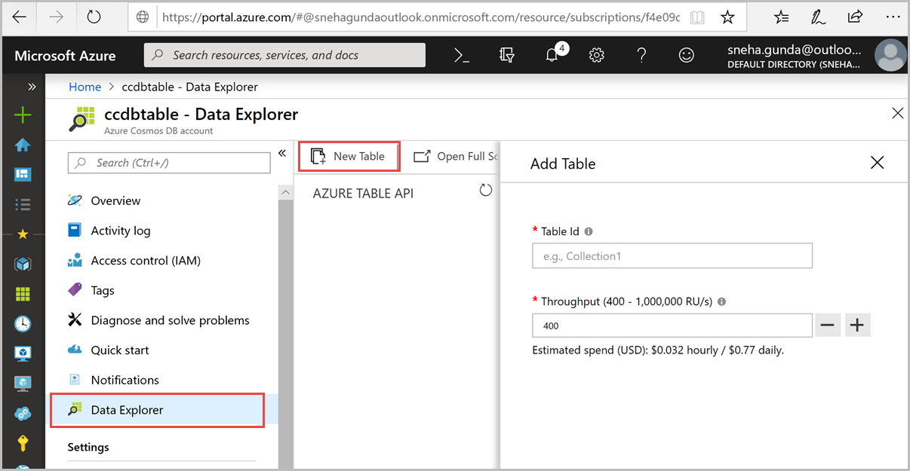
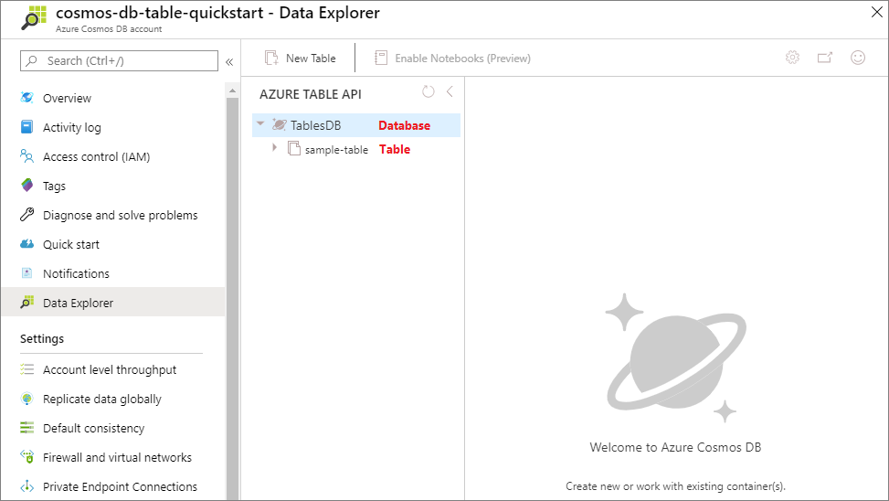

You can now use the Data Explorer tool in the Azure portal to create a database and table. 

1. Click **Data Explorer** > **New Table**. 
    
    The **Add Table** area is displayed on the far right, you may need to scroll right to see it.

    

2. In the **Add Table** page, enter the settings for the new table.

    Setting|Suggested value|Description
    ---|---|---
    Table Id|sample-table|The ID for your new table. Table names have the same character requirements as database ids. Database names must be between 1 and 255 characters, and cannot contain `/ \ # ?` or a trailing space.
    Throughput|400 RUs|Change the throughput to 400 request units per second (RU/s). If you want to reduce latency, you can scale up the throughput later.

3. Click **OK**.

4. Data Explorer displays the new database and table.

   