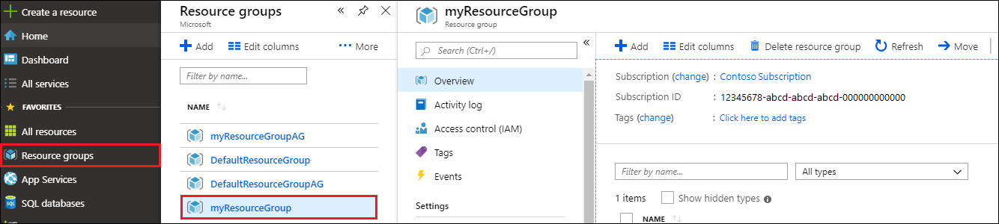
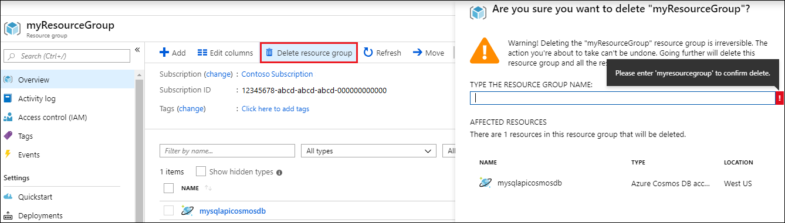

When you're done with your web app and Azure Cosmos DB account, you can delete the Azure resources you created so you don't incur more charges. To delete the resources:

1. In the Azure portal, select **Resource groups** on the far left. If the left menu is collapsed, select  to expand it.

2. Select the resource group you created for this quickstart.  

   

2. In the new window, select **Delete resource group**.

      

3. In the next window, type the name of the resource group to delete, and then select **Delete**.

