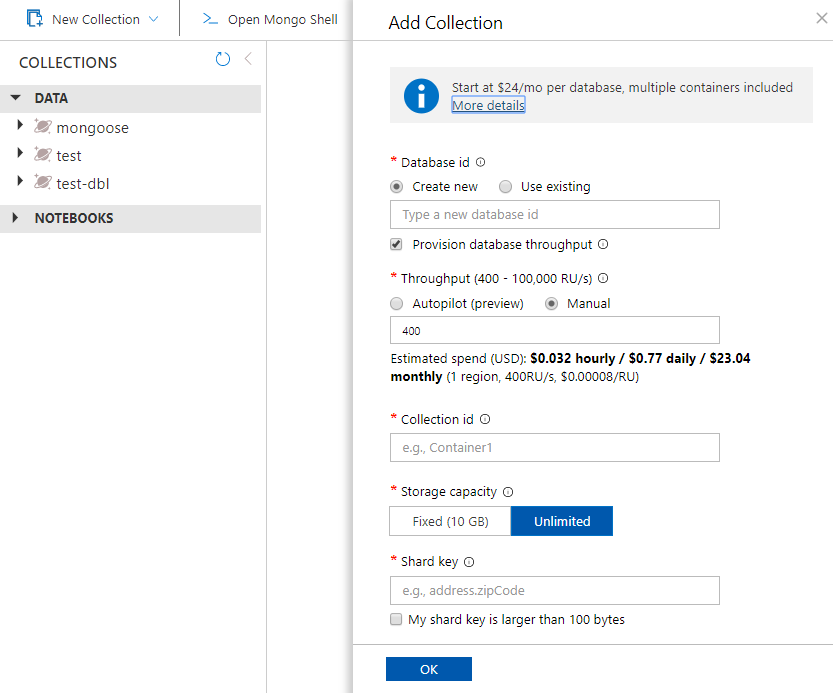

You can now use the Data Explorer tool in the Azure portal to create an Azure Cosmos DB's API for MongoDB database and container. 

1. Select **Data Explorer** > **New Container**. 
    
    The **Add Container** area is displayed on the far right, you may need to scroll right to see it.

    

2. In the **Add container** page, enter the settings for the new container.

    |Setting|Suggested value|Description
    |---|---|---|
    |**Database ID**|db|Enter *db* as the name for the new database. Database names must contain from 1 through 255 characters, and they cannot contain `/, \\, #, ?`, or a trailing space. Check the **Provision database throughput** option, it allows you to share the throughput provisioned to the database across all the containers within the database. This option also helps with cost savings. |
    |**Throughput**|400|Leave the throughput at 400 request units per second (RU/s). If you want to reduce latency, you can scale up the throughput later. You can also choose [Autoscale mode](https://docs.microsoft.com/azure/cosmos-db/provision-throughput-autoscale), which will give you a range of RU/s that will dynamically increase and decrease as needed.| 
    |**Collection ID**|coll|Enter `coll` as the name for your new container. Container IDs have the same character requirements as database names.|
    |**Storage capacity**|Fixed (10GB)|Enter *Fixed (10GB)* for this application. If you select *Unlimited*, you will have to create a `Shard Key`, which all items inserted will require.|
    |**Shard key**| /_id| The sample described in this article does not use a Shard Key, so setting it to  */_id* will use the automatically generated ID field as the shard key. Learn more about sharding, also known as partitioning, in [Partitioning in Azure Cosmos DB](https://docs.microsoft.com/azure/cosmos-db/partitioning-overview)|
        
    Select **OK**. The Data Explorer displays the new database and container.
