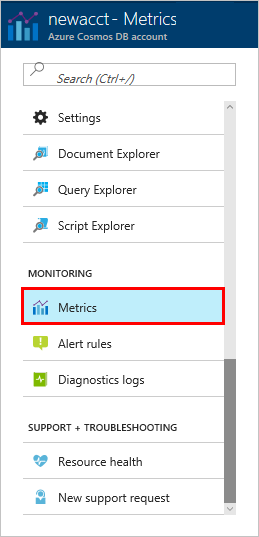

The throughput, storage, availability, latency, and consistency of the resources in your account are monitored in the Azure portal. Let's take a quick look at these metrics. 

1. Click **Metrics** in the navigation menu.

   

2. Click through each of the tabs so you're aware of the metrics Azure Cosmos DB provides. 

    Each chart that's associated with the [Azure Cosmos DB Service Level Agreements (SLAs)](https://azure.microsoft.com/support/legal/sla/cosmos-db/) provides a line that shows if any of the SLAs have been violated. Azure Cosmos DB makes monitoring your SLAs transparent with this suite of metrics. 

   