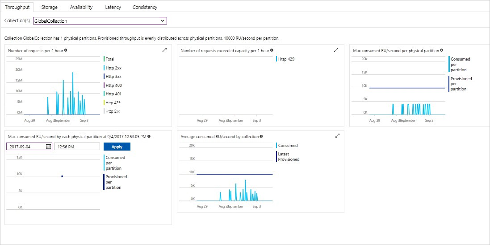

The Azure portal monitors your Cosmos DB account throughput, storage, availability, latency, and consistency. Charts for metrics associated with an [Azure Cosmos DB Service Level Agreement (SLA)](https://azure.microsoft.com/support/legal/sla/cosmos-db/) show the SLA value compared to actual performance. This suite of metrics makes monitoring your SLAs transparent.

To review metrics and SLAs: 

1. Select **Metrics** in your Cosmos DB account's navigation menu.
   
2. Select a tab such as **Latency**, and select a timeframe on the right. Compare the **Actual** and **SLA** lines on the charts.
   
   
   
3. Review the metrics on the other tabs. 

