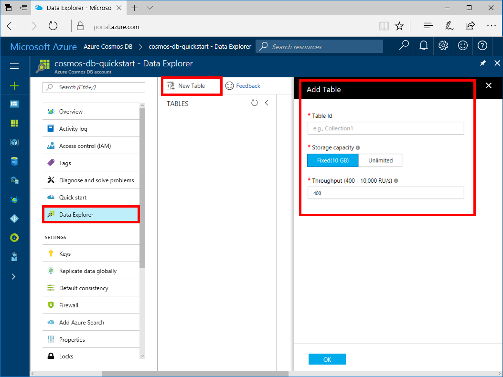

You can now use Data Explorer to create a graph container and add data to your database. 

1. In the Azure portal, in the navigation menu, click **Data Explorer**. 
2. In the Data Explorer blade, click **New Table**, then fill in the page using the following information.

    

    Setting|Suggested value|Description
    ---|---|---
    Database id|sample-database|The ID for your new database. Database names must be between 1 and 255 characters, and cannot contain `/ \ # ?` or a trailing space.
    Table id|sample-table|The ID for your new table. Table names have the same character requirements as database ids.
    Storage Capacity| 10 GB|Leave the default value. This is the storage capacity of the database.
    Throughput|400 RUs|Leave the default value. You can scale up the throughput later if you want to reduce latency.

3. Once the form is filled out, click **OK**.