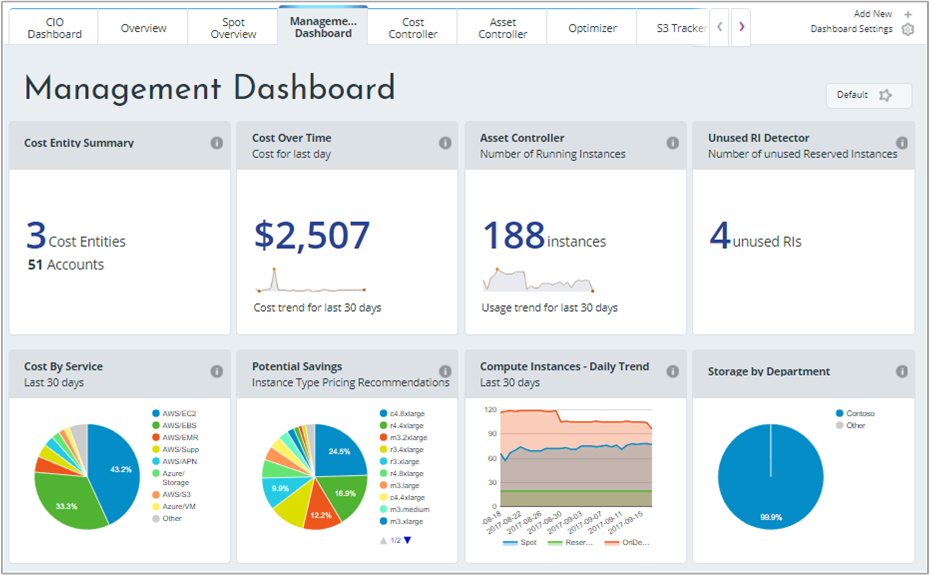
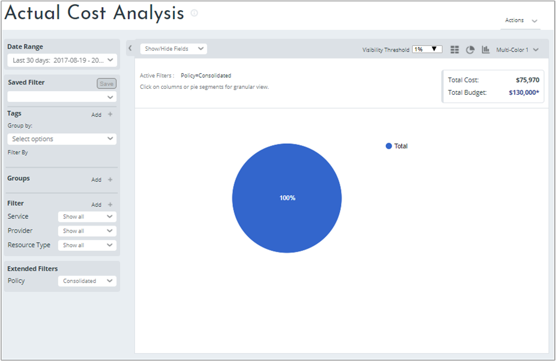
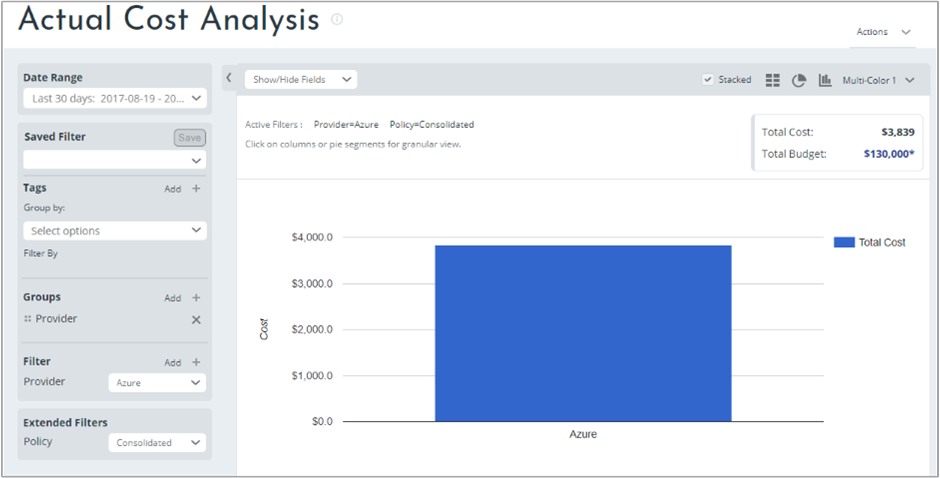
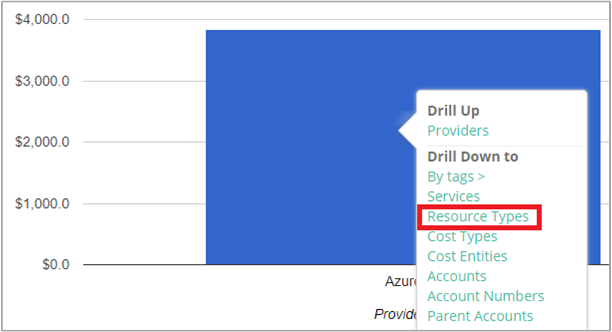
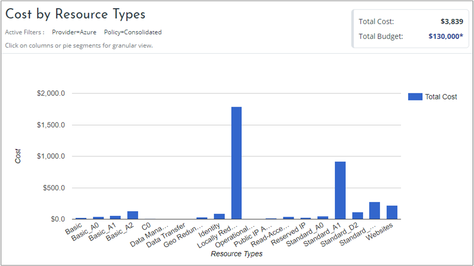
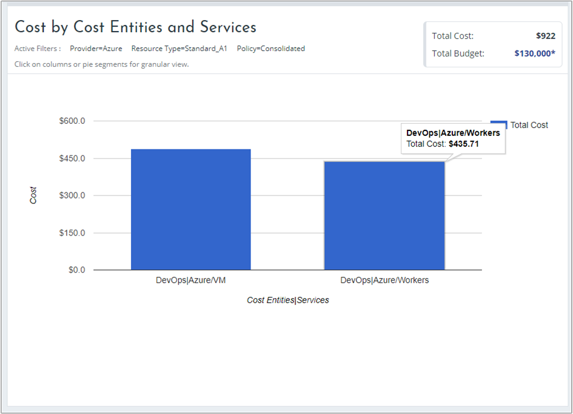

## View cost data

Azure Cost Management by Cloudyn provides you access to all of your cloud resource data. From the dashboard reports you can find both standard and custom reports in a tabbed view. Below are examples of a popular dashboard and a report that show you cost data right away.

In this example, the Management dashboard shows consolidated costs for the Contoso business across all their cloud resources. Contoso uses Azure, AWS, and Google. Dashboards provide at-a-glance information and are quick way to navigate into reports.  

If you're unsure of a report's purpose in a dashboard, hover over the **i** symbol to see an explanation. Click any report on a dashboard to view the full report.

You can also view reports using the reports menu at the top of the portal. Let's take a look at Contoso's Azure resource spending over the last 30 days. Click **Cost** > **Cost Analysis** > **Actual Cost Analysis**. Clear any values if there are any set for tags, groups, or filters in your report.

In this example, $75,970 is the total cost and the budget is $130,000.

Now, let's modify the report format and set groups and filters to narrow results for Azure costs. Set the **Date Range** to the last 30 days. In the top right, click the column symbol to format as a bar chart and under Groups, select **Provider**. Then, set a filter for **Provider** to **Azure**.

In this example, the total cost of Azure resources was $3,839 over the last 30 days.

Right-click the Provider (Azure) bar and drill down to **Resource types**.

The following image shows the costs for Azure resources that Contoso incurred. The total was $3,839. In this example, about half of costs were for locally redundant storage and about the other half of costs were for various VM instances.

Right-click a resource type and select **Cost Entities** to view cost entities and the services that have consumed the resource. The VM and Workers services in DevOps consumed $486.60 and $435.71 in this example. The total for both is $922.

