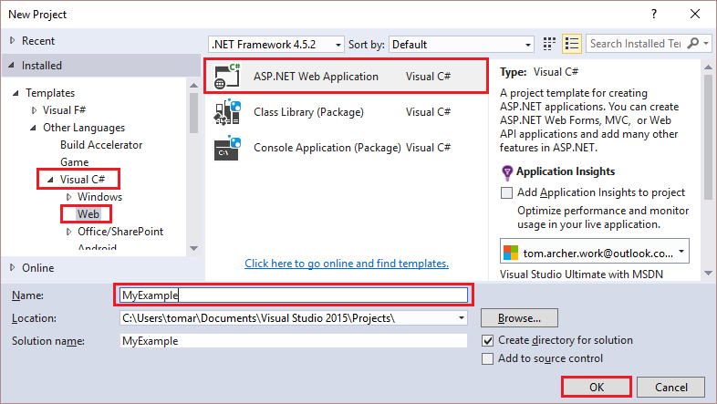
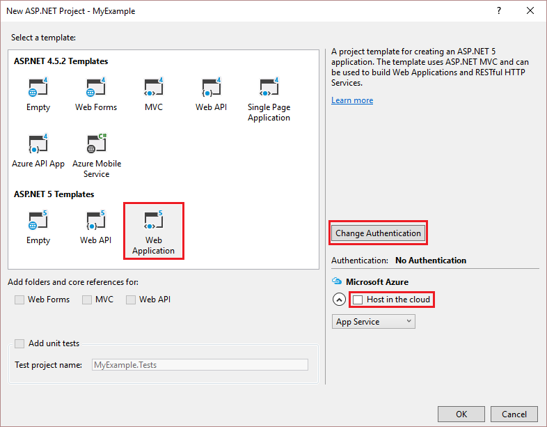

1. From the Visual Studio menu, select **File > New > Project**.

1. The **New Project** dialog will display.

	

1. Under the **Templates** section of the **New Project** dialog, select **Visual C# > Web**.

1. Select **ASP.NET Web Application**.

1. Give your new application a name (or take the default).

1. Tap **OK**.

1. The **New ASP.NET Project** dialog will display.

	

1. Under ASP.NET 5 Templates, select ASP.NET Web Application.

1. Tap **OK**.