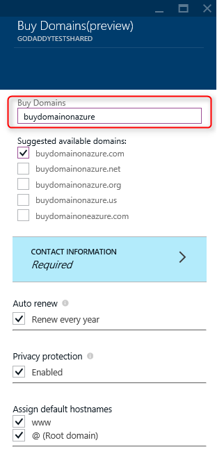
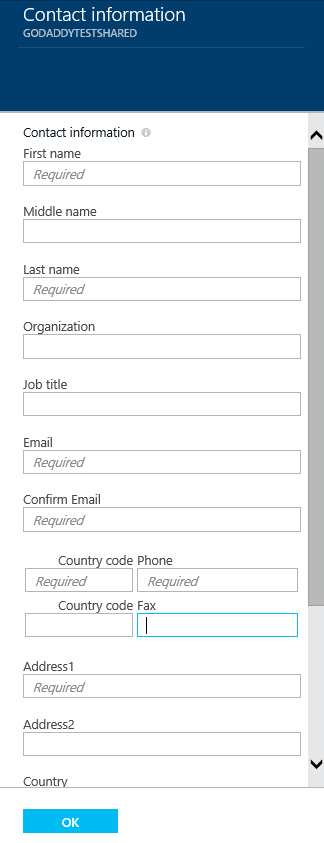
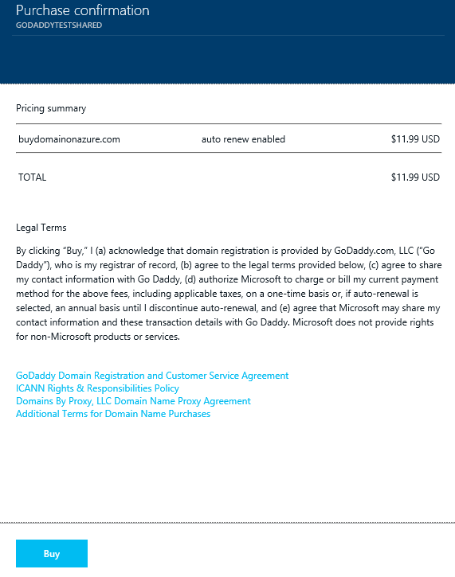
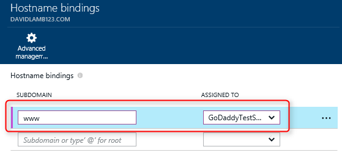

If you want a domain, you can buy domains on [Azure Management Portal](https://portal.azure.com) directly. Use the following steps to buy domain names and assign to your web app.

1. In your browser, open the [Azure Management Portal](https://portal.azure.com).

2. In the **Web Apps** tab, click the name of your web app, select **Settings**, and then select **Custom domains and SSL**

	

3. In the **Custom domains and SSL** blade, click **Buy domains**.

	

4. In the **Buy Domains** blade, use the text box to enter the domain name you want to buy. The suggested available domains will be shown just blow the text box. Select what domain you want to buy.

  

5. Click the **Contact Information** and fill the domain's contact information form.

  

6. Click the **Select** on **Buy Domains** blade, then you will see the purchase information on **Purchase confirmation** blade. If you accept the legal terms and click **Buy**, your order will be submitted and you can monitor the purchasing process on **Notification**.

  

  

7. If you successfully ordered a domain, you can manage the domain and assign to your web app. Click the **"..."** at the right side of your domain. Then you can **Cancel purchase** or **Manage domain**. Click **Manage domain**, then we can bind **subdomain** to our web app on **Manage domain** blade.

	

	Once configuration has completed, the custom domain name will be listed in the **Hostname bindings** section of your web app.

At this point, you should be able to enter the custom domain name in your browser and see that it successfully takes you to your web app.
