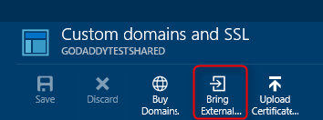

After the records for your domain name have propagated, you must associate them with your web app. Use the following steps to enable the domain names using your web browser.

> [AZURE.NOTE] It can take some time for CNAME records created in the previous steps to propagate through the DNS system. You cannot add the domain name of to your web app until the CNAME has propagated. If you are using an A record, you cannot add the A record domain name to your web app until the **awverify** CNAME record created in the previous step has propagated.
> 
> You can use a service such as <a href="http://www.digwebinterface.com/">http://www.digwebinterface.com/</a> to verify that the CNAME is available.

1. In your browser, open the [Azure Portal](https://portal.azure.com).

2. In the **Web Apps** tab, click the name of your web app, select **Settings**, and then select **Custom domains and SSL**.

	

6. Use the **DOMAIN NAMES** text boxes to enter the domain names to associate with this web app. 

	

6. Click the check mark in the lower right corner to save the domain name configuration.

	Once configuration has completed, the custom domain name will be listed in the **domain names** section of the **Custom domains and SSL** blade for your web app.

At this point, you should be able to enter the custom domain name in your browser and see that it successfully takes you to your web app. 