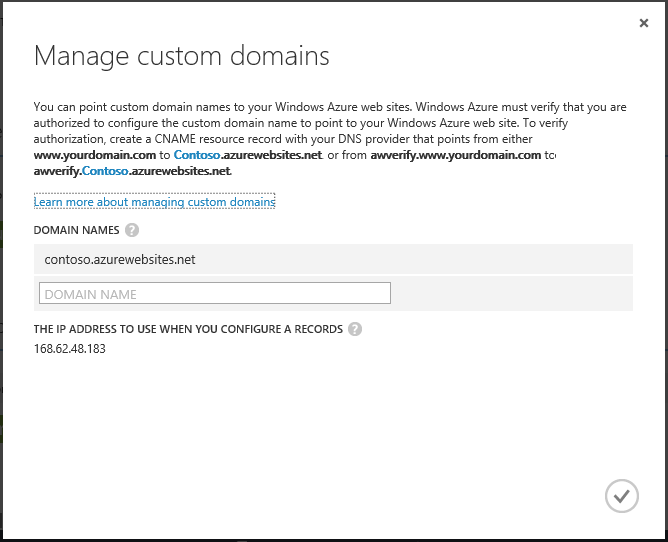

The Domain Name System (DNS) is used to locate resources on the internet. For example, when you enter a web app address in your browser, or click a link on a web page, it uses DNS to translate the domain into an IP address. The IP address is sort of like a street address, but it's not very human friendly. For example, it is much easier to remember a DNS name like **contoso.com** than it is to remember an IP address such as 192.168.1.88 or 2001:0:4137:1f67:24a2:3888:9cce:fea3.

The DNS system is based on *records*. Records associate a specific *name*, such as **contoso.com**, with either an IP address or another DNS name. When an application, such as a web browser, looks up a name in DNS, it finds the record, and uses whatever it points to as the address. If the value it points to is an IP address, the browser will use that value. If it points to another DNS name, then the application has to do resolution again. Ultimately, all name resolution will end in an IP address.

When you create an web app in App Service, a DNS name is automatically assigned to the web app. This name takes the form of **&lt;yourwebappname&gt;.azurewebsites.net**. There is also a virtual IP address available for use when creating DNS records, so you can either create records that point to the **.azurewebsites.net**, or you can point to the IP address.

> [AZURE.NOTE] The IP address of your web app will change if you delete and recreate your web app, or change the App Service plan mode to **Free** after it has been set to **Basic**, **Shared**, or **Standard**.

There are also multiple types of records, each with their own functions and limitations, but for web apps we only care about two, *A* and *CNAME* records.

###Address record (A record)

An A record maps a domain, such as **contoso.com** or **www.contoso.com**, *or a wildcard domain* such as **\*.contoso.com**, to an IP address. In the case of a web app in App Service, either the virtual IP of the service or a specific IP address that you purchased for your web app.

The main benefits of an A record over a CNAME record are:

* You can map a root domain such as **contoso.com** to an IP address; many registrars only allow this using A records

* You can have one entry that uses a wildcard, such as **\*.contoso.com**, which would handle requests for multiple sub-domains such as **mail.contoso.com**, **blogs.contoso.com**, or **www.contso.com**.

> [AZURE.NOTE] Since an A record is mapped to a static IP address, it cannot automatically resolve changes to the IP address of your web app. An IP address for use with A records is provided when you configure custom domain name settings for your web app; however, this value may change if you delete and recreate your web app, or change the App Service plan mode to back to **Free**.

###Alias record (CNAME record)

A CNAME record maps a *specific* DNS name, such as **mail.contoso.com** or **www.contoso.com**, to another (canonical) domain name. In the case of App Service Web Apps, the canonical domain name is the **&lt;yourwebappname>.azurewebsites.net** domain name of your web app. Once created, the CNAME creates an alias for the **&lt;yourwebappname>.azurewebsites.net** domain name. The CNAME entry will resolve to the IP address of your **&lt;yourwebappname>.azurewebsites.net** domain name automatically, so if the IP address of the web app changes, you do not have to take any action.

> [AZURE.NOTE] Some domain registrars only allow you to map subdomains when using a CNAME record, such as **www.contoso.com**, and not root names, such as **contoso.com**. For more information on CNAME records, see the documentation provided by your registrar, <a href="http://en.wikipedia.org/wiki/CNAME_record">the Wikipedia entry on CNAME record</a>, or the <a href="http://tools.ietf.org/html/rfc1035">IETF Domain Names - Implementation and Specification</a> document.

###Web app DNS specifics

Using an A record with Web Apps requires you to first create one of the following CNAME records:

* **For the root domain or wildcard sub-dodmains** - A DNS name of **awverify** to  **awverify.&lt;yourwebappname&gt;.azurewebsites.net**.

* **For a specific sub-domain** - A DNS name of **awverify.&lt;sub-domain>** to **awverify.&lt;yourwebappname&gt;.azurewebsites.net**. For example, **awverify.blogs** if the A record is for **blogs.contoso.com**.

This CNAME record is used to verify that you own the domain you are attempting to use. This is in addition to creating an A record pointing to the virtual IP address of your web ap.

You can find the IP address, as well as the **awverify** name and **.azurewebsites.net** names for your web app by performing the following steps:

1. In your browser, open the [Azure Portal](https://portal.azure.com).

2. In the **Web Apps** blade, click the name of your web app, select **All Settings**, and then select **Custom domains and SSL** from the bottom of the page.

	

	> [AZURE.NOTE] If **Manage Domains** is not enabled, you are using a **Free** web app. You cannot use custom domain names with a **Free** web app, and must upgrade the App Service plan to **Shared**, **Basic**, or **Standard** mode. For more information on the App Service plan modes, including how to change the mode of your web app, see [How to scale web apps](../articles/web-sites-scale.md).

6. In the **MANAGE CUSTOM DOMAINS** dialog, you will see the **awverify** information, the currently assigned **.azurewebsites.net** domain name, and the virtual IP address. Save this information, as it will be used when creating DNS records.

	

