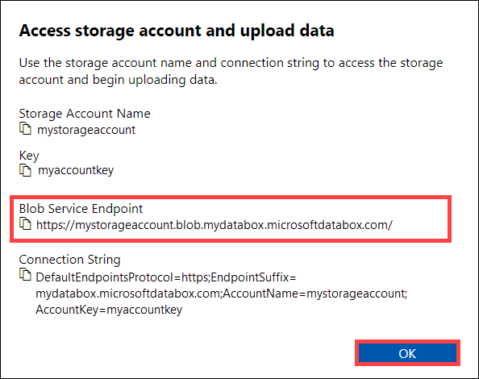

1. Sign into the Data Box device. Ensure it is unlocked.

    

2. Go to **Set network interfaces**. Make a note of the device IP address for the network interface used to connect to the client.

    

3. Go to **Connect and copy** and click **Rest**.

    

4. From the **Access Storage account and upload data** dialog, copy the **Blob Service Endpoint**.

    

5. Start **Notepad** as an administrator, and then open the **hosts** file located at `C:\Windows\System32\Drivers\etc`.
6. Add the following entry to your **hosts** file: `<device IP address> <Blob service endpoint>`
7. For reference, use the following image. Save the **hosts** file.

    
