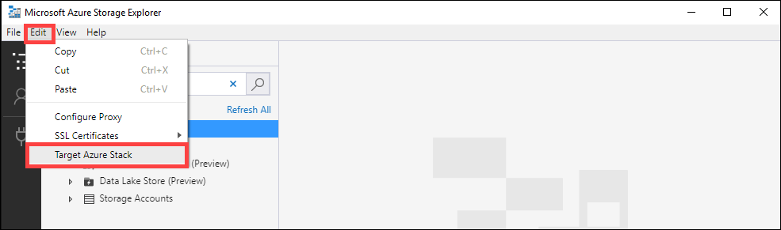
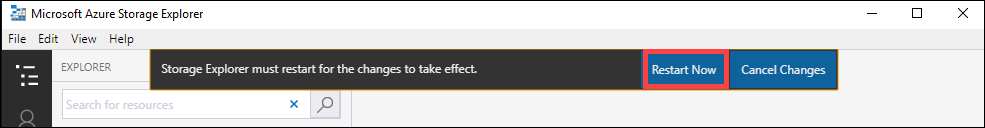

Configure the partner software to connect to the client. To connect to the partner software, you would typically need the following information (may vary) you gathered from the **Connect and copy** page of the local web UI in the previous step:

- Storage account name
- Access key
- Blob service endpoint
 
To verify that the connection is successfully established, use Storage Explorer to attach to an external storage account. If you do not have Storage Explorer, download Storage Explorer.

If this is the first time you are using Storage Explorer, you need to perform the following steps.

1. From the top command bar, go to **Edit > Target Azure Stack**.

    

2. Restart the Storage Explorer for the changes to take effect.

    
