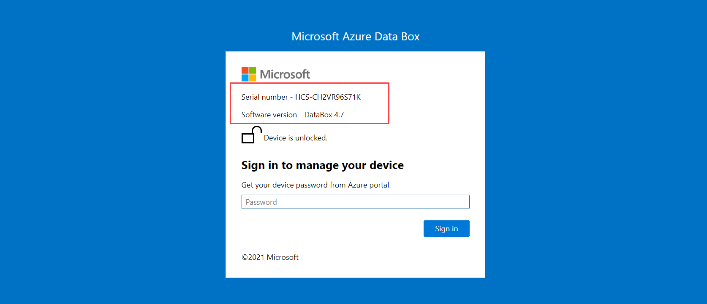
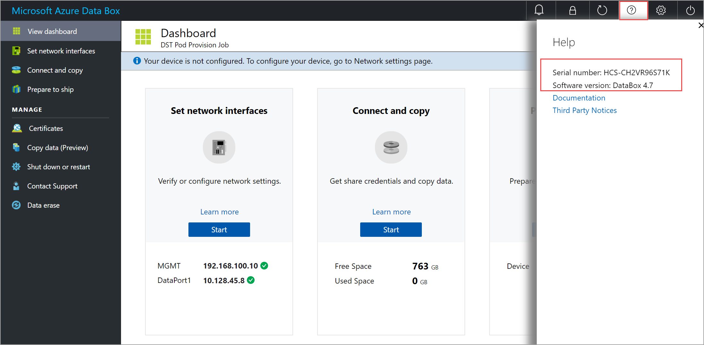
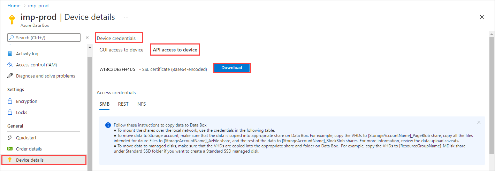
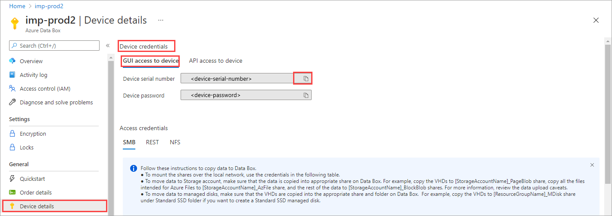

Depending on the software version, that your Data Box is running, you may need to take different steps to connect to the PowerShell interface of the device. The first step in all these cases would be to identify the software version running on your Data Box.

### Identify software version of the device

> [!NOTE]
> The version number is displayed in the local UI starting v 4.9 and later. If you don't see a version number as described here in your local UI, contact Microsoft Support to identify the version number and then follow the steps to connect to the PowerShell interface of the device.

Use one of the following ways to identify the software version running on your device and the device serial number.

 - Go to the **Sign in** page. The software version is displayed on this page.
 
    

 - In the local web UI, select the **Help** icon. In the **Help** pane, the software version and the device serial number are displayed. Make a note of both the device serial number and the software version.
 
    


The next steps are determined by the version of software that your Data Box is running.
 
### [v4.1 and later](#tab/c)

For these versions of software, you must first install certificates on the host accessing your Data Box and then connect to the PowerShell interface of the device. When you install certificates, you can use the default certificates that the device is shipped with or bring your own certificates. In each case, the specific steps that you'll take are slightly different.


### Step 1: Install certificate on host or client

#### Use default certificates 

Follow these steps if you'll use the default certificates (shipped with the device) on Data Box.

1. In the Azure portal, go to your Data Box order resource. Go to **General > Device details**. On the **API access to the device** tab, select **Download**.

    

1. Copy the certificate to the host connecting to your Data Box. If using a Windows host, open Explorer. Right-click the certificate file that you copied to the host and select **Install certificate**. 

1. Complete the installation steps through the **Certificate Import Wizard**. For detailed steps, see [Import certificate to the client](../articles/databox/data-box-bring-your-own-certificates.md#import-certificates-to-client). 

1. Add an entry to host file that maps the device IP address to the FQDN of the device. The format of the entry would be: 

    `<Device IP address>  <Device serial number>.microsoftdatabox.com`

    Provide the device serial number from the earlier step. 

    
 

#### Use your own certificates 

Follow these steps if you'll bring your own certificates on Data Box.
 
1. Install the signing chain certificate that you are bringing, on the host machine that you'll connect to the Data Box. Open the certificate via Explorer, right-click the file and select **Install certificate**. 
1. Follow steps in [Import certificates to client](../articles/databox/data-box-bring-your-own-certificates.md#import-certificates-to-client) and install the certificate in Local machine/root. 
1. Add an entry to the host file that maps the device IP address to the FQDN of the device. The format of the entry would be: 

    `<Device IP address>  <Name>.<DNS domain>` 

    To get the **Name** and **DNS domain** for your device, in the local UI, go to the **Certificates** page. 
1. To upload the certificates, in the local UI, go to the **Certificates** page. Select **+ Add certificates** and provide your certificate. See [Upload certificates](../articles/databox/data-box-bring-your-own-certificates.md#add-certificates-to-device).
 

### Step 2: Connect to the PowerShell interface


1. Set `$Name` parameter.

    ```powershell
    $Name = <Name>.<DNS domain>
    ```
    Provide the **Name** and **DNS domain** for your device from the earlier steps.

1. Add your Data Box to the `TrustedHosts` list using the `$Name` parameter. Type:
 
    ```powershell
    Set-Item wsman:\localhost\Client\TrustedHosts $Name 
    ```

1. Get password for local UI from the Azure portal. Create a secure string containing the password.

    ```powershell
    $Pwd = ConvertTo-SecureString <Password from Azure portal> -AsPlainText -Force 
    ```
   <!--

    ```powershell
    $Cred = New-Object System.Management.Automation.PSCredential("<ipv4_address of databox>\StorSimpleAdmin",$Pwd) 
    ```-->

1. Establish the connection.

    ```powershell
    Enter-PSSession -ComputerName $Name -ConfigurationName Minishell -Credential ~\StorSimpleAdmin -UseSSL  
    ```
    Here is an example output:

    ```powershell
    PS C:\Users\Administrator> winrm quickconfig
    WinRM service is already running on this machine.
    WinRM is already set up for remote management on this computer.
    PS C:\Users\Administrator> $Name = "by506b4b5d0790.microsoftdatabox.com"
    PS C:\Users\Administrator> Set-Item WSMan:\localhost\Client\TrustedHosts $Name -Concatenate -Force
    PS C:\Users\Administrator> Enter-PSSession -ComputerName $Name -Credential ~\StorSimpleAdmin -ConfigurationName Minishell -UseSSL
    WARNING: Please engage Microsoft Support if you need to access this interface
    to troubleshoot any potential issues you may be experiencing.
    Changes made through this interface without involving Microsoft
    Support could result in an unsupported configuration.
    [by506b4b5d0790.microsoftdatabox.com]: PS>
    ```

### Skip certificate validation

If you are not using the certificates (we recommend that you use the certificates!), you can skip the certificate validation check by using the session options: `-SkipCACheck -SkipCNCheck -SkipRevocationCheck`.

Follow these steps to skip certificate validation:

1. Set `$Name` parameter.

    ```powershell
    $Name = <Name>.<DNS domain>
    ```
 
1. Use session options when opening a PowerShell session.

    ```powershell
    $sessOptions = New-PSSessionOption -SkipCACheck -SkipCNCheck -SkipRevocationCheck 
    ```
1. Establish the connection.

    ```powershell
    Enter-PSSession -ComputerName $Name -ConfigurationName Minishell -Credential ~\StorSimpleAdmin -UseSSL -SessionOption $sessOptions 
    ```

### [v3.0 to v4.0](#tab/b)

1. Open a PowerShell session using **Run as administrator**. 
1. Add your Data Box to the `TrustedHosts` list using the IP address. Type:

    ```powershell
    Set-Item Wsman:\localhost\Client\TrustedHosts <IPv4_address for your Data Box> 
    ``` 

1. Get password for your Data Box order resource in the Azure portal. 

1. Convert the password supplied in plain text to a secure string. Type:

    ```powershell
    $Pwd = ConvertTo-SecureString <Password from Azure portal> -AsPlainText -Force 
    ```
1. Provide the username and password for the session and create a credential object. The default username is `StorSimpleAdmin` and the password you got in the earlier step.

    ```powershell
    $Cred = New-Object System.Management.Automation.PSCredential("~\StorSimpleAdmin",$Pwd)
    ``` 
1. Start a session with the device.

    ```powershell
    Enter-PSSession -Computer <IPv4_address for your Data Box> -ConfigurationName Minishell -Credential $Cred 
    ```

    Here is an example output.
    
    ```powershell
    Windows PowerShell
    Copyright (C) Microsoft Corporation. All rights reserved.
    
    Try the new cross-platform PowerShell https://aka.ms/pscore6
    
    PS C:\WINDOWS\system32> Set-Item wsman:\localhost\Client\TrustedHosts "10.128.45.52"
    
    WinRM Security Configuration.
    This command modifies the TrustedHosts list for the WinRM client. The computers in the
    TrustedHosts list might not be authenticated. The client might send credential information to
     these computers. Are you sure that you want to modify this list?
    [Y] Yes  [N] No  [S] Suspend  [?] Help (default is "Y"): Y
    PS C:\WINDOWS\system32> $Pwd = ConvertTo-SecureString "Password1" -AsPlainText -Force
    PS C:\WINDOWS\system32> $Cred = New-Object System.Management.Automation.PSCredential("~\StorSimpleAdmin",$Pwd)
    PS C:\WINDOWS\system32> Enter-PSSession -Computer "10.128.45.52" -ConfigurationName Minishell -Credential $Cred
    WARNING: Please engage Microsoft Support if you need to access this interface
    to troubleshoot any potential issues you may be experiencing.
    Changes made through this interface without involving Microsoft
    Support could result in an unsupported configuration.
    [10.128.45.52]: PS>
    ```


  
