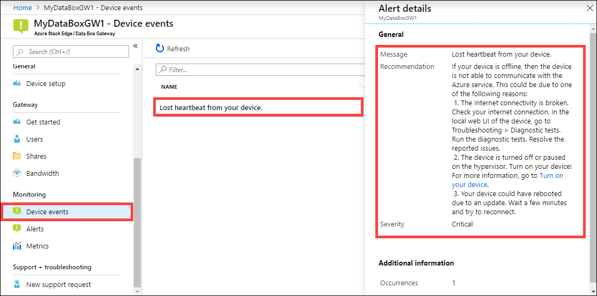

Take the following steps in the Azure portal to view a device event. 

1. In the Azure portal, go to your Azure Stack Edge / Data Box Gateway resource and then go to **Monitoring > Device events**.
2. Select an event and view the alert details. Take appropriate action to resolve the alert condition.

    