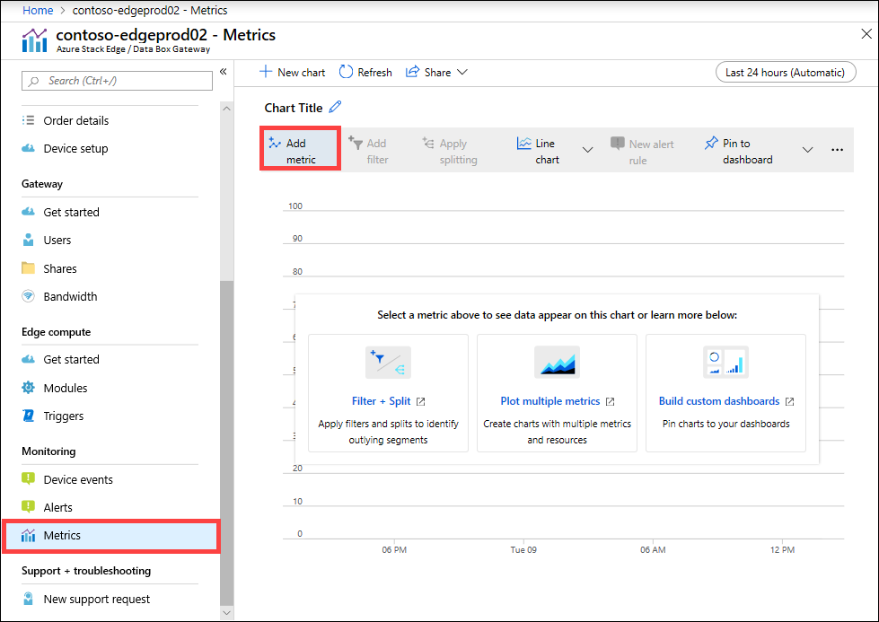
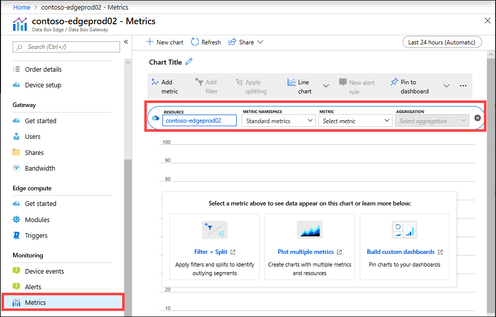
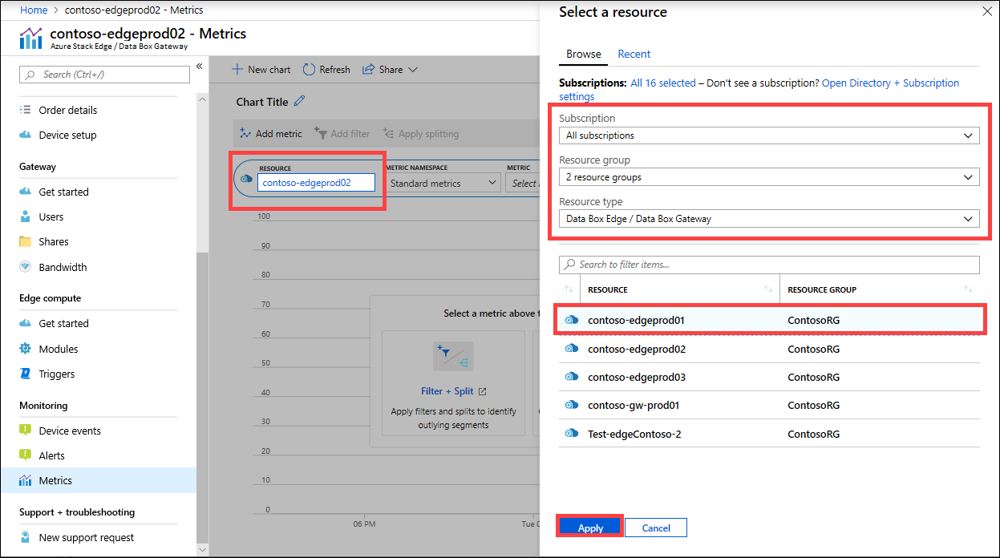
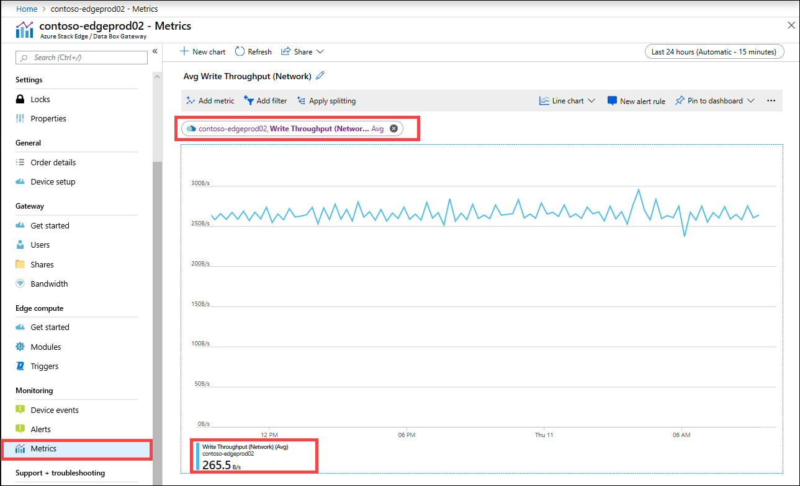
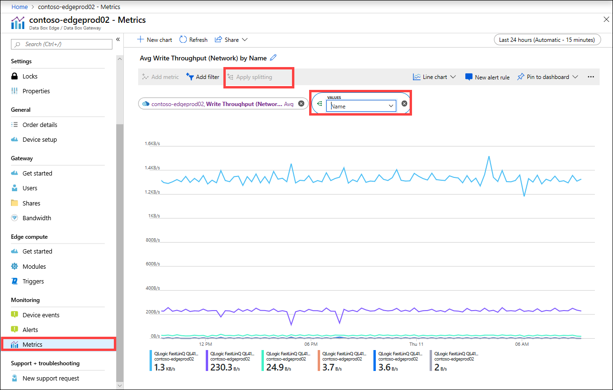
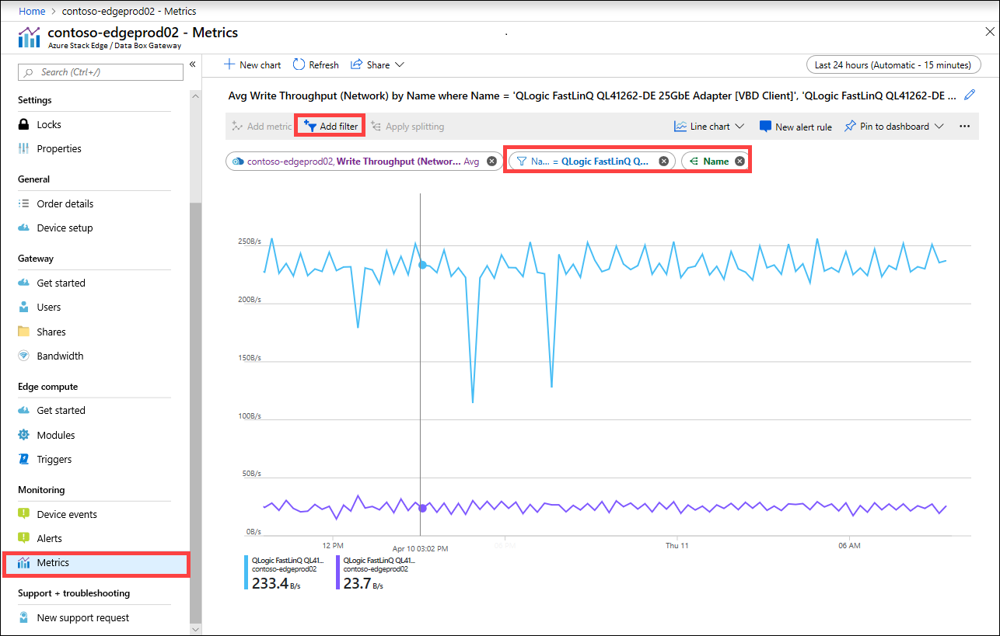
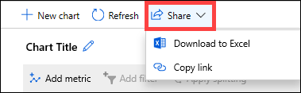

You can also view the metrics to monitor the performance of the device and in some instances for troubleshooting device issues.

Take the following steps in the Azure portal to create a chart for selected device metrics.

1. For your resource in the Azure portal, go to **Monitoring > Metrics** and select **Add metric**.

    

2. The resource is automatically populated.  

    

    To specify another resource, select the resource. On **Select a resource** blade, select the subscription, resource group, resource type, and the specific resource for which you want to show the metrics and select **Apply**.

    

3. From the dropdown list, select a metric to monitor your device. The metrics can be **Capacity metrics** or **Transaction metrics**. The capacity metrics are related to the capacity of the device. The transaction metrics are related to the read and write operations to Azure Storage.

    |Capacity metrics                     |Description  |
    |-------------------------------------|-------------|
    |**Available capacity**               | Refers to the size of the data that can be written to the device. In other words, this is the capacity that can be made available on the device.   You can free up the device capacity by deleting the local copy of files that have a copy on both the device as well as the cloud.        |
    |**Total capacity**                   | Refers to the total bytes on the device to write data to. This is also referred to as the total size of the local cache.    You can now increase the capacity of an existing virtual device by adding a data disk. Add a data disk through the hypervisor management for the VM and then restart your VM. The local storage pool of the Gateway device will expand to accommodate the newly added data disk.   For more information, go to [Add a hard drive for Hyper-V virtual machine](https://www.youtube.com/watch?v=EWdqUw9tTe4). |
    
    |Transaction metrics              | Description         |
    |-------------------------------------|---------|
    |**Cloud bytes uploaded (device)**    | Sum of all the bytes uploaded across all the shares on your device        |
    |**Cloud bytes uploaded (share)**     | Bytes uploaded per share. This can be:    Avg, which is the (Sum of all the bytes uploaded per share / Number of shares),    Max, which is the maximum number of bytes uploaded from a share   Min, which is the minimum number of bytes uploaded from a share      |
    |**Cloud download throughput (share)**| Bytes downloaded per share. This can be:    Avg, which is the (Sum of all bytes read or downloaded to a share / Number of shares)    Max, which is the maximum number of bytes downloaded from a share   and Min, which is the minimum number of bytes downloaded from a share  |
    |**Cloud read throughput**            | Sum of all the bytes read from the cloud across all the shares on your device     |
    |**Cloud upload throughput**          | Sum of all the bytes written to the cloud across all the shares on your device     |
    |**Cloud upload throughput (share)**  | Sum of all bytes written to the cloud from a share / # of shares is average, max, and min per share      |
    |**Read throughput (network)**           | Includes the system network throughput for all the bytes read from the cloud. This view can include data that is not restricted to shares.   Splitting will show the traffic over all the network adapters on the device. This includes adapters that are not connected or enabled.      |
    |**Write throughput (network)**       | Includes the system network throughput for all the bytes written to the cloud. This view can include data that is not restricted to shares.   Splitting will show the traffic over all the network adapters on the device. This includes adapters that are not connected or enabled.          |
    |**Edge compute - memory usage**      | This metric is not applicable for Data Box Gateway and hence not populated.          |
    |**Edge compute - percentage CPU**    | This metric is not applicable for Data Box Gateway and hence not populated.         |

4. When a metric is selected from the dropdown list, aggregation can also be defined. Aggregation refers to the actual value aggregated over a specified span of time. The aggregated values can be average, minimum, or the maximum value. Select the Aggregation from Avg, Max, or Min.

    

5. If the metric you selected has multiple instances, then the splitting option is available. Select **Apply splitting** and then select the value by which you want to see the breakdown.

    

6. If you now want to see the breakdown only for a few instances, you can filter the data. For example, in this case, if you want to see the network throughput only for the two connected network interfaces on your device, you could filter those interfaces. Select **Add filter** and specify the network interface name for filtering.

    

7. You could also pin the chart to dashboard for easy access.

    

8. To export chart data to an Excel spreadsheet or get a link to the chart that you can share, select the share option from the command bar.

    