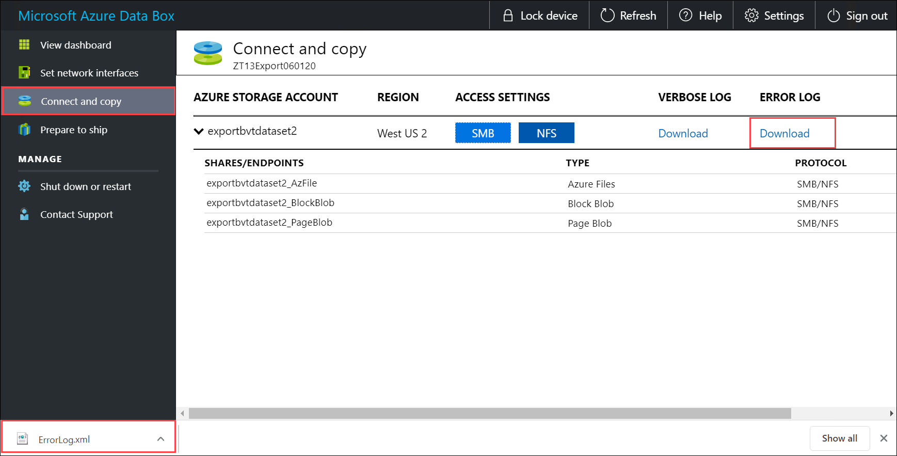

Before you begin the data copy:

1. Download the *copy log*. In the **Connect and copy** page, select **Copy log**. When prompted, save the log on your system. 

    If your copy log size is too large, you will need to use [Azure Storage Explorer](../articles/vs-azure-tools-storage-manage-with-storage-explorer.md?tabs=windows&toc=%2fazure%2fstorage%2fblobs%2ftoc.json) or [AzCopy](../articles/storage/common/storage-ref-azcopy.md?toc=%2fazure%2fstorage%2fblobs%2ftoc.json) in order to download the copy log and prevent any failures.

    * If you are using [Azure Storage Explorer](../articles/databox/data-box-deploy-copy-data-via-rest.md?branch=pr-en-us-193379) to download the copy log, you can map your Azure storage account in Azure Storage Explorer and then download the raw file.
    * If you are using [AzCopy](../articles/storage/common/storage-ref-azcopy-copy.md?toc=%2fazure%2fstorage%2fblobs%2ftoc.json) to download the copy log, you can use the `AzCopy copy` command to copy the log file from your storage account to your local system.

    

  
    Repeat the steps to download the *verbose log*. 

2. Review the *verbose log*. The *verbose log* contains a list of all the files that were successfully exported from Azure Storage account. The log also contains file size and checksum computation.

    ```powershell
    <File CloudFormat="BlockBlob" Path="validblobdata/test1.2.3.4" Size="1024" crc64="7573843669953104266">
    </File><File CloudFormat="BlockBlob" Path="validblobdata/helloEndWithDot..txt" Size="11" crc64="7320094093915972193">
    </File><File CloudFormat="BlockBlob" Path="validblobdata/test..txt" Size="12" crc64="17906086011702236012">
    </File><File CloudFormat="BlockBlob" Path="validblobdata/test1" Size="1024" crc64="7573843669953104266">
    </File><File CloudFormat="BlockBlob" Path="validblobdata/test1.2.3" Size="1024" crc64="7573843669953104266">
    </File><File CloudFormat="BlockBlob" Path="validblobdata/.......txt" Size="11" crc64="7320094093915972193">
    </File><File CloudFormat="BlockBlob" Path="validblobdata/copylogb08fa3095564421bb550d775fff143ed====..txt" Size="53638" crc64="1147139997367113454">
    </File><File CloudFormat="BlockBlob" Path="validblobdata/testmaxChars-123456790-123456790-123456790-123456790-123456790-123456790-123456790-123456790-123456790-123456790-123456790-123456790-123456790-123456790-123456790-123456790-123456790-123456790-123456790-123456790-12345679" Size="1024" crc64="7573843669953104266">
    </File><File CloudFormat="BlockBlob" Path="export-ut-container/file0" Size="0" crc64="0">
    </File><File CloudFormat="BlockBlob" Path="export-ut-container/file1" Size="0" crc64="0">
    </File><File CloudFormat="BlockBlob" Path="export-ut-container/file4096_000001" Size="4096" crc64="16969371397892565512">
    </File><File CloudFormat="BlockBlob" Path="export-ut-container/file4096_000000" Size="4096" crc64="16969371397892565512">
    </File><File CloudFormat="BlockBlob" Path="export-ut-container/64KB-Seed10.dat" Size="65536" crc64="10746682179555216785">
    </File><File CloudFormat="BlockBlob" Path="export-ut-container/LiveSiteReport_Oct.xlsx" Size="7028" crc64="6103506546789189963">
    </File><File CloudFormat="BlockBlob" Path="export-ut-container/NE_Oct_GeoReport.xlsx" Size="103197" crc64="13305485882546035852">
    </File><File CloudFormat="BlockBlob" Path="export-ut-container/64KB-Seed1.dat" Size="65536" crc64="3140622834011462581">
    </File><File CloudFormat="BlockBlob" Path="export-ut-container/1mbfiles-0-0" Size="1048576" crc64="16086591317856295272">
    </File><File CloudFormat="BlockBlob" Path="export-ut-container/file524288_000001" Size="524288" crc64="8908547729214703832">
    </File><File CloudFormat="BlockBlob" Path="export-ut-container/4mbfiles-0-0" Size="4194304" crc64="1339017920798612765">
    </File><File CloudFormat="BlockBlob" Path="export-ut-container/file524288_000000" Size="524288" crc64="8908547729214703832">
    </File><File CloudFormat="BlockBlob" Path="export-ut-container/8mbfiles-0-1" Size="8388608" crc64="3963298606737216548">
    </File><File CloudFormat="BlockBlob" Path="export-ut-container/1mbfiles-0-1" Size="1048576" crc64="11061759121415905887">
    </File><File CloudFormat="BlockBlob" Path="export-ut-container/XLS-10MB.xls" Size="1199104" crc64="2218419493992437463">
    </File><File CloudFormat="BlockBlob" Path="export-ut-container/8mbfiles-0-0" Size="8388608" crc64="1072783424245035917">
    </File><File CloudFormat="BlockBlob" Path="export-ut-container/4mbfiles-0-1" Size="4194304" crc64="9991307204216370812">
    </File><File CloudFormat="BlockBlob" Path="export-ut-container/VL_Piracy_Negtive10_TPNameAndGCS.xlsx" Size="12398699" crc64="13526033021067702820">
    </File>
    ``````

3. Review the *copy log* for any errors. This log indicates the files that could not be copied due to errors.

    Here is a sample output of copy log when there were no errors and all the files were copied during the data copy from Azure to Data Box device.

    ```powershell
    <CopyLog Summary="Summary">
      <Status>Succeeded</Status>
      <TotalFiles_Blobs>5521</TotalFiles_Blobs>
      <FilesErrored>0</FilesErrored>
    </CopyLog>
    ``` 
    Here is a sample output when the copy log has errors and some of the files failed to copy from Azure.

    ```powershell
    <ErroredEntity CloudFormat="AppendBlob" Path="export-ut-appendblob/wastorage.v140.3.0.2.nupkg">
      <Category>UploadErrorCloudHttp</Category>
      <ErrorCode>400</ErrorCode>
      <ErrorMessage>UnsupportBlobType</ErrorMessage>
      <Type>File</Type>
    </ErroredEntity><ErroredEntity CloudFormat="AppendBlob" Path="export-ut-appendblob/xunit.console.Primary_2020-05-07_03-54-42-PM_27444.hcsml">
      <Category>UploadErrorCloudHttp</Category>
      <ErrorCode>400</ErrorCode>
      <ErrorMessage>UnsupportBlobType</ErrorMessage>
      <Type>File</Type>
    </ErroredEntity><ErroredEntity CloudFormat="AppendBlob" Path="export-ut-appendblob/xunit.console.Primary_2020-05-07_03-54-42-PM_27444 (1).hcsml">
      <Category>UploadErrorCloudHttp</Category>
      <ErrorCode>400</ErrorCode>
      <ErrorMessage>UnsupportBlobType</ErrorMessage>
      <Type>File</Type>
    </ErroredEntity><CopyLog Summary="Summary">
      <Status>Failed</Status>
      <TotalFiles_Blobs>4</TotalFiles_Blobs>
      <FilesErrored>3</FilesErrored>
    </CopyLog>    
    ```

    You have the following options to export those files: 

    - You can transfer the files that could not be copied over the network. 
    - If your data size was larger than the usable device capacity, then a partial copy occurs and all the files that were not copied are listed in this log. You can use this log as an input XML to create a new Data Box order and then copy over these files.