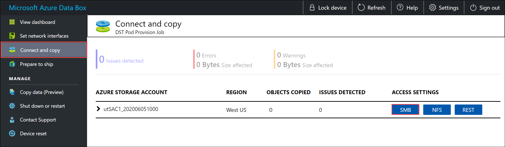

1. Sign in to the local Web UI on your device. Go to **Connect and copy**. Select **SMB** to get the access credentials for the shares associated with your storage account.<!--Verify step 1 for the local web UI.-->

    

2. In the **Access share and copy data** dialog box, copy the **Username** and the **Password** corresponding to the share. Then select **OK**.
    
    <!--Remove box from the copy icon for Storage Account.-->