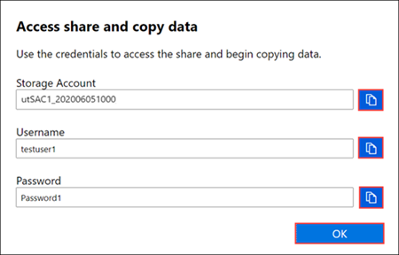

1. In the local web UI, go to **Connect and copy**. Select **SMB** to get the password for the shares associated with your storage account.

    

2. In the **Access share and copy data** dialog box, copy the **Password** corresponding to the share. Then select **OK**.

    
    <!--Remove box from the copy icon for Storage Account and User Name.-->