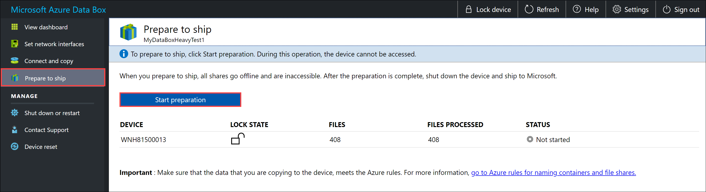
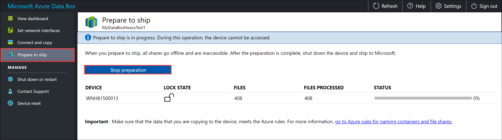
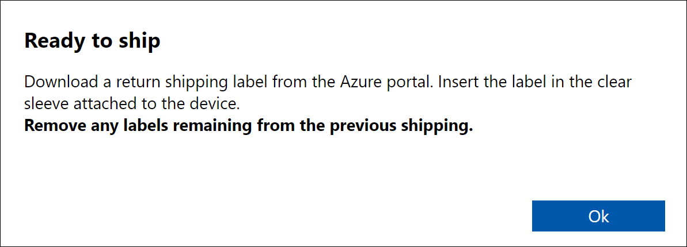
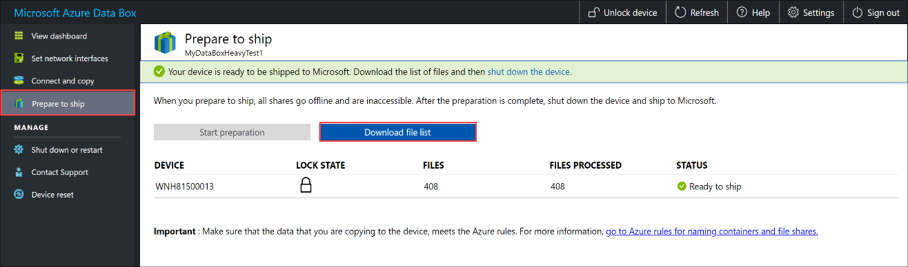
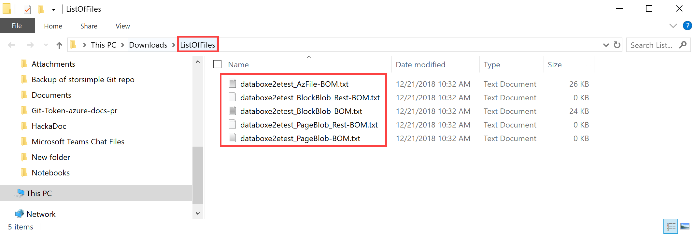
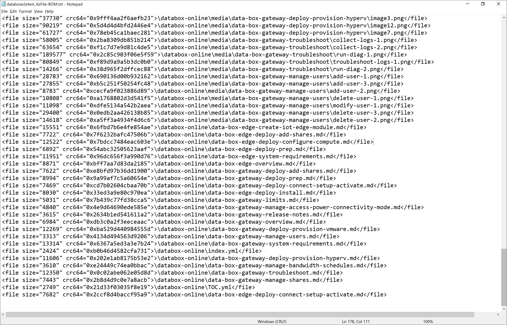
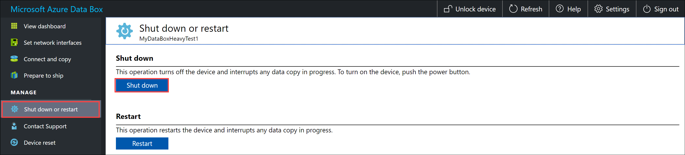

Final step is to prepare the device to ship. In this step, all the device shares are taken offline. The shares cannot be accessed once you start this process.

> [!IMPORTANT]
> Prepare to ship is required as it flags data that does not conform to Azure naming conventions. Skipping this step could result in potential data upload failures due to non-conforming data.

1. Go to **Prepare to ship** and click **Start preparation**. By default, checksums are computed while data is being copied. Prepare to ship completes the checksum computation and creates the list of files ( also known as *BOM files* or the manifest). The checksum computation can take hours to days depending upon the size of your data.
   
    

    If for any reason you want to stop the device preparation, click **Stop preparation**. You can resume the prepare to ship later.
        
    
    
2. The prepare to ship starts and the device shares go offline. You see a reminder to download the shipping label once the device is ready.

    

3. The device status updates to *Ready to ship* and the device is locked once the device preparation is complete.
        
    

    If you want to copy more data to the device, you can unlock the device, copy more data, and run prepare to ship again.

    If there are errors in this step, download the error log and resolve the errors. Once the errors are resolved, run **Prepare to ship**.

4. After the prepare to ship is successfully complete (with no errors), download the list of files ( also known as *BOM files* or the manifest) copied in this process. 

    

   You can later use this list to verify the files uploaded to Azure. For more information, see [Inspect BOM files during Prepare to ship](../articles/databox/data-box-logs.md#inspect-bom-during-prepare-to-ship).
        
    

5. Shut down the device. Go to **Shut down or restart** page and click **Shut down**. When prompted for confirmation, click **OK** to continue.

    

6. Repeat all the above steps for the other device node.
7. Once the device has completely shut down, all the LEDs at the back of the device would have turned off. The next step is to remove all the cables and ship the device to Microsoft.

