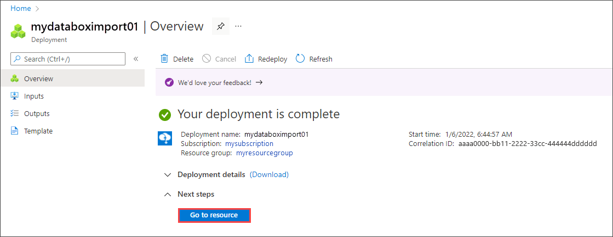

Do the following steps in the Azure portal to order a device:

1. Use your Microsoft Azure credentials to sign in at this URL: [https://portal.azure.com](https://portal.azure.com).
2. Select **+ Create a resource** and search for *Azure Data Box*. Select **Azure Data Box**.

    

3. Select **Create**.  

   

4. Check whether Data Box service is available in your region. Enter or select the following information, and then select **Apply**.

    |Setting  |Value  |
    |---------|---------|
    |Transfer type     | Select **Import to Azure**.        |
    |Subscription     | Select an EA, CSP, or Azure sponsorship subscription for Data Box service.   The subscription is linked to your billing account.       |
    |Resource group | Select an existing resource group. A resource group is a logical container for the resources that can be managed or deployed together. |
    |Source country/region    |    Select the country/region where your data currently resides.         |
    |Destination Azure region     |     Select the Azure region where you want to transfer data.   For more information, see [region availability for Data Box](../articles/databox/data-box-overview.md#region-availability) or [region availability for Data Box Heavy](../articles/databox/data-box-heavy-overview.md#region-availability). If the selected source and destination regions cross international country/region borders, Data Box and Data Box Heavy won't be available. |

    

5. Select the **Data Box** product to order, either Data Box, as shown below, or Data Box Heavy.

    For Data Box, the maximum usable capacity for a single order is 80 TB. For Data Box Heavy, the maximum usable capacity for a single order is 770 TB. You can create multiple orders for larger data sizes.

    You can't select Data Box or Data Box Heavy in either of these cases:

    - If the source and destination regions that you selected cross international country/region boundaries.

      To transfer your data across country/region borders, you can import your data to a destination in the same country/region and then use Azure Import/Export to transfer the data in Azure.

    - If your Azure subscription doesn't support the Data Box product. In some cases, your subscription might not support a Data Box product in a specific country/region.
    
    If you select **Data Box Heavy**, the Data Box team checks device availability in your region. They'll notify you when you can continue with the order.

    

6. In **Order**, go to the **Basics** tab. Enter or select the following information. Then select **Next: Data destination>**.

    |Setting  |Value  |
    |---------|---------|
    |Subscription      | The subscription is automatically populated based on your earlier selection.|
    |Resource group    | The resource group you selected previously. |
    |Import order name | Provide a friendly name to track the order. <ul><li>The name can have from 3 to 24 characters that can be a letter, number, or hyphen.</li><li>The name must start and end with a letter or a number.</li></ul>    |

    

7. On the **Data destination** screen, select the **Data destination** - either storage accounts or managed disks.

    The **Data destination** tab changes based on the destination you select. See either [To use storage accounts](#to-use-storage-accounts) or [To use managed disks](#to-use-managed-disks), below, for instructions. 

    #### To use storage accounts

    If using **storage account(s)** as the storage destination, you'll see the following screen.

    

    Based on the specified Azure region, select one or more storage accounts from the filtered list of existing storage accounts. Your Data Box can be linked with up to 10 storage accounts. You can also create a new **General-purpose v1**, **General-purpose v2**, or **Blob storage account**.

    - If you select Azure Premium FileStorage accounts, the provisioned quota on the storage account share will increase to the size of data being uploaded to the file shares. After the quota is increased, it isn't adjusted again, for example, if for some reason the Data Box can't upload your data.

      This quota is used for billing. After your data is uploaded to the datacenter, you should adjust the quota to meet your needs. For more information, see [Understanding billing](../articles/storage/files/understanding-billing.md).

    - If you're using a **General Purpose v1** or **General Purpose v2** storage account, you can enable large file shares to allow data uploads of up to 100 TiB per share. If large file shares aren't enabled, a data upload to Azure will fail once the 5-TiB standard share limit is reached.

      If you select a General Purpose v1 or General Purpose v2 storage account that supports Azure file shares and doesn't have large file shares enabled, you'll see an **Enable large file shares** button. To enable large file shares for one or more storage accounts, select **Enable large file shares**, and then enable large file shares on each storage account that will need large file shares.

      Once you enable large file shares on an account, the storage account is upgraded and this upgrade can't be reversed. For more information, see [Large file shares](../articles/storage/files/storage-how-to-create-file-share.md?tabs=azure-portal#enable-large-file-shares-on-an-existing-account).

      

    - If you are using a **General Purpose v1**, **General Purpose v2**, or **Blob** storage account, you will also see the **Enable copy to archive** option in addition to the **Enable large file shares** option. Enabling copy to archive will allow you to send your blobs to the archive tier automatically. This is done in two steps with each blob first being uploaded to the default access tier of the storage account and then its metadata updated to archive. Any data that is uploaded to the archive tier is offline and will need to be rehydrated before reading or modifying. 
    
        When copy to archive is enabled, you will see an extra archive share on the data box during the copy process.The extra share is available for [SMB, NFS, REST, and data copy service](../articles/databox/data-box-deploy-copy-data.md) methods. 

         :::image type="content" source="media/data-box-order-portal/enable-copy-to-archive.png" alt-text="Screenshot of Enable copy to archive option.":::

   

    > [!NOTE]
    > Storage accounts with virtual networks are supported. To allow the Data Box service to work with secured storage accounts, enable the trusted services within the storage account network firewall settings. For more information, see how to [Add Azure Data Box as a trusted service](../articles/storage/common/storage-network-security.md#exceptions).

    #### To use managed disks

    If using Data Box to create **Managed disk(s)** from on-premises virtual hard disks (VHDs), you will also need to provide the following information:

    |Setting  |Value  |
    |---------|---------|
    |Resource groups     | Create new resource groups if you intend to create managed disks from on-premises VHDs. You can use an existing resource group only if the resource group was created previously when creating a Data Box order for managed disks by the Data Box service.   Specify multiple resource groups separated by semi-colons. A maximum of 10 resource groups are supported.|

    

    The storage account specified for managed disks is used as a staging storage account. The Data Box service uploads the VHDs as page blobs to the staging storage account before converting the page blobs to managed disks and moving them to the resource groups. For more information, see [Verify data upload to Azure](../articles/databox/data-box-deploy-picked-up.md#verify-data-has-uploaded-to-azure).

    > [!NOTE]
    > If a page blob isn't successfully converted to a managed disk, it stays in the storage account and you're charged for storage.

8. Select **Next: Security>** to continue.

    The **Security** screen lets you use your own encryption key and your own device and share passwords, and choose to use double encryption.

    All settings on the **Security** screen are optional. If you don't change any settings, the default settings will apply.

    

9. If you want to use your own customer-managed key to protect the unlock passkey for your new resource, expand **Encryption type**.

    Configuring a customer-managed key for your Azure Data Box is optional. By default, Data Box uses a Microsoft managed key to protect the unlock passkey.

    A customer-managed key doesn't affect how data on the device is encrypted. The key is only used to encrypt the device unlock passkey.

    If you don't want to use a customer-managed key, skip to Step 15.

   

10. To use a customer-managed key, select **Customer managed key** as the key type. Then choose **Select a key vault and key**.
   
    

11. In the **Select key from Azure Key Vault** blade:

    - The **Subscription** is automatically populated.

    - For **Key vault**, you can select an existing key vault from the dropdown list.

      

      Or select **Create new key vault** if you want to create a new key vault. 
    
      

      Then, on the **Create key vault** screen, enter the resource group and a key vault name. Ensure that **Soft delete** and **Purge protection** are enabled. Accept all other defaults, and select **Review + Create**.

      

      Review the information for your key vault, and select **Create**. Wait for a couple minutes for key vault creation to complete.

      

12. The **Select a key** blade will display your selected key vault.

    

    If you want to create a new key, select **Create new key**. You must use an RSA key. The size can be 2048 or greater. Enter a name for your new key, accept the other defaults, and select **Create**.

      

      You'll be notified when the key has been created in your key vault. Your new key will be selected and displayed on the **Select a key** blade.

13. Select the **Version** of the key to use, and then choose **Select**.

      

    If you want to create a new key version, select **Create new version**.

    

    Choose settings for the new key version, and select **Create**.

    

    The **Encryption type** settings on the **Security** screen show your key vault and key.

    

14. Select a user identity that you'll use to manage access to this resource. Choose **Select a user identity**. In the panel on the right, select the subscription and the managed identity to use. Then choose **Select**.

    A user-assigned managed identity is a stand-alone Azure resource that can be used to manage multiple resources. For more information, see [Managed identity types](../articles/active-directory/managed-identities-azure-resources/overview.md).  

    If you need to create a new managed identity, follow the guidance in [Create, list, delete, or assign a role to a user-assigned managed identity using the Azure portal](../articles/active-directory/managed-identities-azure-resources/how-to-manage-ua-identity-portal.md).
    
    

    The user identity is shown in **Encryption type** settings.

    

    > [!IMPORTANT]
    > If you use a customer-managed key, you must enable the `Get`, `UnwrapKey`, and `WrapKey` permissions on the key. Without these permissions, order creation will fail. They're also needed during data copy. To set the permissions in Azure CLI, see [az keyvault set-policy](/cli/azure/keyvault#az-keyvault-set-policy).

16. If you don't want to use the system-generated passwords that Azure Data Box uses by default, expand **Bring your own password** on the **Security** screen.

    The system-generated passwords are secure, and are recommended unless your organization requires otherwise.

     

   - To use your own password for your new device, by **Set preference for the device password**, select **Use your own password**, and type a password that meets the security requirements.
     
     The password must be alphanumeric and contain from 12 to 15 characters, with at least one uppercase letter, one lowercase letter, one special character, and one number.

     - Allowed special characters: @ # - $ % ^ ! + = ; : _ ( )
     - Characters not allowed: I i L o O 0
   
     

 - To use your own passwords for shares:

   1. By **Set preference for share passwords**, select **Use your own passwords** and then **Select passwords for the shares**.
     
       

    1. Type a password for each storage account in the order. The password will be used on all shares for the storage account.
    
       The password must be alphanumeric and contain from 12 to 64 characters, with at least one uppercase letter, one lowercase letter, one special character, and one number.

       - Allowed special characters: @ # - $ % ^ ! + = ; : _ ( )
       - Characters not allowed: I i L o O 0
     
    1. To use the same password for all of the storage accounts, select **Copy to all**. 

    1. When you finish, select **Save**.
     
       

    On the **Security** screen, you can use **View or change passwords** to change the passwords.

17. In **Security**, if you want to enable software-based double encryption, expand **Double-encryption (for highly secure environments)**, and select **Enable double encryption for the order**.

    

    The software-based encryption is performed in addition to the  AES-256 bit encryption of the data on the Data Box.

    > [!NOTE]
    > Enabling this option could make order processing and data copy take longer. You can't change this option after you create your order.

    Select **Next: Contact details>** to continue.

18. In **Contact details**, select **+ Add Address**.

    

19. On the **Add address** screen, provide your first and last name, the name and postal address of the company, and a valid phone number. Select **Validate address**. The service validates the address for service availability and notifies you if service is available for that address.

    

    If you selected self-managed shipping, you will receive an email notification after the order is placed successfully. For more information about self-managed shipping, see [Use self-managed shipping](../articles/databox/data-box-portal-customer-managed-shipping.md).

20. Select **Add shipping address** once the shipping details have been validated successfully. You will return to the **Contact details** tab.

21. Beside **Email**, add one or more email addresses. The service sends email notifications regarding any updates to the order status to the specified email addresses.

    We recommend that you use a group email so that you continue to receive notifications if an admin in the group leaves.

    

    Select **Review + Order** to continue.

21. In **Review + Order**:

    1. Review the information in **Review + Order** related to the order, contact details, notification, and privacy terms. 
    
    1. Check the box corresponding to the agreement to privacy terms. When you select the checkbox, the order information is validated.

    1. Once the order is validated, select **Order**.
    
        :::image type="content" source="media/data-box-order-portal/data-box-import-10.png" alt-text="Screenshot of the Review Plus Order tab for a Data Box order. The validation status, terms checkbox, and Order button are highlighted.":::

    The order takes a few minutes to be created. Your completed order will look similar to this one. You can select **Go to resource** to open the order.

    

