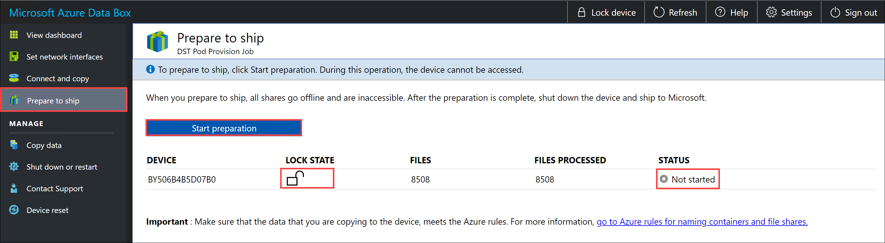
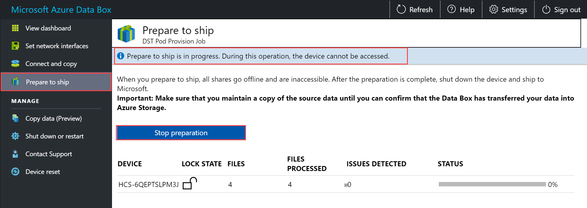
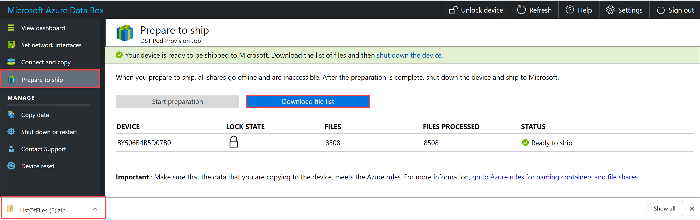

Final step is to prepare the device to ship. In this step, all the device shares are taken offline. The shares cannot be accessed once you start preparing the device to ship.
1. Go to **Prepare to ship** and click **Start preparation**. 
   
    

2. By default, checksums are computed inline during the prepare to ship. The checksum computation may take some time depending upon the size of your data. Click **Start preparation**.
    1. The device shares go offline and the device is locked when we prepare to ship.
        
         
   
    2. The device status updates to *Ready to ship* once the device preparation is complete. 
        
        

    3. Download the list of files (manifest) that were copied in this process. You can later use this list to verify the files uploaded to Azure.
        
        

3. Shut down the device. Go to **Shut down or restart** page and click **Shut down**. When prompted for confirmation, click **OK** to continue.
4. Remove the cables. The next step is to ship the device to Microsoft.
