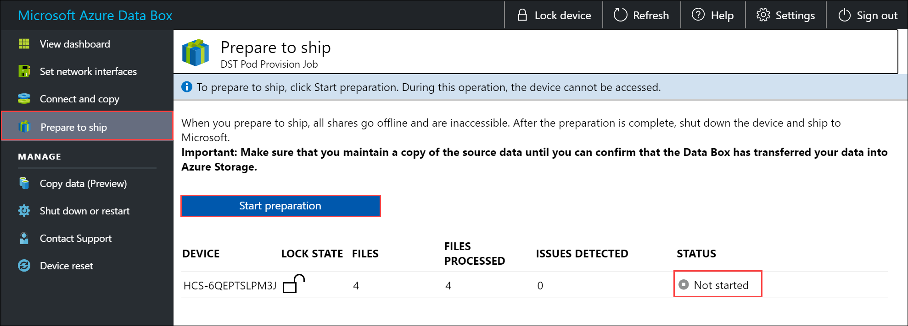
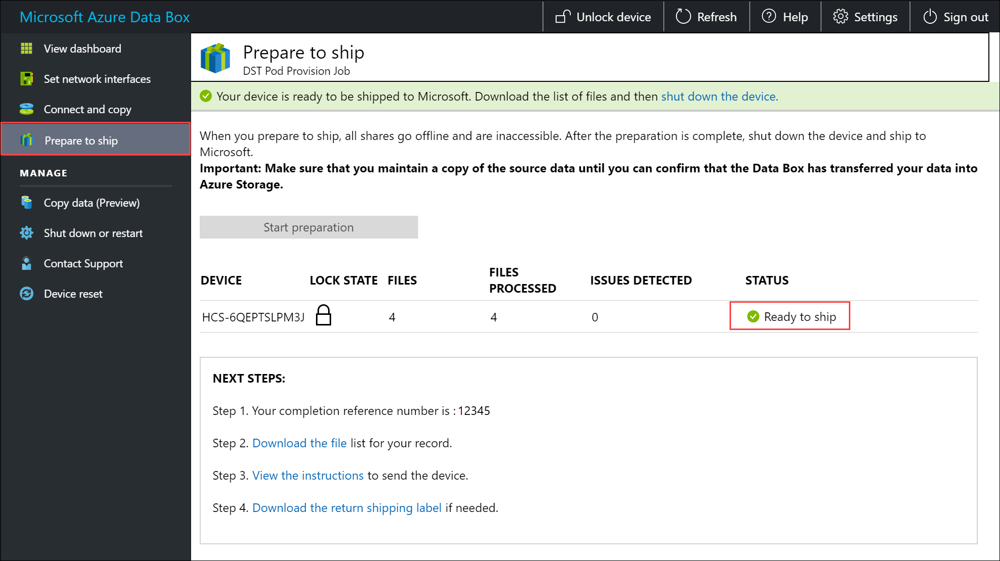
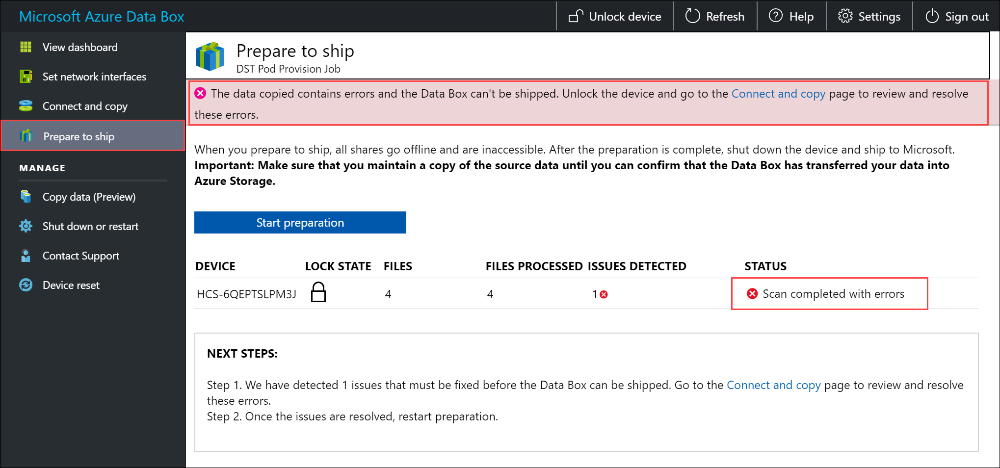
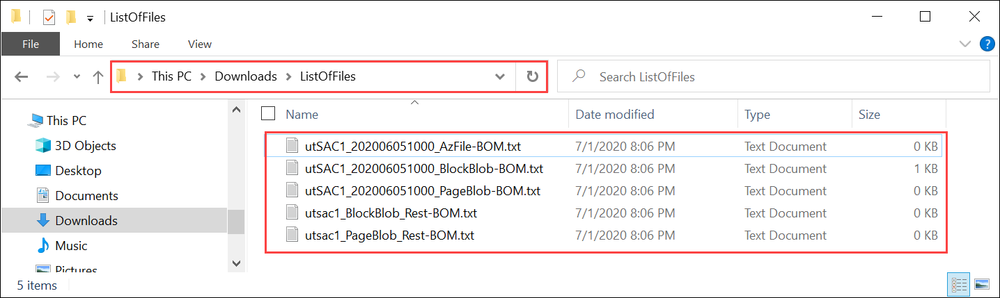

Final step is to prepare the device to ship. In this step, all the device shares are taken offline. The shares cannot be accessed once you start this process.

> [!IMPORTANT]
> Prepare to ship is required as it flags data that does not conform to Azure naming conventions. This step prevents potential data upload failures due to non-conforming data.

1. Go to **Prepare to ship** and click **Start preparation**. By default, checksums are computed while data is being copied. Prepare to ship completes the checksum computation and creates the list of files ( *-BOM files*). The checksum computation can take hours to days depending upon the size of your data. 
   
    

    If for any reason you want to stop the device preparation, click **Stop preparation**. You can resume the prepare to ship later.
        
    
    
2. The prepare to ship starts and the device shares go offline. <!--You see a reminder to download the shipping label once the device is ready.--> The device status updates to *Ready to ship* and the device is locked once the device preparation is complete.
        
    

    If you want to copy more data to the device, you can unlock the device, copy more data, and run prepare to ship again.

    If there are errors in this step, the status updates to *Scan completed with errors*. Unlock the device and go to **Connect and copy** page, download the issues list, and resolve the errors.

    

    If you have enabled the **copy to archive** option and you have not copied data into the Block Blob (Archive) shares, make sure to do so to prevent the following error:

    :::image type="content" source="media/data-box-prepare-to-ship/prepare-to-ship-no-data-copy-archive.png" alt-text="Screenshot of no data archive error.":::

    After the errors are resolved, run **Prepare to ship**.

4. After the prepare to ship is successfully complete (with no errors), follow these steps:

    1. Make a note of the completion reference number. Depending on the country/region in which you are, this number may be required for different operations.
    2. Download the list of files (also known as the manifest) copied in this process. You can later use this list to verify the files uploaded to Azure. For more information, see [Inspect BOM files during Prepare to ship](../articles/databox/data-box-logs.md#inspect-bom-during-prepare-to-ship).
        
        
    3. Select and download the shipping instructions for the device. The shipping instructions are different depending on the country/region in which you are located.
    4. If the E-ink is not displaying the shipping label, you can download the [reverse shipment label](../articles/databox/data-box-portal-admin.md). Make sure you have the shipping label before you shut down and disconnect the device.

5. Shut down the device. Go to **Shut down or restart** page and click **Shut down**. When prompted for confirmation, click **OK** to continue.

6. Remove the cables. The next step is to ship the device to Microsoft.