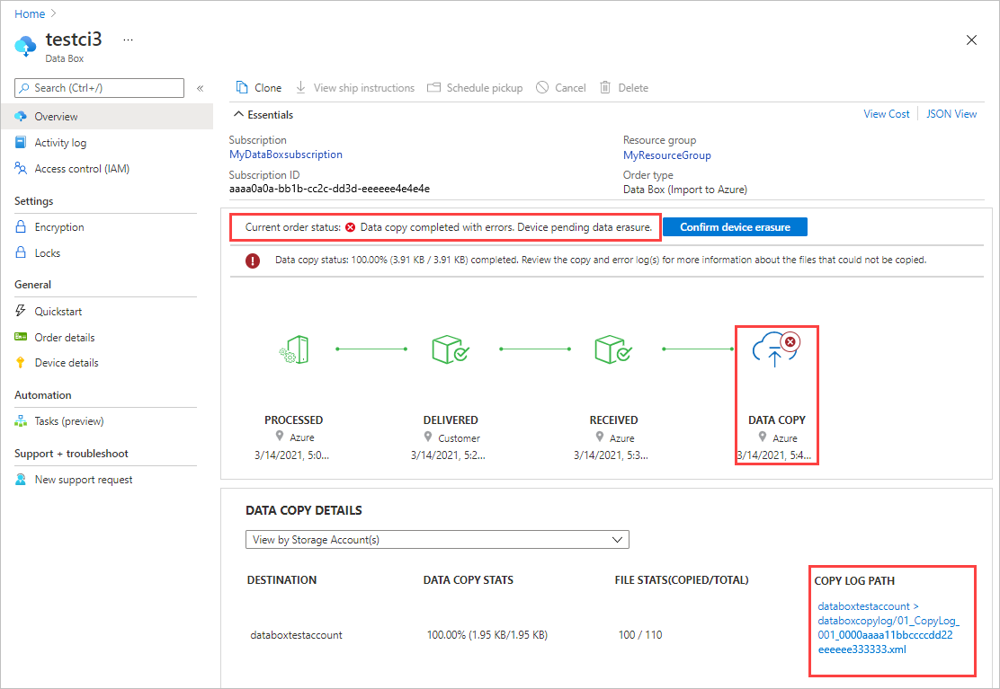
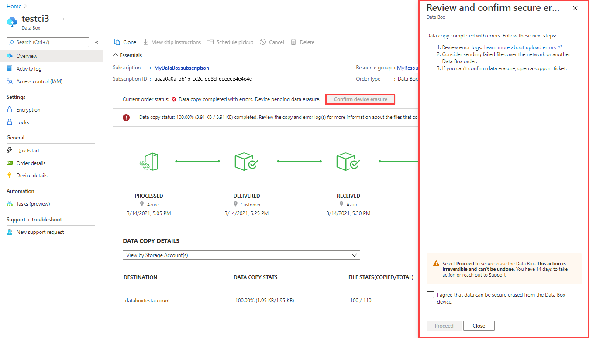
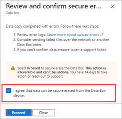
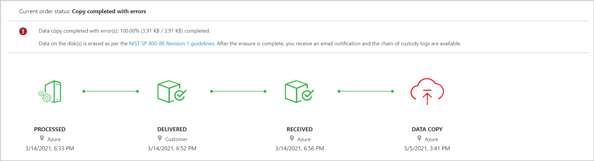

To review non-retryable errors and proceed with your order, do the following:

1. Open your order in the Azure portal.  

   If any non-retryable errors prevented files from uploading, you'll see the following notification. The current order status will be **Data copy completed with errors. Device pending data erasure.**

   

   Make a note of the **COPY LOG PATH** in **DATA COPY DETAILS**. You'll review the errors in the data copy log.

   > [!NOTE]
   > [!INCLUDE [data-box-copy-logs-behind-firewall](data-box-copy-logs-behind-firewall.md)]

2. Select **Confirm device erasure** to open a review panel.

   

3. Review the errors in the data copy log using the copy log path that you made a note of earlier. If you need to, you can select **Close** to display the path again. 

   You'll need to fix any configuration issues before you try another upload via a network transfer or a new import order. <!--For guidance, see [Review copy errors in uploads from Azure Data Box and Azure Data Box Heavy devices](../articles/databox/data-box-troubleshoot-data-upload.md). - To make the Include, I needed to move this reference out of the main procedure.-->

4. After you review the errors, select the check box to acknowledge that you're ready to proceed with data erasure. Then select **Proceed**.

   

   After the data is secure erased from the device, the order status is updated to **Copy completed with errors**.

   

   If you don't take any action, the order completes automatically after 14 days.

