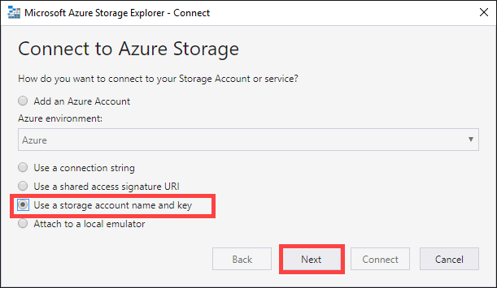
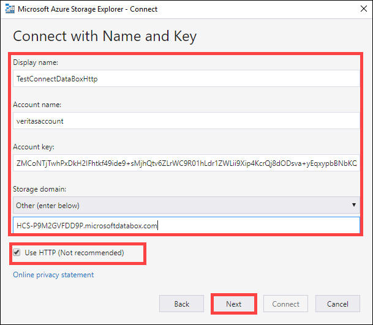
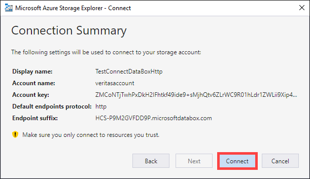
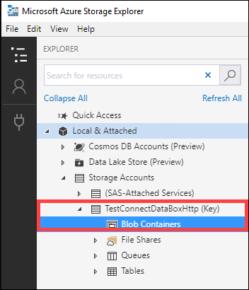

Follow these steps to connect to the storage account and verify the connection.

1. In Storage Explorer, open the **Connect to Azure Storage** dialog. In the **Connect to Azure Storage** dialog, select **Use a storage account name and key**.

    

2. Paste your **Account name** and **Account key** (key 1 value from the **Connect and copy** page in the local web UI). Select Storage endpoints domain as **Other (enter below)** and then provide the blob service endpoint as shown below. Check **Use HTTP** option only if transferring over *http*. If using *https*, leave the option unchecked. Select **Next**.

        

3. In the **Connection Summary** dialog, review the provided information. Select **Connect**.

    

4. The account that you successfully added is displayed in the left pane of Storage Explorer with (External, Other) appended to its name. Click **Blob Containers** to view the container.

    
