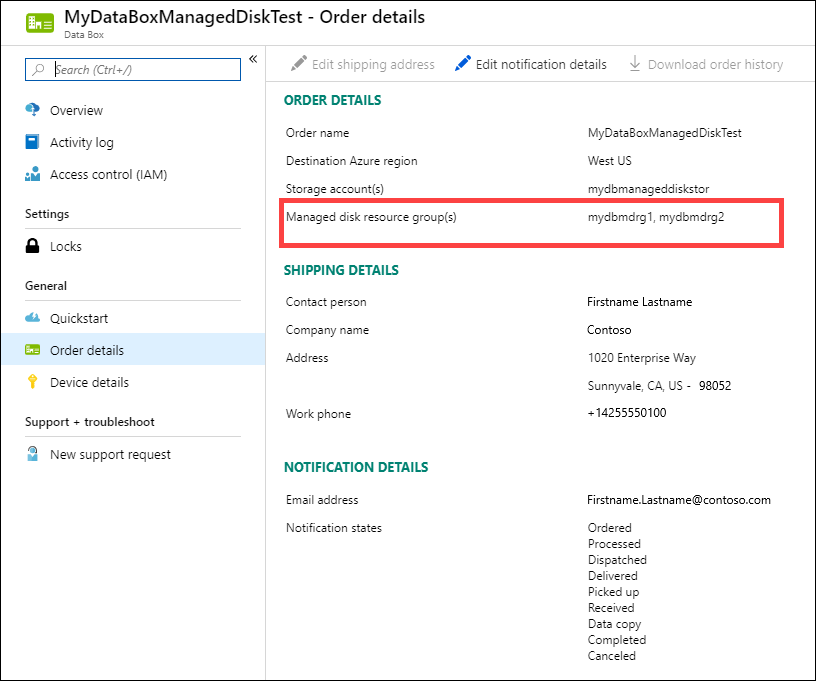
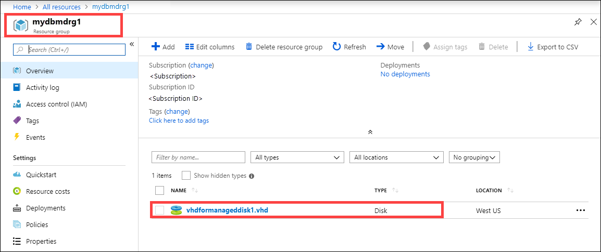

When Microsoft receives and scans the device, order status is updated to **Received**. The device then undergoes physical verification for damage or signs of tampering.

After the verification is complete, the Data Box is connected to the network in the Azure datacenter. The data copy starts automatically. Depending upon the data size, the copy operation may take a few hours to days to complete. You can monitor the copy job progress in the portal.

### Review copy errors from upload

When files fail to upload because of an non-retryable error, you're notified to review the errors before proceeding. The errors are listed in the data copy log.

You can't fix these errors. The upload has completed with errors. The notification lets you know about any configuration issues you need to fix before you try another upload via network transfer or a new import order. For guidance, see [Review copy errors in uploads from Azure Data Box and Azure Data Box Heavy devices](../articles/databox/data-box-troubleshoot-data-upload.md).

When you confirm that you've reviewed the errors and are ready to proceed, the data will be secure erased from the device. The order is completed automatically after 14 days. By acting on the notification, you can move things along more quickly.

[!INCLUDE [data-box-review-nonretryable-errors](data-box-review-nonretryable-errors.md)]

### Verify data in completed upload

Once the data upload is complete, order status updates to **Completed**.

Verify that your data is uploaded to Azure before you delete it from the source. Your data can be in:

- Your Azure Storage account(s). When you copy the data to Data Box, the data is uploaded to one of the following paths in your Azure Storage account:

  - For block blobs and page blobs: `https://<storage_account_name>.blob.core.windows.net/<containername>/files/a.txt`
  - For Azure Files: `https://<storage_account_name>.file.core.windows.net/<sharename>/files/a.txt`

    Alternatively, you could go to your Azure storage account in Azure portal and navigate from there.

- Your managed disk resource group(s). When creating managed disks, the VHDs are uploaded as page blobs and then converted to managed disks. The managed disks are attached to the resource groups specified at the time of order creation. 

    - If your copy to managed disks in Azure was successful, you can go to the **Order details** in the Azure portal and make a note of the resource groups specified for managed disks.

        

        Go to the noted resource group and locate your managed disks.

        

    - If you copied a VHDX or a dynamic or differencing VHD, the VHDX or VHD is uploaded to the staging storage account as a page blob, but the conversion of the VHD to a managed disk will fail. Go to your staging **Storage account > Blobs**, and select the appropriate container - Standard SSD, Standard HDD, or Premium SSD. The VHDs are uploaded as page blobs in your staging storage account and accrue charges.

## Erasure of data from Data Box
 
Once the upload to Azure is complete, the Data Box erases the data on its disks as per the [NIST SP 800-88 Revision 1 guidelines](https://csrc.nist.gov/News/2014/Released-SP-800-88-Revision-1,-Guidelines-for-Medi).

## Next steps

In this tutorial, you learned about Azure Data Box topics such as:

> [!div class="checklist"]
> * Prerequisites
> * Ship Data Box to Microsoft
> * Verify data upload to Azure
> * Erasure of data from Data Box

Advance to the following article to learn how to manage Data Box via the local web UI.

> [!div class="nextstepaction"]
> [Use local web UI to administer Azure Data Box](../articles/databox/data-box-local-web-ui-admin.md)