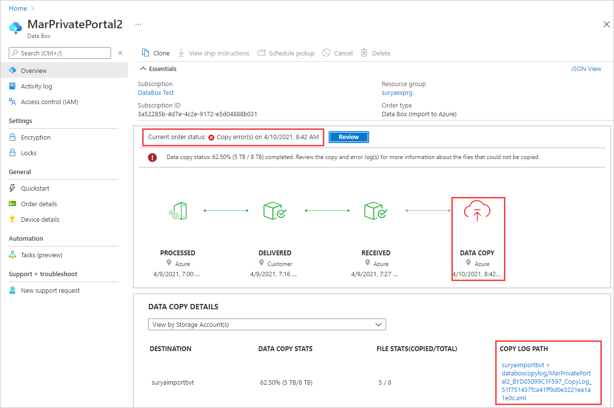
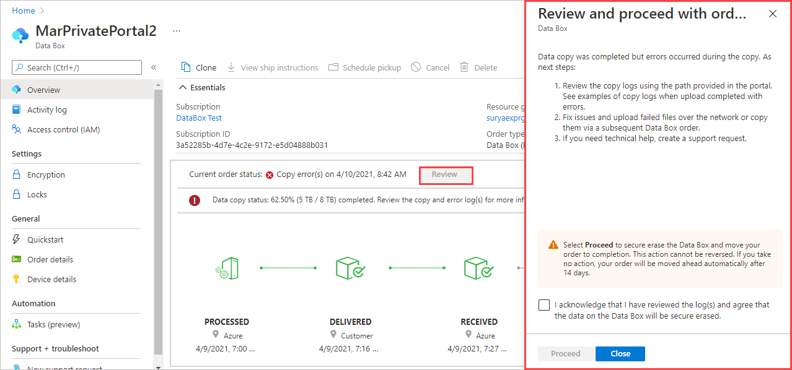
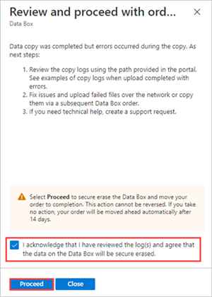

When the Data Box device is connected to the Azure datacenter network, the data upload to Azure starts automatically.

#### Upload completed with errors

When files fail to upload because of an un-retryable error, the upload is paused, and you're notified to review the errors. To resume the upload, you'll need to confirm that you've reviewed the errors and want to proceed.

You can't fix the errors. The upload will complete with errors. The notification is to make sure you know about any files that failed to upload so you can fix the issues for a future upload or network transfer.

It also gives you a chance to make sure you have backup copies of the files that didn't upload before the data is secure erased from the Data Box.

After 14 days, the upload will be completed automatically. By acting on the notification, you can move things along more quickly.

To review errors for a paused upload, do the following:

1. Open your order in the Azure portal.

   When an upload is paused, you'll see the following notification. The order status will be **Copy errors.** You'll find a link to the copy log in the **DATA COPY DETAILS**.

   

2. Select **Review** to open a panel for managing your review.

   

3. Review the errors in the copy log using the path in **DATA COPY DETAILS**. For troubleshooting information, see [Troubleshoot paused data uploads from Azure Data Box and Azure Data Box Heavy devices](../articles/databox/data-box-troubleshoot-data-upload.md).

   You can't fix the errors. The upload will complete with errors. After the upload completes, the data will be secure erased from the device.

   The notification lets you know about any configuration issues you need to fix before you try another upload via network transfer or a new import order.

4. Make sure you have backup copies of the files that failed to upload. After the upload completes, the data will be secure erased from the Data Box.

5. Select the check box to acknowledge that you've reviewed the errors, understand that the data will be erased from the Data Box after the upload, and are ready to proceed.

6. When you're ready to complete the upload, select **Proceed**.

   <!--Reshoot after getting the scale right.-->

   The upload will be completed automatically after 14 days.

#### Verify completed data upload

After the copy completes, the Azure Data Box service notifies you that the data copy is complete via the Azure portal.

1. Check the error logs for any failures, and take appropriate actions. For more information, see [Review copy log during upload to Azure](../articles/databox/data-box-logs.md#review-copy-log-during-upload-to-azure).

2. In the Azure portal, verify that your data is in the storage account(s) before you delete the data from the source.
