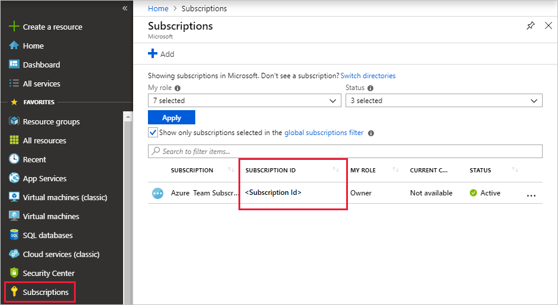
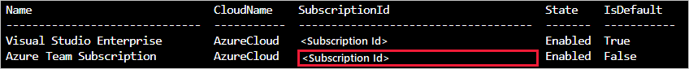
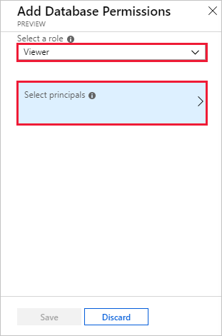
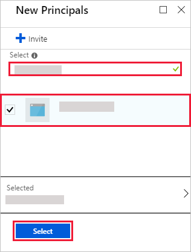

## Configure the data source

You perform the following steps to configure Azure Data Explorer as a data source for your dashboard tool. We'll cover these steps in more detail in this section:

1. Create an Azure Active Directory (Azure AD) service principal. The service principal is used by your dashboard tool to access the Azure Data Explorer service.

1. Add the Azure AD service principal to the *viewers* role in the Azure Data Explorer database.

1. Specify your dashboard tool connection properties based on information from the Azure AD service principal, then test the connection.

### Create a service principal

You can create the service principal in the [Azure portal](#azure-portal) or using the [Azure CLI](#azure-cli) command-line experience. Regardless of which method you use, after creation you get values for four connection properties that you'll use in later steps.

#### Azure portal

1. To create the service principal, follow the instructions in the [Azure portal documentation](/azure/active-directory/develop/howto-create-service-principal-portal).

    1. In the [Assign the application to a role](/azure/active-directory/develop/howto-create-service-principal-portal#assign-a-role-to-the-application) section, assign a role type of **Reader** to your Azure Data Explorer cluster.

    1. In the [Get values for signing in](/azure/active-directory/develop/howto-create-service-principal-portal#get-values-for-signing-in) section, copy the three property values covered in the steps: **Directory ID** (tenant ID), **Application ID**, and **Password**.

1. In the Azure portal, select **Subscriptions** then copy the ID for the subscription in which you created the service principal.

    

#### Azure CLI

1. Create a service principal. Set an appropriate scope and a role type of `reader`.

    ```azurecli
    az ad sp create-for-rbac --name "https://{UrlToYourDashboard}:{PortNumber}" --role "reader" \
                             --scopes /subscriptions/{SubID}/resourceGroups/{ResourceGroupName}
    ```

    For more information, see [Create an Azure service principal with Azure CLI](/cli/azure/create-an-azure-service-principal-azure-cli).

1. The command returns a result set like the following. Copy the three property values: **appID**, **password**, and **tenant**.


    ```json
    {
      "appId": "XXXXXXXX-XXXX-XXXX-XXXX-XXXXXXXXXXXX",
      "displayName": "{UrlToYourDashboard}:{PortNumber}",
      "name": "https://{UrlToYourDashboard}:{PortNumber}",
      "password": "XXXXXXXX-XXXX-XXXX-XXXX-XXXXXXXXXXXX",
      "tenant": "XXXXXXXX-XXXX-XXXX-XXXX-XXXXXXXXXXXX"
    }
    ```

1. Get a list of your subscriptions.

    ```azurecli
    az account list --output table
    ```

    Copy the appropriate subscription ID.

    

### Add the service principal to the viewers role

Now that you have a service principal, you add it to the *viewers* role in the Azure Data Explorer database. You can perform this task under **Permissions** in the Azure portal, or under **Query** by using a management command.

#### Azure portal - Permissions

1. In the Azure portal, go to your Azure Data Explorer cluster.

1. In the **Overview** section, select the database with the StormEvents sample data.

    

1. Select **Permissions** then **Add**.

    

1. Under **Add database permissions**, select the **Viewer** role then **Select principals**.

    

1. Search for the service principal you created. Select the principal, then **Select**.

    

1. Select **Save**.

    

#### Management command - Query

1. In the Azure portal, go to your Azure Data Explorer cluster, and select **Query**.

    

1. Run the following command in the query window. Use the application ID and tenant ID from the Azure portal or CLI.

    ```kusto
    .add database {TestDatabase} viewers ('aadapp={ApplicationID};{TenantID}')
    ```

    The command returns a result set like the following. In this example, the first row is for an existing user in the database, and the second row is for the service principal that was just added.

    
