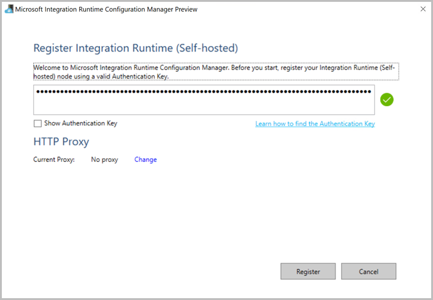
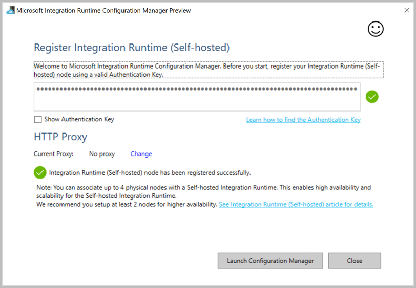
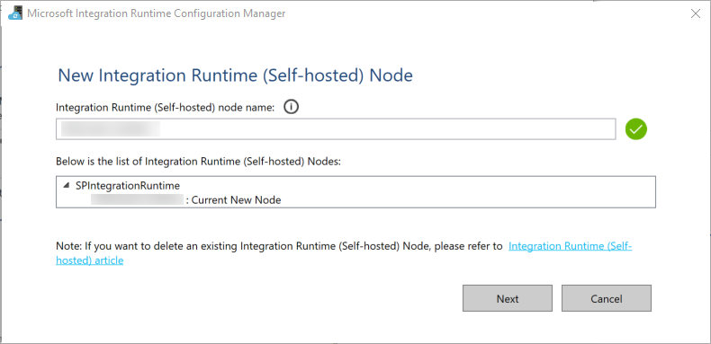
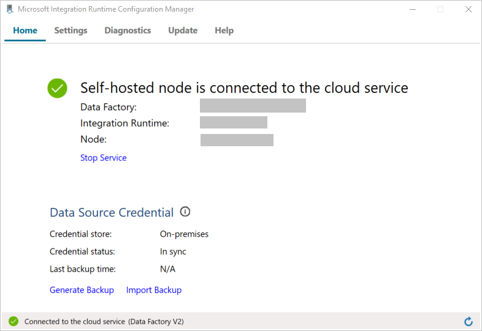

## Create a self-hosted integration runtime

In this section, you create a self-hosted integration runtime and associate it with an on-premises machine with the SQL Server database. The self-hosted integration runtime is the component that copies data from SQL Server on your machine to Azure Blob storage. 

1. Create a variable for the name of the integration runtime. Use a unique name, and make a note of it. You use it later in this tutorial. 

    ```powershell
   $integrationRuntimeName = "ADFTutorialIR"
    ```
2. Create a self-hosted integration runtime. 

   ```powershell
   Set-AzDataFactoryV2IntegrationRuntime -Name $integrationRuntimeName -Type SelfHosted -DataFactoryName $dataFactoryName -ResourceGroupName $resourceGroupName
   ```

   Here is the sample output:

   ```json
    Id                : /subscriptions/<subscription ID>/resourceGroups/ADFTutorialResourceGroup/providers/Microsoft.DataFactory/factories/onpremdf0914/integrationruntimes/myonpremirsp0914
    Type              : SelfHosted
    ResourceGroupName : ADFTutorialResourceGroup
    DataFactoryName   : onpremdf0914
    Name              : myonpremirsp0914
    Description       :
    ```
  
3. To retrieve the status of the created integration runtime, run the following command. Confirm that the value of the **State** property is set to **NeedRegistration**. 

   ```powershell
   Get-AzDataFactoryV2IntegrationRuntime -name $integrationRuntimeName -ResourceGroupName $resourceGroupName -DataFactoryName $dataFactoryName -Status
   ```

   Here is the sample output:

   ```json
   Nodes                     : {}
   CreateTime                : 9/14/2017 10:01:21 AM
   InternalChannelEncryption :
   Version                   :
   Capabilities              : {}
   ScheduledUpdateDate       :
   UpdateDelayOffset         :
   LocalTimeZoneOffset       :
   AutoUpdate                :
   ServiceUrls               : {eu.frontend.clouddatahub.net, *.servicebus.windows.net}
   ResourceGroupName         : <ResourceGroup name>
   DataFactoryName           : <DataFactory name>
   Name                      : <Integration Runtime name>
   State                     : NeedRegistration
   ```

4. To retrieve the authentication keys used to register the self-hosted integration runtime with Azure Data Factory service in the cloud, run the following command: 

   ```powershell
   Get-AzDataFactoryV2IntegrationRuntimeKey -Name $integrationRuntimeName -DataFactoryName $dataFactoryName -ResourceGroupName $resourceGroupName | ConvertTo-Json
   ```

   Here is the sample output:

   ```json
   {
       "AuthKey1":  "IR@0000000000-0000-0000-0000-000000000000@xy0@xy@xxxxxxxxxxxxxxxxxxxxxxxxxxxxxxxxxxxxxxxx=",
       "AuthKey2":  "IR@0000000000-0000-0000-0000-000000000000@xy0@xy@yyyyyyyyyyyyyyyyyyyyyyyyyyyyyyyyyyyyyyyy="
   }
   ```    

5. Copy one of the keys (exclude the double quotation marks) used to register the self-hosted integration runtime that you install on your machine in the following steps.  

## Install the integration runtime
1. If you already have the integration runtime on your machine, uninstall it by using **Add or Remove Programs**. 

2. [Download](https://www.microsoft.com/download/details.aspx?id=39717) the self-hosted integration runtime on a local Windows machine. Run the installation.

3. On the **Welcome to Microsoft Integration Runtime Setup** page, select **Next**.

4. On the **End-User License Agreement** page, accept the terms and license agreement, and select **Next**.

5. On the **Destination Folder** page, select **Next**.

6. On the **Ready to install Microsoft Integration Runtime** page, select **Install**.

7. If you see a warning message about configuring the computer to enter sleep or hibernate mode when not in use, select **OK**.

8. If you see the **Power Options** page, close it, and go to the setup page.

9. On the **Completed the Microsoft Integration Runtime Setup** page, select **Finish**.

10. On the **Register Integration Runtime (Self-hosted)** page, paste the key you saved in the previous section, and select **Register**. 

    

11. When the self-hosted integration runtime is registered successfully, you see the following message:

    

12. On the **New Integration Runtime (Self-hosted) Node** page, select **Next**. 

    

13. On the **Intranet Communication Channel** page, select **Skip**. Select a TLS/SSL certification to secure intranode communication in a multinode integration runtime environment. 

    

14. On the **Register Integration Runtime (Self-hosted)** page, select **Launch Configuration Manager**.

15. When the node is connected to the cloud service, you see the following page:

    

16. Now, test the connectivity to your SQL Server database.

       

    a. On the **Configuration Manager** page, go to the **Diagnostics** tab.

    b. Select **SqlServer** for the data source type.

    c. Enter the server name.

    d. Enter the database name.

    e. Select the authentication mode.

    f. Enter the user name.

    g. Enter the password for the user name.

    h. Select **Test** to confirm that the integration runtime can connect to SQL Server. If the connection is successful, you see a green check mark. If the connection is not successful, you see an error message. Fix any issues, and ensure that the integration runtime can connect to SQL Server.    

    > [!NOTE]
    > Make a note of the values for authentication type, server, database, user, and password. You use them later in this tutorial. 
    
