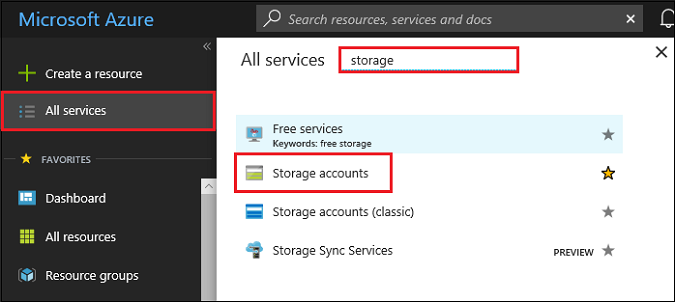
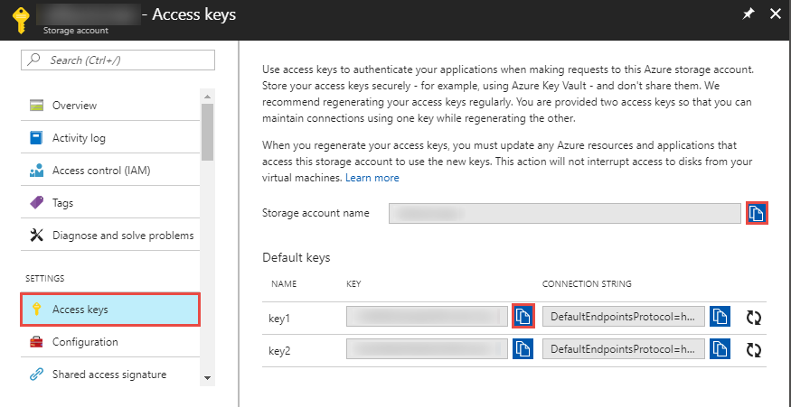
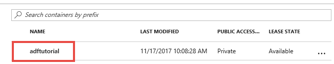
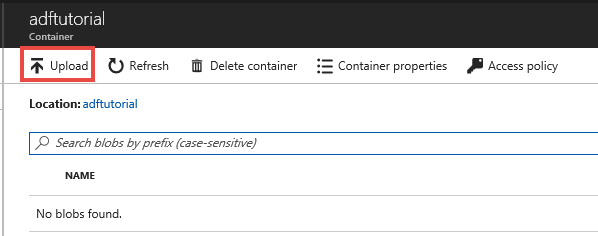
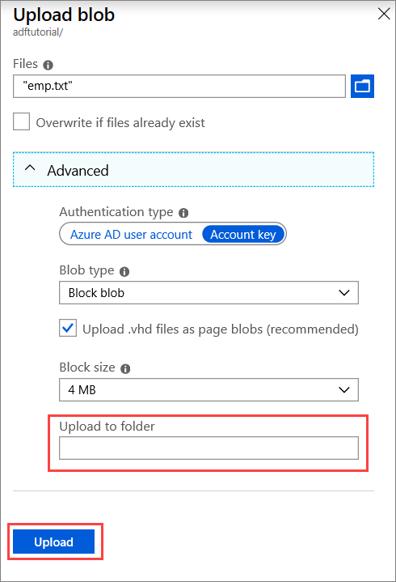

## Prerequisites

### Azure subscription
If you don't have an Azure subscription, create a [free account](https://azure.microsoft.com/free/) before you begin.

### Azure roles
To create Data Factory instances, the user account that you use to sign in to Azure must be a member of the *contributor* or *owner* role, or an *administrator* of the Azure subscription. To view the permissions that you have in the subscription, in the Azure portal, select your username in the upper-right corner, and then select **Permissions**. If you have access to multiple subscriptions, select the appropriate subscription. 

To create and manage child resources for Data Factory - including datasets, linked services, pipelines, triggers, and integration runtimes - the following requirements are applicable:
- To create and manage child resources in the Azure portal, you must belong to the **Data Factory Contributor** role at the resource group level or above.
- To create and manage child resources with PowerShell or the SDK, the **contributor** role at the resource level or above is sufficient.

For sample instructions about how to add a user to a role, see the [Add roles](../articles/billing/billing-add-change-azure-subscription-administrator.md) article.

For more info, see the following articles:
- [Data Factory Contributor role](../articles/role-based-access-control/built-in-roles.md#data-factory-contributor)
- [Roles and permissions for Azure Data Factory](../articles/data-factory/concepts-roles-permissions.md)

### Azure storage account
You use a general-purpose Azure storage account (specifically Blob storage) as both *source* and *destination* data stores in this quickstart. If you don't have a general-purpose Azure storage account, see [Create a storage account](../articles/storage/common/storage-quickstart-create-account.md) to create one. 

#### Get the storage account name and account key
You will need the name and key of your Azure storage account for this quickstart. The following procedure provides steps to get the name and key of your storage account: 

1. In a web browser, go to the [Azure portal](https://portal.azure.com). Sign in by using your Azure username and password. 
2. Select **All services** on the left menu, filter with the **Storage** keyword, and select **Storage accounts**.

   
3. In the list of storage accounts, filter for your storage account (if needed), and then select your storage account. 
4. On the **Storage account** page, select **Access keys** on the menu.

   
5. Copy the values for the **Storage account name** and **key1** boxes to the clipboard. Paste them into Notepad or any other editor and save it. You use them later in this quickstart.   

#### Create the input folder and files
In this section, you create a blob container named **adftutorial** in Azure Blob storage. You create a folder named **input** in the container, and then upload a sample file to the input folder. 

1. On the **Storage account** page, switch to **Overview**, and then select **Blobs**. 

   
2. On the **Blob service** page, select **+ Container** on the toolbar. 

       
3. In the **New container** dialog box, enter **adftutorial** for the name, and then select **OK**. 

   
4. Select **adftutorial** in the list of containers. 

   
5. On the **Container** page, select **Upload** on the toolbar.  

   
6. On the **Upload blob** page, select **Advanced**.

   
7. Start **Notepad** and create a file named **emp.txt** with the following content. Save it in the **c:\ADFv2QuickStartPSH** folder. Create the **ADFv2QuickStartPSH** folder if it does not already exist.
    
   ```
   John, Doe
   Jane, Doe
   ```    
8. In the Azure portal, on the **Upload blob** page, browse to and select the **emp.txt** file for the **Files** box. 
9. Enter **input** as a value for the **Upload to folder** box. 

        
10. Confirm that the folder is **input** and the file is **emp.txt**, and select **Upload**.
    
    You should see the **emp.txt** file and the status of the upload in the list. 
12. Close the **Upload blob** page by clicking **X** in the corner. 

    
1. Keep the **Container** page open. You use it to verify the output at the end of this quickstart.