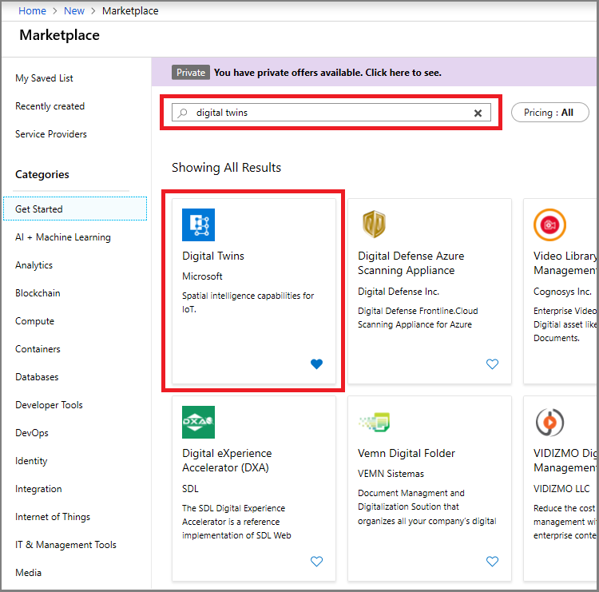
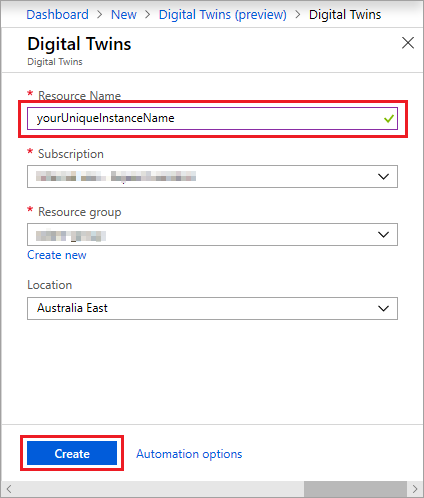
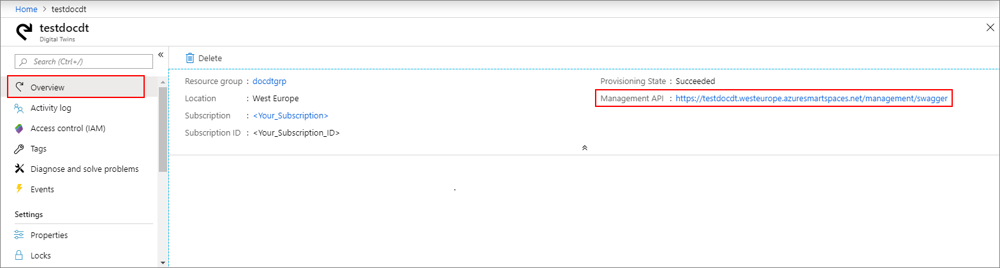

1. Sign in to the [Azure portal](http://portal.azure.com).

1. From the left side navigation pane, click **Create a resource**. Search for *digital twins*, and select **Digital Twins (preview)**. Click **Create** to start the deployment process.

    

1. In the **Digital Twins** pane, enter the following information:
   * **Resource Name**: Create a unique name for your Digital Twins instance.
   * **Subscription**: Choose the subscription that you want to use to create this Digital Twins instance. 
   * **Resource group**: Select or create a [resource group](https://docs.microsoft.com/azure/azure-resource-manager/resource-group-overview#resource-groups) for the Digital Twins instance.
   * **Location**: Select the closest location to your devices.

    

1. Review your Digital Twins information, then click **Create**. Your Digital Twins instance might take a few minutes to get created. You can monitor the progress in the **Notifications** pane.

1. Open the **Overview** pane of your Digital Twins instance. Note the link that shows under **Management API**.

    1. The **Management API** URL is formatted as: **_https://yourDigitalTwinsName.yourLocation.azuresmartspaces.net/management/swagger_**. This URL takes you to the Azure Digital Twins REST API documentation that applies to your instance. Read [How to use Azure Digital Twins Swagger](../articles/digital-twins/how-to-use-swagger.md) to learn how to read and use this API documentation.

    1. Modify the **Management API** URL to this format: **_https://yourDigitalTwinsName.yourLocation.azuresmartspaces.net/management/api/v1.0/_**. Your application will use the modified URL as the base URL to access your instance. Copy this modified URL to a temporary file. You will need this in the proceeding section.

    