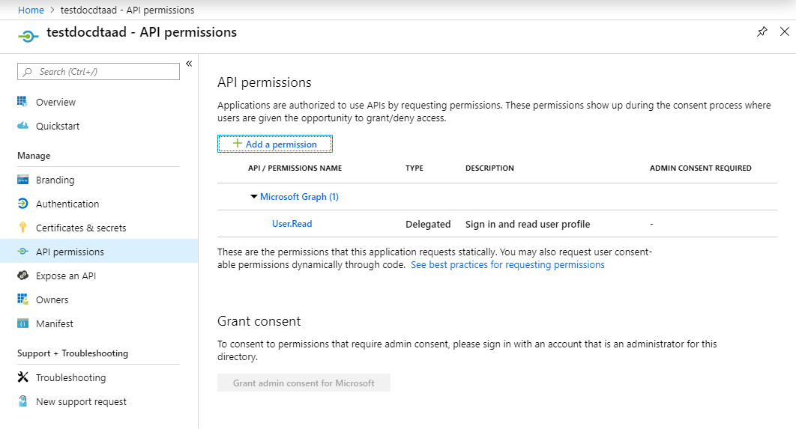
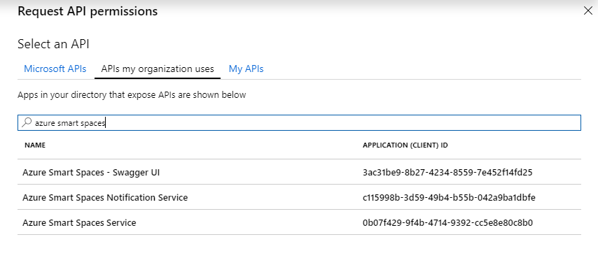
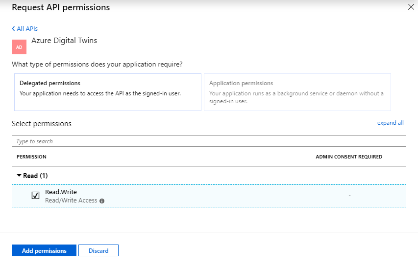

1. In the [Azure portal](https://portal.azure.com), open **Azure Active Directory** from the left pane, and then open the **App registrations** pane. Select the **New registration** button.

    

1. Give a friendly name for this app registration in the **Name** box. Under the **Redirect URI (optional)** field, choose **Public client (mobile & desktop)**, and then enter the URI `https://microsoft.com` in the following field. Select **Register**.

    

1. Open the registered app. Copy the following values to a temporary file:
    a. The value of the **Application (client) ID** field, which identifies your Azure Active Directory app, and
    b. The value of the **Directory (tenant) ID** field, which represents your Azure Active Directory tenant. 
   
   You'll use both these values to configure your sample application in the following sections.

    

1. In your app registration pane, select **API permissions**, and then select **Add a permission**.

    

1. In the **Request API permissions** pane, select the tab **APIs my organization uses**, and then search for **Azure Digital Twins**. Select the **Azure Digital Twins Deployer - Dev** option. 

    

1. Note that the **Request API permissions** pane now shows the permissions to select for these APIs. Select **user_impersonation**, and then select **Add permissions**. 

    
 
   The API **Azure Digital Twins Deployer - Dev** will appear in the list of **API permissions**. 
 