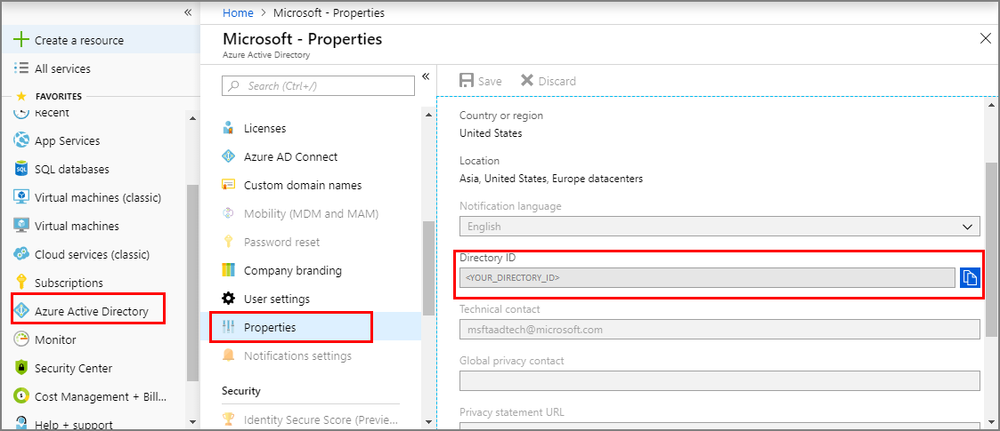
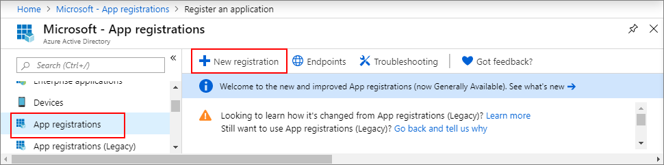
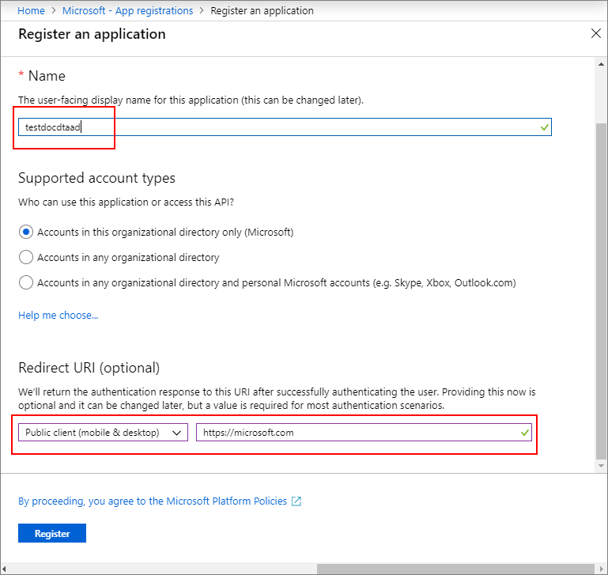
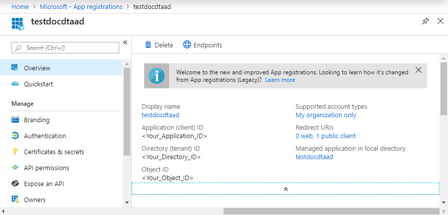
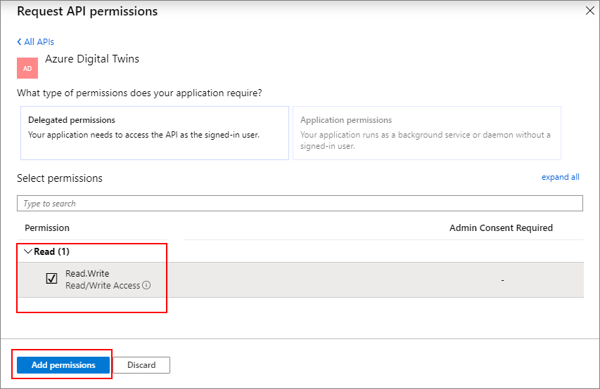

1. In the [Azure portal](https://portal.azure.com), open **Azure Active Directory** from the left navigation panel, and then open the **Properties** pane. Copy the **Directory ID** to a temporary file. You will use this value to configure sample application in the following section.

    

1. Open the **App registrations** pane, and then click **New application registration** button.
    
    

1. Give a friendly name for this app registration in the **Name** field. Choose **Application type** as **_Native_**, and **Redirect URI** as **_https://microsoft.com_**. Click **Create**.

    

1. Open the registered app, and copy the value of the **Application ID** field to a temporary file; this value identifies your Azure Active Directory app. You will use Application ID to configure your sample application in the following sections.

    

1. Open your app registration pane, and click **Settings** > **Required permissions**:
    - Click **Add** on the top left to open the **Add API access** pane.
    - Click **Select an API** and search for **Azure Digital Twins**. If your search doesn't locate the API, search for **Azure Smart Spaces** instead.
    - Select the **Azure Digital Twins (Azure Smart Spaces Service)** option and click **Select**.
    - Click **Select permissions**. Check the **Read/Write Access** delegated permissions box, and click **Select**.
    - Click **Done** in the **Add API access** pane.
    - In the **Required permissions** pane, click the **Grant permissions** button, and accept the acknowledgement that appears.

       
