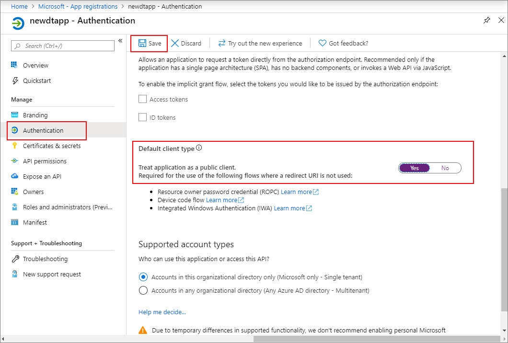

1. In the [Azure portal](https://portal.azure.com), open **Azure Active Directory** from the left pane, and then open the **App registrations** pane. Select the **New registration** button.

    

1. Give a friendly name for this app registration in the **Name** box. Under the **Redirect URI (optional)** section, choose **Public client (mobile & desktop)** in the drop-down on the left, and enter `https://microsoft.com` in the textbox on the right. Select **Register**.

    

1. To make sure that [the app is registered as a *native app*](https://docs.microsoft.com/azure/active-directory/develop/scenario-desktop-app-registration), open the **Authentication** pane for your app registration, and scroll down in that pane. In the **Default client type** section, choose **Yes** for **Treat application as a public client**. 

    

1.  Open the **Overview** pane of your registered app, and copy the values of following entities to a temporary file. You'll use these values to configure your sample application in the following sections.

    - **Application (client) ID**
    - **Directory (tenant) ID**

    

1. Open the **API permissions** pane for your app registration. Select **Add a permission** button. In the **Request API permissions** pane, select the **APIs my organization uses** tab, and then search for **Azure Smart Spaces**. Select the **Azure Smart Spaces Service** API.

    

1. The selected API shows up as **Azure Digital Twins** in the same **Request API permissions** pane. Select the **Read (1)** drop down, and then select **Read.Write** checkbox. Select the **Add permissions** button.

    

1. Depending on your organization's settings, you might need to take additional steps to grant admin access to this API. Contact your adminstrator for more information. Once the admin access is approved, the **ADMIN CONSENT REQUIRED** column in the **API permissions** pane will show similar to the following for your APIs:

    

   a. Select **Add** on the upper left to open the **Add API access** pane.

   b. Select **Select an API** and search for **Azure Digital Twins**. If your search doesn't locate the API, search for **Azure Smart Spaces** instead.

   c. Select the **Azure Digital Twins (Azure Smart Spaces Service)** option and choose **Select**.

   d. Choose **Select permissions**. Select the **Read/Write Access** delegated permissions check box, and choose **Select**.

   e. Select **Done** in the **Add API access** pane.

   f. In the **Required permissions** pane, select the **Grant permissions** button, and accept the acknowledgement that appears. If the permission is not granted for this API, contact your administrator.

      

 