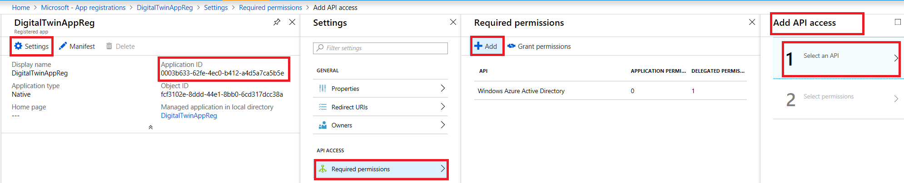
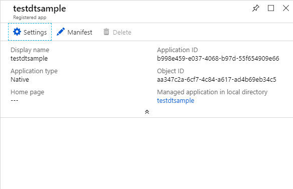

For an application to communicate with the Azure Digital Twins, register it in the Azure Active Directory and [give access to read or write](https://docs.microsoft.com/azure/active-directory/develop/v1-permissions-and-consent) the Digital Twins REST APIs. This section shows how users can authenticate against the middle-tier application and use an Oauth [on-behalf-of](https://docs.microsoft.com/azure/active-directory/develop/active-directory-v2-protocols-oauth-on-behalf-of) flow to call the actual API downstream, as demonstrated in this [example](https://azure.microsoft.com/resources/samples/active-directory-dotnet-webapi-onbehalfof/).

### Azure Active Directory app registration

1. In the [Azure portal](https://portal.azure.com), click **Azure Active Directory**, and then select **App registrations**. Click **New application registration**.
    
    

1. Give a friendly name for this app registration in the **Name** field. Choose **Application type** as **_Native_**, and **Redirect URI** as **_https://microsoft.com_**. Click **Create**.
    
    

1. Once complete, open your app registration pane, and click **Settings** > **Required permissions**:
    - Click **Add** on the top left to open the **Add API access** pane.
    - Click **Select an API**, search for **Azure Smart Spaces Service** API, select the **Azure Digital Twins (Azure Smart Spaces Service)** and click **Select**.

        

    - Click **Select permissions**. Check the **Read/Write Access** delegated permissions box, and click **Select**.
    - Click **Done** in the **Add API access** pane.
    - In the **Required permissions** pane, click the **Grant permissions** button, and accept the acknowledgement that appears.

1. Back in your app registration pane, copy to clipboard the value of the **Application ID** field, that identifies your Azure Active Directory app. You will need this to configure the *Client ID* of your sample application in the proceeding sections.

    

1. Close your app registration pane, and navigate back to your **Azure Active Directory** pane. Click **Properties**, and copy to clipboard the **Directory ID**. You will need this to configure the *Tenant* in your sample application in the proceeding sections.

    
