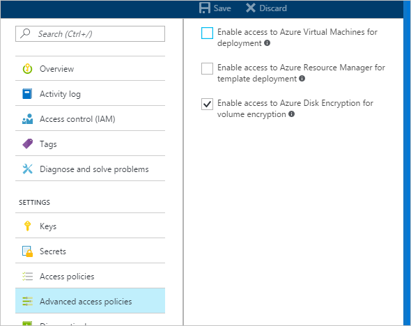

## Create a resource group

*If you already have a resource group, you can skip to [Create a key vault](#create-a-key-vault).*

A resource group is a logical container into which Azure resources are deployed and managed.

Create a resource group using the [az group create](/cli/azure/group#az-group-create) Azure CLI command, the [New-AzResourceGroup](/powershell/module/az.resources/new-azresourcegroup) Azure PowerShell command, or from the [Azure portal](https://portal.azure.com).

# [Azure portal](#tab/azure-portal)
### Azure CLI

```azurecli-interactive
az group create --name "myResourceGroup" --location eastus
```

### Azure PowerShell

```azurepowershell-interactive
New-AzResourceGroup -Name "myResourceGroup" -Location "EastUS"
```

## Create a key vault

*If you already have a key vault, you can skip to [Set key vault advanced access policies](#set-key-vault-advanced-access-policies).*

Create a key vault using the [az keyvault create](/cli/azure/keyvault#az-keyvault-create) Azure CLI command, the [New-AzKeyvault](/powershell/module/az.keyvault/new-azkeyvault) Azure PowerShell command, the [Azure portal](https://portal.azure.com), or a [Resource Manager template](https://github.com/Azure/azure-quickstart-templates/tree/master/quickstarts/microsoft.keyvault/key-vault-create).

>[!WARNING]
> To ensure that encryption secrets don't cross regional boundaries, you must create and use a key vault that's in the **same region and tenant** as the VMs to be encrypted.

Each Key Vault must have a unique name. Replace \<your-unique-keyvault-name\> with the name of your key vault in the following examples.

### Azure CLI

When creating a key vault by using the Azure CLI, add the "--enabled-for-disk-encryption" flag.

```azurecli-interactive
az keyvault create --name "<your-unique-keyvault-name>" --resource-group "myResourceGroup" --location "eastus" --enabled-for-disk-encryption
```

### Azure PowerShell

When creating a key vault using Azure PowerShell, add the "-EnabledForDiskEncryption" flag.

```azurepowershell-interactive
New-AzKeyvault -name "<your-unique-keyvault-name>" -ResourceGroupName "myResourceGroup" -Location "eastus" -EnabledForDiskEncryption
```

### Resource Manager template

You can also create a key vault by using the [Resource Manager template](https://github.com/Azure/azure-quickstart-templates/tree/master/quickstarts/microsoft.keyvault/key-vault-create).

1. On the Azure Quickstart Template, click **Deploy to Azure**.
2. Select the subscription, resource group, resource group location, Key Vault name, Object ID, legal terms, and agreement, and then click **Purchase**.

## Set key vault advanced access policies

> [!IMPORTANT]
> Newly-created key vaults have soft-delete on by default. If you are using a pre-existing key vault, you **must** enable soft-delete. See [Azure Key Vault soft-delete overview](../articles/key-vault/general/soft-delete-overview.md).

The Azure platform needs access to the encryption keys or secrets in your key vault to make them available to the VM for booting and decrypting the volumes.

If you didn't enable your key vault for disk encryption, deployment, or template deployment at the time of creation (as demonstrated in the previous step), you must update its advanced access policies.  

### Azure CLI

Use [az keyvault update](/cli/azure/keyvault#az-keyvault-update) to enable disk encryption for the key vault.

 - **Enable Key Vault for disk encryption:** Enabled-for-disk-encryption is required.

     ```azurecli-interactive
     az keyvault update --name "<your-unique-keyvault-name>" --resource-group "MyResourceGroup" --enabled-for-disk-encryption "true"
     ```  

 - **Enable Key Vault for deployment, if needed:** Enables the Microsoft.Compute resource provider to retrieve secrets from this key vault when this key vault is referenced in resource creation, for example when creating a virtual machine.

     ```azurecli-interactive
     az keyvault update --name "<your-unique-keyvault-name>" --resource-group "MyResourceGroup" --enabled-for-deployment "true"
     ```

 - **Enable Key Vault for template deployment, if needed:** Allow Resource Manager to retrieve secrets from the vault.

     ```azurecli-interactive  
     az keyvault update --name "<your-unique-keyvault-name>" --resource-group "MyResourceGroup" --enabled-for-template-deployment "true"
     ```

### Azure PowerShell
 Use the key vault PowerShell cmdlet [Set-AzKeyVaultAccessPolicy](/powershell/module/az.keyvault/set-azkeyvaultaccesspolicy) to enable disk encryption for the key vault.

  - **Enable Key Vault for disk encryption:** EnabledForDiskEncryption is required for Azure Disk encryption.

     ```azurepowershell-interactive
     Set-AzKeyVaultAccessPolicy -VaultName "<your-unique-keyvault-name>" -ResourceGroupName "MyResourceGroup" -EnabledForDiskEncryption
     ```

  - **Enable Key Vault for deployment, if needed:** Enables the Microsoft.Compute resource provider to retrieve secrets from this key vault when this key vault is referenced in resource creation, for example when creating a virtual machine.

     ```azurepowershell-interactive
      Set-AzKeyVaultAccessPolicy -VaultName "<your-unique-keyvault-name>" -ResourceGroupName "MyResourceGroup" -EnabledForDeployment
     ```

  - **Enable Key Vault for template deployment, if needed:** Enables Azure Resource Manager to get secrets from this key vault when this key vault is referenced in a template deployment.

     ```azurepowershell-interactive
     Set-AzKeyVaultAccessPolicy -VaultName "<your-unique-keyvault-name>" -ResourceGroupName "MyResourceGroup" -EnabledForTemplateDeployment
     ```

### Azure portal

1. Select your key vault and go to **Access Policies**.
2. Under "Enable Access to", select the box labeled **Azure Disk Encryption for volume encryption**.
3. Select **Azure Virtual Machines for deployment** and/or **Azure Resource Manager for template deployment**, if needed.
4. Click **Save**.

    

## Azure Disk Encryption and auto-rotation

Although Azure Key Vault now has [key auto-rotation](../articles/key-vault/keys/how-to-configure-key-rotation.md), it isn't currently compatible with Azure Disk Encryption. Specifically, Azure Disk Encryption will continue to use the original encryption key, even after it has been auto-rotated.

Rotating an encryption key won't break Azure Disk Encryption, but disabling the "old" encryption key (in other words, the key Azure Disk Encryption is still using) will.

## Set up a key encryption key (KEK)

> [!IMPORTANT]
> The account running to enable disk encryption over the key vault must have "reader" permissions.

If you want to use a key encryption key (KEK) for an additional layer of security for encryption keys, add a KEK to your key vault. When a key encryption key is specified, Azure Disk Encryption uses that key to wrap the encryption secrets before writing to Key Vault.

You can generate a new KEK by using the Azure CLI [`az keyvault key create`](/cli/azure/keyvault/key#az-keyvault-key-create) command, the Azure PowerShell [Add-AzKeyVaultKey](/powershell/module/az.keyvault/add-azkeyvaultkey) cmdlet, or the [Azure portal](https://portal.azure.com/). You must generate an RSA key type; Azure Disk Encryption doesn't currently support using Elliptic Curve keys.

You can instead import a KEK from your on-premises key management HSM. For more information, see [Key Vault Documentation](../articles/key-vault/keys/hsm-protected-keys.md).

Your key vault KEK URLs must be versioned. Azure enforces this restriction of versioning. For valid secret and KEK URLs, see the following examples:

* Example of a valid secret URL: *https://contosovault.vault.azure.net/secrets/EncryptionSecretWithKek/xxxxxxxxxxxxxxxxxxxxxxxxxxxxxxxx*
* Example of a valid KEK URL: *https://contosovault.vault.azure.net/keys/diskencryptionkek/xxxxxxxxxxxxxxxxxxxxxxxxxxxxxxxx*

### Azure CLI

Use the Azure CLI [`az keyvault key create`](/cli/azure/keyvault/key#az-keyvault-key-create) command to generate a new KEK and store it in your key vault.

```azurecli-interactive
az keyvault key create --name "myKEK" --vault-name "<your-unique-keyvault-name>" --kty RSA --size 4096
```

You may instead import a private key by using the Azure CLI [az keyvault key import](/cli/azure/keyvault/key#az-keyvault-key-import) command:

In either case, you supply the name of your KEK to the Azure CLI [`az vm encryption enable`](/cli/azure/vm/encryption#az-vm-encryption-enable) --key-encryption-key parameter. 

```azurecli-interactive
az vm encryption enable -g "MyResourceGroup" --name "myVM" --disk-encryption-keyvault "<your-unique-keyvault-name>" --key-encryption-key "myKEK"
```

###  Azure PowerShell 

Use the Azure PowerShell [Add-AzKeyVaultKey](/powershell/module/az.keyvault/add-azkeyvaultkey) cmdlet to generate a new KEK and store it in your key vault.

```powershell-interactive
Add-AzKeyVaultKey -Name "myKEK" -VaultName "<your-unique-keyvault-name>" -Destination "HSM" -Size 4096
```

You may instead import a private key using the Azure PowerShell [`az keyvault key import`](/cli/azure/keyvault/key#az-keyvault-key-import) command.

In either case, you will supply the ID of your KEK key Vault and the URL of your KEK to the Azure PowerShell [Set-AzVMDiskEncryptionExtension](/powershell/module/az.compute/set-azvmdiskencryptionextension) -KeyEncryptionKeyVaultId and -KeyEncryptionKeyUrl parameters. This example assumes that you are using the same key vault for both the disk encryption key and the KEK.

```powershell-interactive
$KeyVault = Get-AzKeyVault -VaultName "<your-unique-keyvault-name>" -ResourceGroupName "myResourceGroup"
$KEK = Get-AzKeyVaultKey -VaultName "<your-unique-keyvault-name>" -Name "myKEK"

Set-AzVMDiskEncryptionExtension -ResourceGroupName MyResourceGroup -VMName "MyVM" -DiskEncryptionKeyVaultUrl $KeyVault.VaultUri -DiskEncryptionKeyVaultId $KeyVault.ResourceId -KeyEncryptionKeyVaultId $KeyVault.ResourceId -KeyEncryptionKeyUrl $KEK.Id -SkipVmBackup -VolumeType All
```
