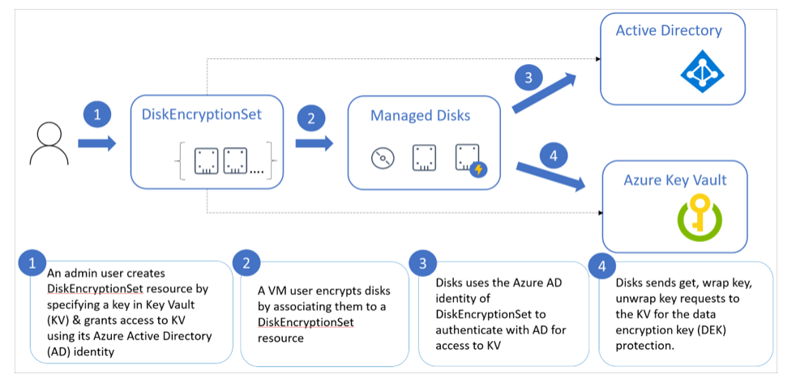

Azure managed disks automatically encrypt your data by default when persisting it to the cloud. Server-side encryption protects your data and helps you meet your organizational security and compliance commitments. Data in Azure managed disks is encrypted transparently using 256-bit [AES encryption](https://en.wikipedia.org/wiki/Advanced_Encryption_Standard), one of the strongest block ciphers available, and is FIPS 140-2 compliant.   

Encryption does not impact the performance of managed disks. There is no additional cost for the encryption.

For more information about the cryptographic modules underlying Azure managed disks, see [Cryptography API: Next Generation](https://docs.microsoft.com/windows/desktop/seccng/cng-portal)

## About encryption key management

You can rely on platform-managed keys for the encryption of your managed disk, or you can manage encryption using your own keys (public preview). If you choose to manage encryption with your own keys, you can specify a *customer-managed key* to use for encrypting and decrypting all data in managed disks. 

The following sections describe each of the options for key management in greater detail.

## Platform-managed keys

By default, managed disks use platform-managed encryption keys. As of June 10th, 2017, all new managed disks, snapshots, images, and new data written to existing managed disks are automatically encrypted-at-rest with platform-managed keys. 

## Customer-managed keys (public preview)

You can choose to manage encryption at the level of each managed disk, with your own keys. Server-side encryption for managed disks with customer-managed keys offers an integrated experience with Azure Key Vault. You can either import [your RSA keys](../articles/key-vault/key-vault-hsm-protected-keys.md) to your Key Vault or generate new RSA keys in Azure Key Vault. Azure managed disks handles the encryption and decryption in a fully transparent fashion using [envelope encryption](../articles/storage/common/storage-client-side-encryption.md#encryption-via-the-envelope-technique). It encrypts data using an [AES](https://en.wikipedia.org/wiki/Advanced_Encryption_Standard) 256 based data encryption key (DEK), which is, in turn, protected using your keys. You have to grant access in your Key Vault in order to use your keys for encrypting and decrypting the DEK. This allows you full control of your data and keys. You can disable your keys or revoke access to managed disks at any time. You can also audit the encryption key usage with Azure Key Vault monitoring to ensure that only managed disks or other trusted Azure services are accessing your keys.

The following diagram shows how managed disks uses Azure Active Directory and Azure Key Vault to make requests using the customer-managed key:




The following list explains the numbered steps in the diagram:

1. An Azure Key Vault administrator creates key vault resources.
1. The key vault admin either imports their RSA keys to Key Vault or generate new RSA keys in Key Vault.
1. That administrator creates an instance of Disk Encryption Set resource, specifying an Azure Key Vault ID and a key URL. Disk Encryption Set is a new resource introduced for simplifying the key management for managed disks. 
1. When a disk encryption set is created, a [system-assigned managed identity](../articles/active-directory/managed-identities-azure-resources/overview.md) is created in Azure active directory (AD) and associated with the disk encryption set. 
1. The Azure key vault administrator then grants the managed identity permission to perform operations in the key vault.
1. A VM user creates disks by associating them with the disk encryption set. The VM user can also enable server-side encryption with customer-managed keys for existing resources by associating them with the disk encryption set. 
1. Managed disks use the managed identity to send requests to the Azure Key Vault.
1. For reading or writing data, managed disks sends requests to Azure Key Vault to encrypt (wrap) and decrypt (unwrap) the data encryption key in order to perform encryption and decryption of the data. 

To revoke access to customer-managed keys, see [Azure Key Vault PowerShell](https://docs.microsoft.com/powershell/module/azurerm.keyvault/) and [Azure Key Vault CLI](https://docs.microsoft.com/cli/azure/keyvault). Revoking access effectively blocks access to all data in the storage account, as the encryption key is inaccessible by Azure Storage.

### Supported scenarios and restrictions

During the preview, only the following scenarios are supported:

- Create a virtual machine (VM) from an Azure Marketplace image and encrypt the OS disk with server-side encryption using customer-managed keys.
- Create a custom image encrypted with server-side encryption and customer-managed keys.
- Create a VM from a custom image and encrypt the OS disk using server-side encryption and customer-managed keys.
- Create data disks encrypted using server-side encryption and customer-managed keys.
- Create snapshots that are encrypted using server-side encryption and customer-managed keys.
- Create virtual machine scale sets that are encrypted with server-side encryption and customer-managed keys.

The preview also has the following restrictions:

- Only available in West Central US.
- Disks created from custom images that are encrypted using server-side encryption and customer-managed keys must be encrypted using the same customer-managed keys and must be in the same subscription.
- Snapshots created from disks that are encrypted with server-side encryption and customer-managed keys must be encrypted with the same customer-managed keys.
- Custom images encrypted using server-side encryption and customer-managed keys cannot be used in the shared image gallery.
- Your Key Vault must be in the same subscription and region as your customer-managed keys.
- Disks, snapshots, and images encrypted with customer-managed keys cannot move to another subscription.

### Setting up your Azure Key Vault

1.	Create an instance of Azure Key Vault and encryption key.

    When creating the Key Vault instance, you must enable soft delete and purge protection. Soft delete ensures that the Key Vault holds a deleted key for a given retention period (90 day default). Purge protection Ensures that a deleted key cannot be permanently deleted until the retention period lapses. These settings protect you from losing data due to accidental deletion. These settings are mandatory when using a Key Vault for encrypting managed disks.

    ```powershell
    $keyVault = New-AzKeyVault -Name myKeyVaultName ` 
    -ResourceGroupName myRGName ` 
    -Location westcentralus ` 
    -EnableSoftDelete ` 
    -EnablePurgeProtection 
     
    $key = Add-AzKeyVaultKey -VaultName $keyVault.VaultName ` 
    -Name myKeyName ` 
    -Destination Software `  
    ```

1.	Create an instance of a DiskEncryptionSet. 
    
    ```powershell
    New-AzResourceGroupDeployment -ResourceGroupName myRGName ` 
      -TemplateUri "https://raw.githubusercontent.com/ramankumarlive/manageddiskscmkpreview/master/CreateDiskEncryptionSet.json" ` 
      -diskEncryptionSetName "myDiskEncryptionSet1" ` 
      -keyVaultId "/subscriptions/mySubscriptionId/resourceGroups/myRGName/providers/Microsoft.KeyVault/vaults/myKeyVaultName" ` 
      -keyVaultKeyUrl "https://myKeyVaultName.vault.azure.net/keys/myKeyName/403445136dee4a57af7068cab08f7d42" ` 
      -region "WestCentralUS"
    ```

1.	Grant the DiskEncryptionSet resource access to the key vault.

    ```powershell
    $identity = Get-AzADServicePrincipal -DisplayName myDiskEncryptionSet1  
     
    Set-AzKeyVaultAccessPolicy ` 
        -VaultName $keyVault.VaultName ` 
        -ObjectId $identity.Id ` 
        -PermissionsToKeys wrapkey,unwrapkey,get 
     
    New-AzRoleAssignment ` 
        -ObjectId $identity.Id ` 
        -RoleDefinitionName "Reader" ` 
        -ResourceName $keyVault.VaultName ` 
        -ResourceType "Microsoft.KeyVault/vaults" ` 
        -ResourceGroupName myRGName `  
    ```

### Create a VM using a marketplace image, encrypting the OS and data disks with customer-managed keys via a Resource Manager template

```
$password=ConvertTo-SecureString -String "myVMPassword" `
  -AsPlainText -Force
New-AzResourceGroupDeployment -ResourceGroupName CMKTesting `
  -TemplateUri "https://raw.githubusercontent.com/ramankumarlive/manageddiskscmkpreview/master/CreateVMWithDisksEncryptedWithCMK.json" `
  -virtualMachineName "myVMName" `
  -adminPassword $password `
  -vmSize "Standard_DS3_V2" `
  -diskEncryptionSetId "/subscriptions/mySubscriptionId/resourceGroups/myRGName/providers/Microsoft.Compute/diskEncryptionSets/myDiskEncryptionSet1" `
  -region "westcentralus" 
```

### Create an empty disk encrypted using server-side encryption with customer-managed keys and attach it to a VM

```PowerShell
$vmName = "yourVMName"
$rgName = "yourRGName"
$diskName = "yourDiskName"
$diskSKU = "Premium_LRS"
$diskSizeinGiB = "30"
$diskEncryptionSetId = "/subscriptions/<subscriptionID>/resourceGroups/yourRGName/providers/Microsoft.Compute/diskEncryptionSets/<yourDiskEncryptionSetName>"
$region = "westcentralus"
$diskLUN = 1

New-AzResourceGroupDeployment -ResourceGroupName $rgName `
  -TemplateUri "https://raw.githubusercontent.com/ramankumarlive/manageddiskscmkpreview/master/CreateEmptyDataDiskEncryptedWithSSECMK.json" `
  -diskName $diskName `
  -diskSkuName $diskSKU `
  -dataDiskSizeInGb $diskSizeinGiB `
  -diskEncryptionSetId $diskEncryptionSetId `
  -region $region 

$vm = Get-AzVM -Name $vmName -ResourceGroupName $rgName 
$disk = Get-AzDisk -DiskName $diskName -ResourceGroupName $rgName
$vm = Add-AzVMDataDisk -VM $vm -Name $diskName -CreateOption Attach -ManagedDiskId $disk.Id -Lun 1
```


> [!IMPORTANT]
> Customer-managed keys rely on managed identities for Azure resources, a feature of Azure Active Directory (Azure AD). When you configure customer-managed keys, a managed identity is automatically assigned to your resources under the covers. If you subsequently move the subscription, resource group, or managed disk from one Azure AD directory to another, the managed identity associated with managed disks is not transferred to the new tenant, so customer-managed keys may no longer work. For more information, see [Transferring a subscription between Azure AD directories](../articles/active-directory/managed-identities-azure-resources/known-issues.md#transferring-a-subscription-between-azure-ad-directories).

## Server-side encryption versus Azure disk encryption

[Azure Disk Encryption](../articles/security/fundamentals/azure-disk-encryption-vms-vmss.md) leverages the [BitLocker](https://docs.microsoft.com/windows/security/information-protection/bitlocker/bitlocker-overview) feature of Windows and the [DM-Crypt](https://en.wikipedia.org/wiki/Dm-crypt) feature of Linux to encrypt managed disks with customer-managed keys within the guest VM.  Server-side encryption with customer-managed keys improves on ADE by enabling you to use any OS types and images for your VMs by encrypting data in the Storage service.

## Next steps

- [What is Azure Key Vault?](../articles/key-vault/key-vault-overview.md)
