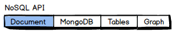

1. In a new window, sign in to the [Azure portal](https://portal.azure.com/).
2. In the left menu, click **New**, click **Databases**, and then click **Azure Cosmos DB**.
   
   
   *screenshot to be updated with new UX*

3. In the **New account** blade, specify the desired configuration for the Azure Cosmos DB account. 

    With Azure Cosmos DB, you can choose one of four programming models: DocumentDB, MongoDB, Table, and Graph. 
    
    
    *screenshot to be updated with new UX*
    
    In this quick start we'll be programming against the DocumentDB API, so you'll choose **DocumentDB** as you fill out the form. But if you have graph data for a social media app, or key/value (table) data, or data migrated from a MongoDB app, realize that Azure Cosmos DB can provide a highly available, globally-distributed database service platform for all your mission-critical applications.

    Fill out the New account blade using the information in the screenshot as a guide, the exact values you choose will be slightly different.
 
    
    *screenshot to be updated with new UX*
   
   * In the **ID** box, enter a unique name you choose to identify the Azure Cosmos DB account. *documents.azure.com* is appended to the ID you provide to create your URI, so use a unique but identifyable ID. The **ID** may contain only lowercase letters, numbers, and the '-' character, and must be between 3 and 50 characters.
   * In the **NoSQL API** box, select **DocumentDB** as we'll be programming against the DocumentDB API later in this quick start.  
   * For **Subscription**, select the Azure subscription that you want to use for the DocumentDB account. 
   * In **Resource Group**, create a new resource group for your account. For simplicity, you can use the same name as your ID. 
   * Use **Location** to specify the geographic location in which to host your Azure Cosmos DB account. Choose the location closest to your users to give them the fastest access to the data.
4. Click **Create** to create the account.
5. On the toolbar, click **Notifications** to monitor the deployment process.

    

6.  When the deployment is complete, open the new accout account from the All Resources tile. 

    

[How to: Create a DocumentDB account]: #Howto
[Next steps]: #NextSteps
[documentdb-manage]:../articles/documentdb/documentdb-manage.md
