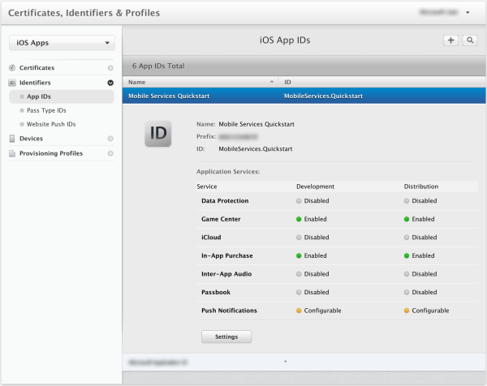
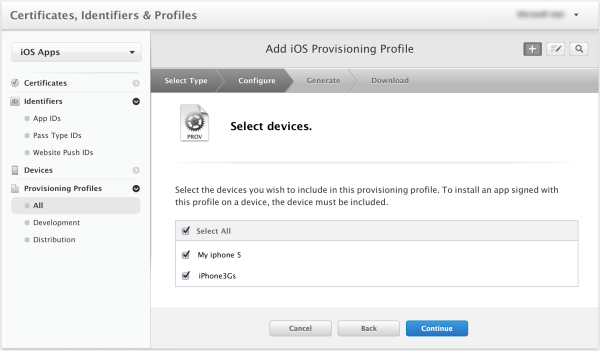

The Apple Push Notification Service (APNS) uses certificates to authenticate your mobile service. Follow these instructions to create the necessary certificates and upload it to your Mobile Service. For the official APNS feature documentation, see [Apple Push Notification Service](http://go.microsoft.com/fwlink/p/?LinkId=272584).

## Generate the Certificate Signing Request file

First you must generate the Certificate Signing Request (CSR) file, which is used by Apple to generate a signed certificate.

1. From the Utilities folder, run the Keychain Access tool.

2. Click **Keychain Access**, expand **Certificate Assistant**, then click **Request a Certificate from a Certificate Authority...**.

  	

3. Select your **User Email Address** and **Common Name** , make sure that **Saved to disk** is selected, and then click **Continue**. Leave the **CA Email Address** field blank as it is not required.

  	

4. Type a name for the Certificate Signing Request (CSR) file in **Save As**, select the location in **Where**, then click **Save**.

  	

  	This saves the CSR file in the selected location; the default location is in the Desktop. Remember the location chosen for this file.

Next, you will register your app with Apple, enable push notifications, and upload this exported CSR to create a push certificate.

## Register your app for push notifications

To be able to send push notifications to an iOS app from mobile services, you must register your application with Apple and also register for push notifications.  

1. If you have not already registered your app, navigate to the <a href="http://go.microsoft.com/fwlink/p/?LinkId=272456" target="_blank">iOS Provisioning Portal</a> at the Apple Developer Center, log on with your Apple ID, click **Identifiers**, then click **App IDs**, and finally click on the **+** sign to register a new app.

   	

> [WACOM.NOTE] If you choose to supply a <strong>Bundle Identifier</strong> value other than <i>MobileServices.Quickstart</i>, you must also update the bundle identifier value in your Xcode project. We recommend that you use the exact bundle identifier value you already used in your quickstart project.

2. Type a name for your app in **Description**, enter the value _MobileServices.Quickstart_ in **Bundle Identifier**, check the "Push Notifications" option in the "App Services" section, and then click **Continue**. This example uses the ID **MobileServices.Quickstart** but you may not reuse this same ID, as app IDs must be unique across all users. As such, it is recommended that you append your full name or initials after the app name.

    

   	This generates your app ID and requests you to **Submit** the information. Click **Submit**

    

   	Once you click **Submit**, you will see the **Registration complete** screen, as shown below. Click **Done**.

    

3. Locate the app ID that you just created, and click on its row.

   	

   	Clicking on the app ID will display details on the app and app ID. Click the **Settings** button.

   	

4. Scroll to the bottom of the screen, and click the **Create Certificate...** button under the section **Development Push SSL Certificate**.

   	

   	This displays the "Add iOS Certificate" assistant.

    > [WACOM.NOTE] This tutorial uses a development certificate. The same process is used when registering a production certificate. Just make sure that you set the same certificate type when you upload the certificate to Mobile Services.

5. Click **Choose File**, browse to the location where you saved the CSR file that you created in the first task, then click **Generate**.

  	

6. After the certificate is created by the portal, click the **Download** button, and click **Done**.

  	

   	This downloads the signing certificate and saves it to your computer in your Downloads folder.

  	

    > [WACOM.NOTE] By default, the downloaded file a development certificate is named **aps_development.cer**.

7. Double-click the downloaded push certificate **aps_development.cer**.

   	This installs the new certificate in the Keychain, as shown below:

   	

    > [WACOM.NOTE] The name in your certificate might be different, but it will be prefixed with **Apple Development iOS Push Services:**.

Later, you will use this certificate to generate a .p12 file and upload it to Mobile Services to enable authentication with APNS.

## Create a provisioning profile for the app

1. Back in the <a href="http://go.microsoft.com/fwlink/p/?LinkId=272456" target="_blank">iOS Provisioning Portal</a>, select **Provisioning Profiles**, select **All**, and then click the **+** button to create a new profile. This launches the **Add iOS Provisiong Profile** Wizard

   	

2. Select **iOS App Development** under **Development** as the provisiong profile type, and click **Continue**

   	

3. Next, select the app ID for the Mobile Services Quickstart app from the **App ID** drop-down list, and click **Continue**

   	

4. In the **Select certificates** screen, select the certificate created earlier, and click **Continue**

   	

5. Next, select the **Devices** to use for testing, and click **Continue**

   	

6. Finally, pick a name for the profile in **Profile Name**, click **Generate**, and click **Done**

   	

  	This creates a new provisioning profile.

7. In Xcode, open the Organizer select the Devices view, select **Provisioning Profiles** in the **Library** section in the left pane, and then click the **Refresh** button at the bottom of the middle pane.

8. Alternatively, from the Xcode menu, select **Preferences** and then **Accounts**. Select your Apple Developer ID in the left panel. Click the **View Details** button on the right. In the pop-over window, click the rounded **Refresh** button. This refreshes the list of Provisioning profiles. This process may take a few minutes. We recommend that you click **Refresh** 2-3 times until you see your new provisioning profile. Also, confirm that the bundle identifier of this Xcode project is identical to the bundle identifier associated with the app ID and provisioning profile you've created so far.

    

9. Under **Targets**, click **Quickstart**, expand **Code Signing Identity**, then under **Debug** select the new profile. This ensures that the Xcode project uses the new profile for code signing. Next, you must upload the certificate to Azure.

   	
