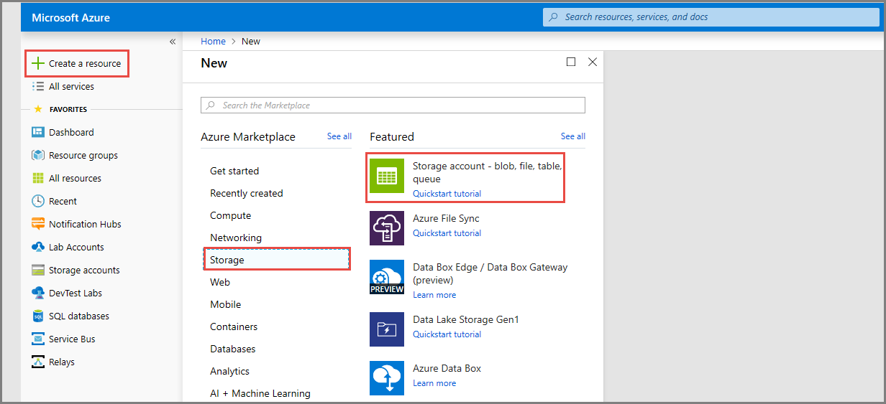
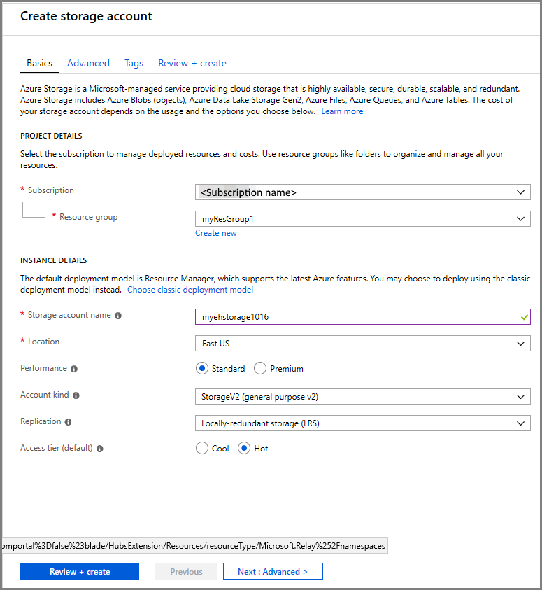
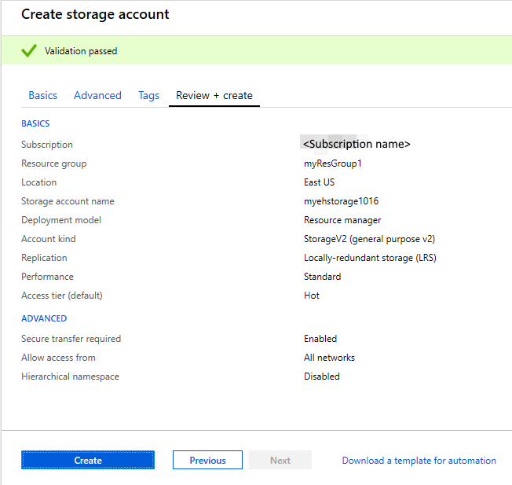
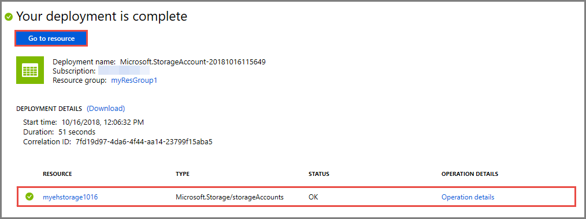
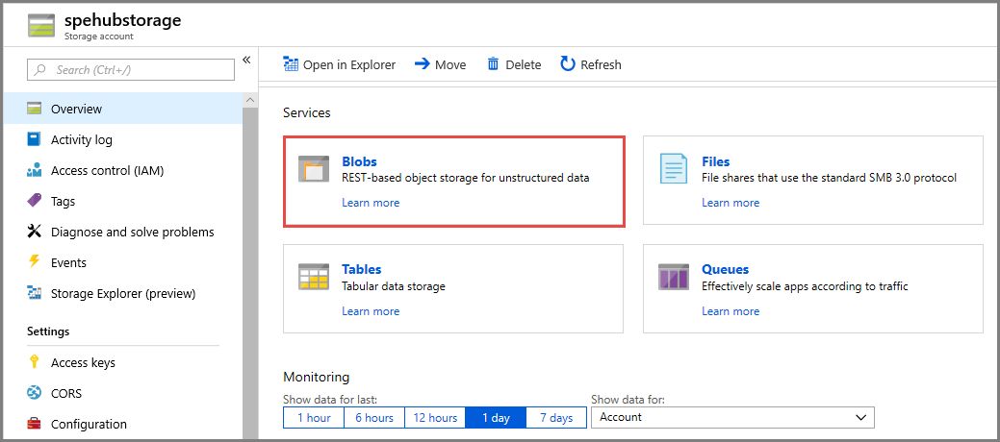
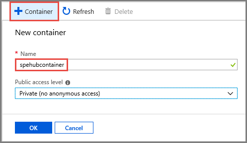

### Create a storage account for Event Processor Host
The Event Processor Host is an intelligent agent that simplifies receiving events from Event Hubs by managing persistent checkpoints and parallel receives. For checkpointing, the Event Processor Host requires a storage account. The following example shows how to create a storage account and how to get its keys for access:

1. In the Azure portal, and select **Create a resource** at the top left of the screen.

2. Select **Storage**, then select **Storage account - blob, file, table, queue**.
   
    

3. On the **Create storage account** page, take the following steps: 

   1. Enter a name for the storage account. 
   2. Choose an Azure subscription that contains the event hub.
   3. Select the resource group that has the event hub.
   4. Select a location in which to create the resource. 
   5. Then click **Review + create**.
   
      

4. On the **Review + create** page, review the values, and select **Create**. 

    
5. After you see the **Deployments Succeeded** message, select **Go to resource** at the top of the page. You can also launch the Storage Account page by selecting your storage account from the resource list.  

     
7. In the **Essentials** window, select **Blobs**. 

    
1. Select **+ Container** at the top, enter a **name** for the container, and select **OK**. 

    
1. Select **Access keys** in the left-side menu, and copy the value of **key1**. 

    Save the following values to Notepad or some other temporary location.
    - Name of the storage account
    - Access key for the storage account
    - Name of the container
