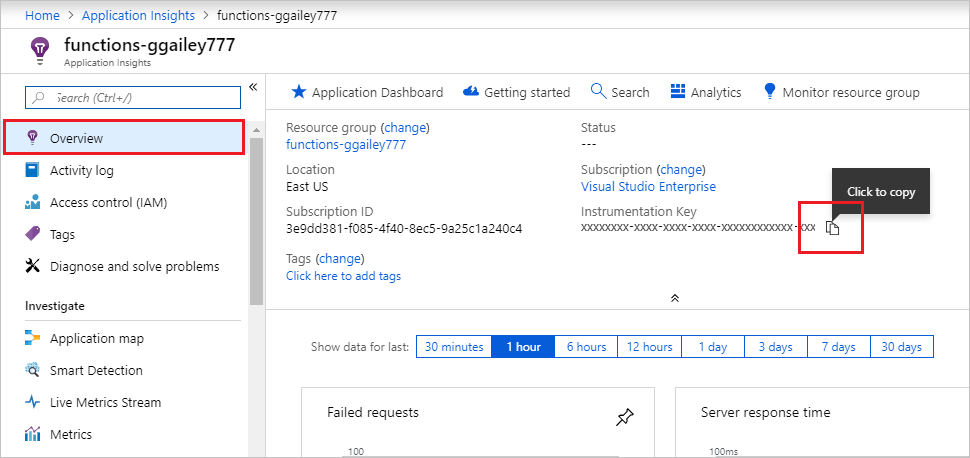
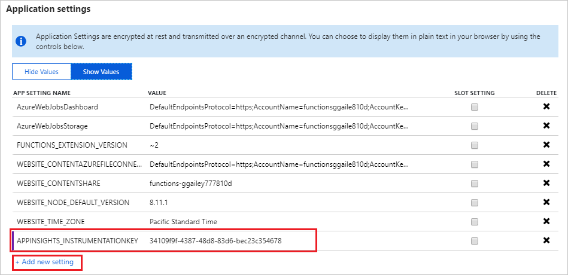

1. Create an Application Insights resource in the [Azure Portal](https://portal.azure.com). Use the settings as specified in the table below the image:

   

    | Setting      | Suggested value  | Description                                        |
    | ------------ |  ------- | -------------------------------------------------- |
    | **Name** | Unique app name | It's easiest to use the same name as your function app, which must be unique in your subscription. | 
    | **Application type** | General | Use the **General** app type for Functions. | 
    | **Subscription** | Your subscription | The same subscription as your function app. | 
    | **[Resource Group](../articles/azure-resource-manager/resource-group-overview.md)** |  Your resource group| Ideally, use the same resource group as your function app, although this isn't required. |
    | **Location** | West Europe | If possible, use the same [region](https://azure.microsoft.com/regions/) as your function app, or near to it. |

1. Copy the instrumentation key from the **Essentials** page of the Application Insights resource. Hover over the end of the displayed key value to get a **Click to copy** button.

   

1. In the function app's **Application settings** page, [add an app setting](functions-how-to-use-azure-function-app-settings.md#settings) by clicking **Add new setting**. Name the new setting `APPINSIGHTS_INSTRUMENTATIONKEY` and paste the copied instrumentation key.

   

1. Click **Save**.
