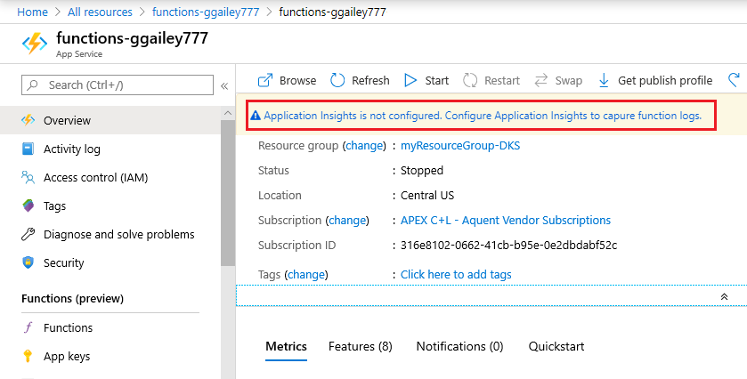
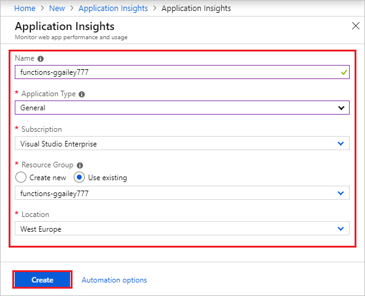

Functions makes it simple to add Application Insights integration to a function app from the [Azure portal].

1. In the [portal][Azure Portal], select **All services > Function Apps**, select your function app, and then choose the **Application Insights** banner at the top of the window

    

1. Create an Application Insights resource by using the settings specified in the table below the image:

   

    | Setting      | Suggested value  | Description                                        |
    | ------------ |  ------- | -------------------------------------------------- |
    | **Name** | Unique app name | It's easiest to use the same name as your function app, which must be unique in your subscription. | 
    | **Location** | West Europe | If possible, use the same [region](https://azure.microsoft.com/regions/) as your function app, or near to it. |

1. Choose **OK**. The Application Insights resource is created in the same resource group and subscription as your function app. After creation completes, close the Application Insights window.

1. Back in your function app, select **Application settings**, and scroll down to **Application settings**. When you see a setting named `APPINSIGHTS_INSTRUMENTATIONKEY`, it means that Application Insights integration is enabled for your function app running in Azure.

[Azure Portal]: https://portal.azure.com
