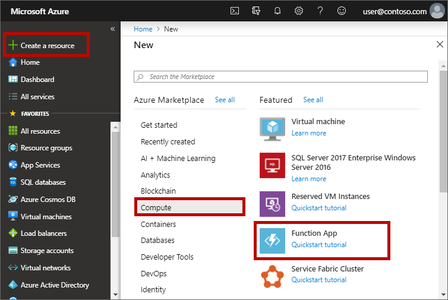

1. Select the **Create a resource** button found on the upper left-hand corner of the Azure portal, then select **Compute** > **Function App**.

    

1. Use the function app settings as specified in the table below the image.

    

    | Setting      | Suggested value  | Description                                        |
    | ------------ |  ------- | -------------------------------------------------- |
    | **Subscription** | Your subscription | The subscription under which this new function app is created. |
    | **[Resource Group](../articles/azure-resource-manager/resource-group-overview.md)** |  *myResourceGroup* | Name for the new resource group in which to create your function app. |
    | **Function App name** | Globally unique name | Name that identifies your new function app. Valid characters are `a-z`, `0-9`, and `-`.  |
    |**Publish**| Code | Option to publish code files or a Docker conatiner |
    | **Runtime stack** | Preferred language | Choose a runtime that supports your favorite function programming language. Choose **.NET** for C# and F# functions. |
    |**Region**| Perferred region | Choose a [region](https://azure.microsoft.com/regions/) near you or near other services your functions access. |

1. Select the **Hosting** tab and enter the following settings.

    

    | **[Storage account](../articles/storage/common/storage-quickstart-create-account.md)** |  Globally unique name |  Create a storage account used by your function app. Storage account names must be between 3 and 24 characters in length and may contain numbers and lowercase letters only. You can also use an existing account, which must meets the [storage account requirements](../articles/azure-functions/functions-scale.md#storage-account-requirements). |
    |**Operating system**| Perferred operating system | An operating system is pre-selected for you based on your runtime stack selection. |
    | **[Plan](../articles/azure-functions/functions-scale.md)** | Consumption plan | Hosting plan that defines how resources are allocated to your function app. In the default **Consumption Plan**, resources are added dynamically as required by your functions. In this [serverless](https://azure.microsoft.com/overview/serverless-computing/) hosting, you only pay for the time your functions run. When you run in an App Service plan, you must manage the [scaling of your function app](../articles/azure-functions/functions-scale.md).  |

1. Select **Review + Create** to review the app configuration selections..

1. Select **Create** to provision and deploy the function app.

1. Select the Notification icon in the upper-right corner of the portal and watch for the **Deployment succeeded** message.

    

1. Select **Go to resource** to view your new function app. You can also select **Pin to dashboard**. Pinning makes it easier to return to this function app resource from your dashboard.
